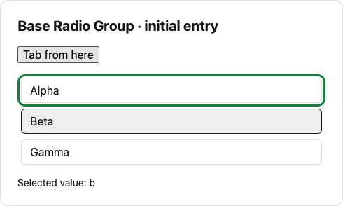
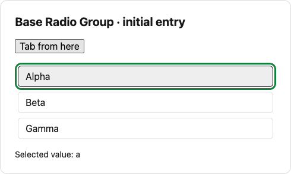

# Base Radio Group initial Tab entry

Evidence-only branch owned by HyacinthHaru. Do not merge this branch into the code tree.

## Request and scope

Agent's sanitized paraphrase of [Issue #662](https://github.com/Proto-UI/Proto-UI/issues/662): complete the bounded Shadcn presentation over the existing Base Radio Group, preserving Base selection, Collection, roving focus and accessibility ownership. Native browser verification found a prerequisite mismatch in the unchanged Base family. This packet asks for a bounded maintainer decision; it does not implement a repair or expand #662's accepted scope.

Baseline: `3b756f450e7505e834629e2aef67f7b29afa94e7`, macOS, Node 22.23.2, pnpm 10.32.1, Chromium 153.0.8010.48; observed 2026-09-19. The Base source used in the experiment is byte-identical to that commit. Root blob: `7119b7202499e0273dc1014b3d1b523d9f1d68b7`; shared helper blob: `aebc79cff2561384d9f28a314903c87126835e8e`.

## Executed behavior

The fixture mounts real public Base Root and Item exports through the official Web Component Adapter, with DOM/Collection order `a, b, c`. It sets either `defaultValue` or controlled `value` before mounting. It makes no focus or selection request while observing 12 animation frames after all three Items and the checked state have appeared. A native click on the preceding App button followed by a native Tab then observes the actual focused element.

| Input                 | Checked item | Initial tabindex values | First native Tab |
| --------------------- | ------------ | ----------------------- | ---------------- |
| `defaultValue: a`     | a            | 0, -1, -1               | a                |
| `defaultValue: b`     | b            | 0, -1, -1               | a                |
| controlled `value: a` | a            | 0, -1, -1               | a                |
| controlled `value: b` | b            | 0, -1, -1               | a                |

All 12 sampled frames retain the same values in each case. Root Collection count is 3; there are no page errors. `observations.json` preserves every sample. The gray selected treatment and green native `:focus-visible` outline are App presentation over real Base data attributes and browser focus; no checked/focus fact is injected. These are actual components, not a diagram or simulated state card.





The expected selected-or-first entry is cataloged by `P-BASE-RADIO-GROUP-FOCUS-ENTRY`, `P-BASE-RADIO-GROUP-COLLECTION-AND-ROVING` and `P-BASE-RADIO-GROUP-ITEM-ROVING-PARTICIPATION` (all draft). The new Shadcn public page reproduces the same initial-entry mismatch; these Base-only cases establish that Shadcn styles are not its owner.

Source-derived diagnosis, not an instrumented registration trace: `resolveCurrentItemId()` retains any enabled current before checking the selected Item. A first registered fallback can therefore remain current after the non-first selected Item becomes available. `publish()` carries that current forward, and Item projects navigation participation from it. The existing tests that start with the first Item selected do not distinguish this ordering.

## Reproduce

From this evidence branch, with the repository's frozen dependencies and Node 22:

```sh
corepack pnpm@10.32.1 install --frozen-lockfile
corepack pnpm@10.32.1 exec tsx evidence/2026-09-19/radio-group-entry/capture.mts
```

The script uses the existing Vite source resolver and browser harness, serves only localhost, captures four cases, and prints its temporary output directory. It closes every page, browser and server. No new dependency, release or hosting service is required.

Evidence disposition: complete for the stated WC/browser reproduction and first-selected control, partial for other Adapters and a future repair. No product fix or independent acceptance is claimed. The fixture and analysis were AI-assisted; the components and adapter come from this repository's MIT code. These small evidence assets are retained on the contributor's dedicated evidence branch, outside the product PR.
