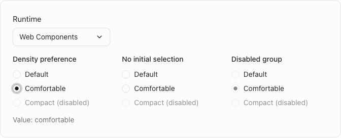
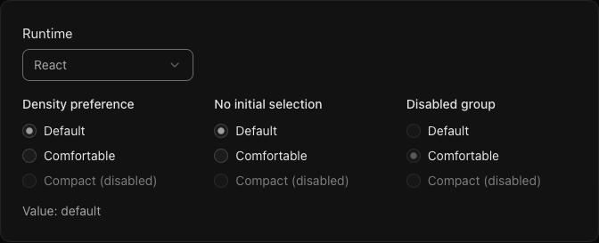
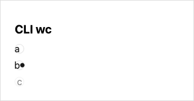
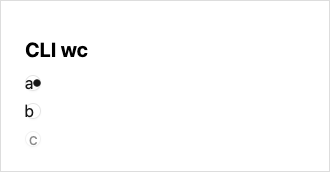

# Shadcn Radio Group projection evidence

This is an evidence-only packet owned by the contributor, outside the product PR. Do not merge this evidence branch into the product tree.

## Request, source and disposition

Agent's sanitized paraphrase of [Issue #662](https://github.com/Proto-UI/Proto-UI/issues/662): deliver the complete Shadcn Root, Item and Indicator projection over the existing Base Radio Group, retaining Base selection, Collection, focus and accessibility ownership, with package, CLI, documentation and real browser evidence.

- Product candidate: [`a7f231b71604055af162730aa3b04450e21805bc`](https://github.com/HyacinthHaru/Proto-UI/tree/a7f231b71604055af162730aa3b04450e21805bc).
- Product base: [`3b756f450e7505e834629e2aef67f7b29afa94e7`](https://github.com/Proto-UI/Proto-UI/tree/3b756f450e7505e834629e2aef67f7b29afa94e7).
- Evidence branch before this packet: `cd4cede77dcd9f30011e5466dd54f8a920514c48`. This branch contains the earlier [Base-only initial-entry packet](../radio-group-entry/README.md), and does not itself contain the new product implementation.
- Captured on 2026-09-19, macOS, Node 22.23.2, pnpm 10.32.1, Chromium 153.0.8010.48; the public-page suite used Vitest 2.1.9. The tarball experiment used Vite 6.4.1.

**Acceptance remains incomplete.** The public-page suite reports **4 initial-entry failures and 4 independent interaction passes**. An initially selected non-first Item is checked but is not the initial Tab target. The governing Base selected-or-first criteria have not been weakened, and no Base repair is included. The [bounded prerequisite request](https://github.com/Proto-UI/Proto-UI/issues/662#issuecomment-5741460931) retains the clean-main reproduction and asks for the repair boundary.

These are actual rendered components and measured states. No checked, focus or tabindex value was injected to produce the captures. Passing evidence below is scoped to the executed path; it is not maintainer acceptance, independent approval, a release claim or permission to merge.

## Public preview: four runtimes, eight cases

Source: the candidate's [browser suite](https://github.com/HyacinthHaru/Proto-UI/blob/a7f231b71604055af162730aa3b04450e21805bc/apps/www/src/content/docs/zh-cn/demo-shadcn-radio-group.browser.test.ts), [demo](https://github.com/HyacinthHaru/Proto-UI/blob/a7f231b71604055af162730aa3b04450e21805bc/apps/www/src/content/docs/zh-cn/demo-shadcn-radio-group.demo.ts), and [public page](https://github.com/HyacinthHaru/Proto-UI/blob/a7f231b71604055af162730aa3b04450e21805bc/apps/www/src/content/docs/zh-cn/ui-libraries/shadcn/radio-group.mdx). The route is `/zh-cn/ui-libraries/shadcn/radio-group/`.

Each runtime has a fresh-context `initial-entry` case and a separate `interaction` case. The former performs no Item input before its initial tabindex assertion. All four stop at that hard assertion; their later native-Tab substep is not claimed as executed. The earlier Base-only WC packet separately records the native-Tab consequence.

The interaction case first records the original state and visuals, then clicks Default and Comfortable with real pointer input, establishing current through actual selection transitions. It verifies native Shift+Tab/Tab re-entry, keyboard focus feedback, both arrow axes and Home/End, empty-group Enter/Space, pointer-down and outside-release rejection, valid pointer selection, disabled Item/group rejection, dark/light presentation and 320px layout. The demo order is unchanged. Native-input checks use a frame boundary for its rAF value caption, rather than treating an immediately unchanged caption as proof.

The applicable draft criteria are in `P-BASE-RADIO-GROUP*` and `P-SHADCN-RADIO-GROUP*`; `T-SHADCN-RADIO-GROUP-0001` separates rendered evidence from unit token/attribute checks. Measured presentation includes the 16px Item, 8px SVG box, 12px group gap, centered decorative glyph, 150ms transition, focus ring and disabled/tint feedback. The SVG box size is not a claim that the circle's filled diameter occupies every pixel of that box.

The preview loads the source-pinned runtime endpoints `esm.sh/react@18`, `react-dom@18`, `vue@3` and `vue@2.6.14`. The major-only endpoints' resolved patch versions were not retained by this capture; do not substitute the separately installed consumer versions below. This is source-resolved website evidence, not installed-tarball evidence.

| Runtime | Entry result | Interaction result | Light | Focus | Dark | 320px |
| --- | --- | --- | --- | --- | --- | --- |
| WC | [failed JSON](preview/wc-initial-entry-failure.json) | [passed JSON](preview/wc-interaction.json) | [image](preview/wc-interaction-light.png) | [image](preview/wc-interaction-focus.png) | [image](preview/wc-interaction-dark.png) | [image](preview/wc-interaction-narrow.png) |
| React | [failed JSON](preview/react-initial-entry-failure.json) | [passed JSON](preview/react-interaction.json) | [image](preview/react-interaction-light.png) | [image](preview/react-interaction-focus.png) | [image](preview/react-interaction-dark.png) | [image](preview/react-interaction-narrow.png) |
| Vue | [failed JSON](preview/vue-initial-entry-failure.json) | [passed JSON](preview/vue-interaction.json) | [image](preview/vue-interaction-light.png) | [image](preview/vue-interaction-focus.png) | [image](preview/vue-interaction-dark.png) | [image](preview/vue-interaction-narrow.png) |
| Vue 2 | [failed JSON](preview/vue2-initial-entry-failure.json) | [passed JSON](preview/vue2-interaction.json) | [image](preview/vue2-interaction-light.png) | [image](preview/vue2-interaction-focus.png) | [image](preview/vue2-interaction-dark.png) | [image](preview/vue2-interaction-narrow.png) |





[The retained runner output](logs/preview-browser.log) reports the complete 8-case run and its nonzero result. The packet retains 16 complete preview images and all 8 case JSON files. Four additional full-page failure screenshots are omitted as redundant; no failure result is omitted.

## Installed tarballs and production browser

The existing release pack path built/staged **43** packages. The chosen CLI/Web consumer closure installed **40** Proto UI packages, all from local tarballs, with **0** Proto UI registry resolutions. The three unconsumed packages are `adapter-vue2`, `prototypes-brutalist` and `prototypes-lucide`. Exact installed identities, versions and integrity values are in [package-closure.json](consumer/package-closure.json); this is not an npm publication.

The installed consumer used React/React DOM 19.2.6, Vue 3.5.29, TypeScript 5.9.3 and tsx 4.21.0. The generated CLI facades were not edited. The fixture and capture use only those installed packages, without workspace source aliases. Vite 6.4.1 built 377 modules for the production browser fixture.

In real Chromium, WC, React and Vue each mounted three named radio Items, updated the App-controlled value from `b` to `a`, retained exactly the explicitly authored Indicators (`[1,1,0]`), and changed generated-CSS Indicator opacity from `[0,1]` to `[1,0]`, with no page errors. The update calls the fixture's App-owned controlled-value API; it is not a native-input journey. This scope does not claim complete keyboard/pointer interactions, SSR, Vue 2 CLI consumption or first Tab entry. The production JSON still records initial tabindex `[0,-1,-1]` while the second Item is selected.

| Runtime | Initial | Updated |
| --- | --- | --- |
| WC | [image](consumer/radio-tarball-production-wc-initial.png) | [image](consumer/radio-tarball-production-wc-updated.png) |
| React | [image](consumer/radio-tarball-production-react-initial.png) | [image](consumer/radio-tarball-production-react-updated.png) |
| Vue | [image](consumer/radio-tarball-production-vue-initial.png) | [image](consumer/radio-tarball-production-vue-updated.png) |





[Production observations](consumer/production.json) and [build/capture log](logs/consumer-production.log) retain the scope. Six PNGs cover the three runtimes before and after the update.

## Preserved environment differences

The installed happy-dom consumer run is **not all green**. React and Vue completed the bounded Radio Group smoke; WC failed with `CONTEXT_PROVIDER_MISSING` for `base-radio-group-item`. [Its full path-normalized log](logs/consumer-smoke.log) is retained.

The consumer pinned `@happy-dom/global-registrator@20.11.0`, whose `happy-dom:^20.11.0` dependency installed **20.14.5**. The repository unit runner uses **15.11.7**. A three-level custom-element probe with no Proto UI code measured:

| Environment | Actual connectedCallback order | Raw data |
| --- | --- | --- |
| workspace happy-dom 15.11.7 | Root, Item, Indicator | [JSON](environment/custom-element-order-workspace.json) |
| consumer happy-dom 20.14.5 | Indicator, Item, Root | [JSON](environment/custom-element-order-consumer.json) |
| Chromium 153.0.8010.48 | Root, Item, Indicator | [JSON](environment/custom-element-order-chromium.json) |

The inspected 20.14.5 source recursively connects children before synchronously invoking the parent's callback; 15.11.7 has the opposite order. This explains a plausible path for Indicator setup to precede the Item provider. The pure-element ordering is measured; the full Proto UI provider-registration sequence was not instrumented. Chrome success does not repair the simulated-DOM failure. [happy-dom #230](https://github.com/capricorn86/happy-dom/issues/230) records the same ordering class historically, not a verified current-version fix.

The Vite **development** experiment retains three separate outcomes using the same driver/expectations and persistent cache:

1. [First run](logs/dev-first.log): WC passed; newly discovered React dependencies caused optimization/reload, followed by an AsHook setup-context error in the React phase. [Failure JSON](environment/dev-first-failure.json).
2. [Second run](logs/dev-vue-discovery.log): WC and React passed; newly discovered `adapter-vue` caused another optimization/reload, followed by the same class of error in the Vue phase. [Failure JSON](environment/dev-vue-discovery-failure.json).
3. [Warm-cache run](logs/dev-warm.log): all three bounded mount/update/presentation paths passed. [JSON](environment/dev-warm.json).

The installed tree has one core package; the inspected final optimized graph also shares one AsHook context chunk. Failure moving with dependency discovery supports an optimization-environment hypothesis, but loaded module identities and the complete causal sequence were not instrumented. Neither the warm run nor the separate production pass proves reliable cold startup or a resolved duplicate-core defect. [Proto UI #663](https://github.com/Proto-UI/Proto-UI/issues/663) has a similar error under Windows/Astro preview, with a different environment and no established common cause.

## Reproduce from the candidate checkout

Use a checkout of the candidate SHA, its frozen repository dependencies, Node 22 and an existing Chrome/Chromium executable. The existing browser harness accepts `CHROME_PATH`. Do not run the new product suite from this older evidence branch. The following are POSIX-shell examples; supply your own paths.

```sh
REPO=/absolute/path/to/candidate-checkout
EVIDENCE=/absolute/path/to/this/radio-group-projection
LAB=$(mktemp -d)
cd "$REPO"
git rev-parse HEAD
# Expected product candidate: a7f231b71604055af162730aa3b04450e21805bc
corepack pnpm@10.32.1 install --frozen-lockfile
```

Run the retained public-page suite directly; its shared harness starts `apps-www dev` and the normal style generator unless `PROTO_UI_BROWSER_BASE_URL` points to an existing server. The original full run is expected to report four hard initial-entry failures until the prerequisite is repaired. Do not filter those cases away when reporting total acceptance.

```sh
corepack pnpm@10.32.1 exec vitest run \
  apps/www/src/content/docs/zh-cn/demo-shadcn-radio-group.browser.test.ts \
  --maxWorkers=1 --minWorkers=1 --no-file-parallelism
```

For installed-package evidence, use the existing release pack implementation. `--pack` builds local tarballs; it does not publish. If you already have that candidate's pack directory, reuse it and skip the first command.

```sh
node scripts/release/publish.mjs --pack --out-dir "$LAB/release"
node "$EVIDENCE/reproduce/prepare-consumer.mjs" \
  --repo "$REPO" --release "$LAB/release" --consumer "$LAB/consumer"
corepack pnpm@10.32.1 exec tsx "$EVIDENCE/reproduce/capture-consumer.mts" \
  --repo "$REPO" --consumer "$LAB/consumer" --out "$LAB/production" --mode production
```

The small preparer derives the same declared package closure as `scripts/release/consumer-smoke-cli.mjs`, checks local package resolutions, calls the installed CLI's `init`/`add`, and copies the two small browser fixture files. It does not copy or replace the release builder. It explicitly pins the **observed** transitive happy-dom 20.14.5 for a repeatable environment; the original run obtained that version through the registrator's range. Other third-party dependencies may be downloaded from their ordinary registry. Only Proto UI packages are required to resolve to the local tarballs.

The capture helper resolves Vite and Chrome support through the explicitly supplied repository. Vite 6.4.1 declares `main` and its import export as `./dist/node/index.js`; the helper uses that inspected ESM entry, without a guessed compatibility fallback. Existing checkout/consumer paths and created output/cache paths are normalized with `realpath`, so macOS `/var` aliases do not disagree with Vite's filesystem allow-list. This path normalization is not a repair of the separate AsHook/dependency-optimization failure. The helper adds no source aliases and closes its browser/server. Its production output is disposable under the consumer directory. To inspect development dependency discovery, run the same helper with `--mode dev`, distinct result directories, and the same `--cache` directory; preserve failures rather than treating a later successful run as their erasure.

```sh
corepack pnpm@10.32.1 exec tsx "$EVIDENCE/reproduce/capture-consumer.mts" \
  --repo "$REPO" --consumer "$LAB/consumer" --out "$LAB/dev-first" \
  --mode dev --cache "$LAB/dev-cache"
# Repeat manually into dev-second/dev-warm while retaining the same dev-cache.
# This is an environment diagnostic, not an automatic retry or cold-start guarantee.
```

The connection-order control uses no Proto UI component. The happy-dom argument must name the already installed `lib/index.js`; use each environment's actual module, not a newly downloaded substitute.

```sh
corepack pnpm@10.32.1 exec tsx "$EVIDENCE/reproduce/probe-element-order.mts" \
  --happy-dom "$REPO/node_modules/happy-dom/lib/index.js" --out "$LAB/order-workspace.json"
corepack pnpm@10.32.1 exec tsx "$EVIDENCE/reproduce/probe-element-order.mts" \
  --happy-dom "$LAB/consumer/node_modules/happy-dom/lib/index.js" --out "$LAB/order-consumer.json"
corepack pnpm@10.32.1 exec tsx "$EVIDENCE/reproduce/probe-element-order.mts" \
  --repo "$REPO" --out "$LAB/order-chromium.json"
```

The portable helpers were prepared after the original captures. They were subsequently executed by the producing task: the preparer installed a fresh 40-package consumer from the same 43-package pack; the production capture passed in WC, React and Vue; and all three connection-order probes reproduced the retained order. The six new production PNGs are byte-for-byte identical to the retained six, so they are not duplicated here. [Portable validation](validation/portable-validation.json) and its adjacent observation JSON retain this later execution. Portable dev mode was not executed in this validation round; the original local-driver dev failures and warm success remain separate evidence.

The HTML and TypeScript files are source/download artifacts. GitHub does not execute this fixture; the helper serves it on localhost, and the retained PNGs are the static visual fallback.

## Integrity, normalization and provenance

`manifest.json` lists every delivered file's size/SHA-256 and, for copied captures, the source hash and normalization. All **22 PNG files are byte-for-byte copies**: no editing, compositing or generated replacement imagery. Preview, production and dev observation JSON retains the same parsed values; repository Prettier formatting may change whitespace. Formatting is checked for deep equality and noted in the manifest. The two happy-dom order records replace only the machine-specific module path with `<WORKSPACE>`/`<CONSUMER>` and add the inspected installed version; their order arrays are unchanged. Logs replace absolute machine paths with `<REPO>`, `<CONSUMER>`, `<CONSUMER_LAB>`, `<TASK>`, `<TOOLCHAIN>` and `<PREVIEW_CAPTURE>`. Trailing whitespace and redundant final blank lines in logs are removed so the retained text passes the repository whitespace check. Error names, result counts and observations remain intact.

No dependency tree, tarball, build output, local configuration, credential, token or private prompt is included. The package-closure JSON contains public package identities/integrity hashes, not authentication material. The manifest intentionally excludes its own hash.

The component, adapter, CLI, test and fixture work derives from this repository's [MIT-licensed source](https://github.com/HyacinthHaru/Proto-UI/blob/a7f231b71604055af162730aa3b04450e21805bc/LICENSE). The Shadcn design comparison retains the package's existing attribution to [shadcn-ui/ui at f31ed81983653919dd4fe77aee4b4859f610f1dc](https://github.com/shadcn-ui/ui/blob/f31ed81983653919dd4fe77aee4b4859f610f1dc/apps/v4/registry/new-york-v4/ui/radio-group.tsx); no unsupported upstream API is claimed. No new third-party implementation was copied into these helpers.

Material AI assistance included implementation, test design, browser/consumer operation, diagnosis and preparation of this packet under current-user direction. The captures were inspected during the producing task; assembling this packet is not a fresh independent review or maintainer approval. All remaining entry, simulated-DOM and cold-dev limitations stay visible. Publication/upload and byte readback are separate steps owned by the authorized uploader.
