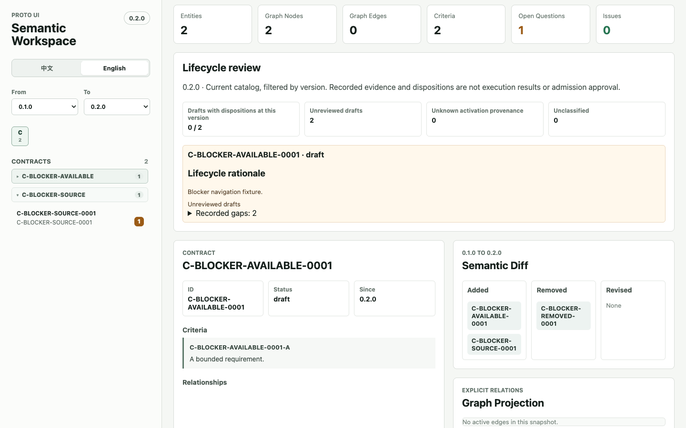
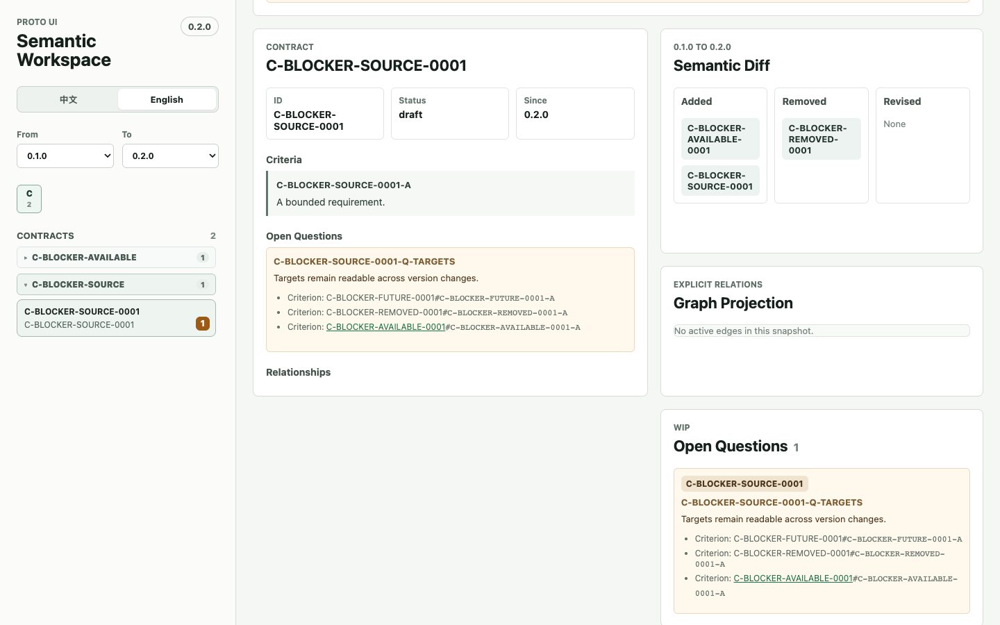

# Lifecycle evidence and blocker scope

Evidence for Issue #670, a bounded follow-up to #635/#592. Captured on September 20, 2026 using Node 22.23.2, Corepack pnpm 10.32.1 and Chromium 153.0.8010.48 on macOS. The final source binding is recorded in `provenance.json`.

## Internal report reproduction

`engine-probe.mts` constructs schema-valid synthetic entities and runs the actual Node loader, lifecycle report and authoring check. Its tiny executable file is only a path-resolution sentinel; it is not evidence that any real product criterion was tested or admitted.

The contract has criteria A and B. Test A supplies an ordinary A mapping. A second passing implementation consumes a case covering B. The negative case constrains that second Test's `verifies` target to A; the control constrains it to B. Measurements come from the returned `row.evidence`, `row.gaps` and `checkSpecLifecycleAuthoring` result, retained in each `engine-result.json`.

| Input | Baseline criterion gaps / evidence records / authoring errors | Candidate criterion gaps / evidence records / authoring errors |
| --- | --- | --- |
| Only Test A | 1 / 1 / 1 | 1 / 1 / 1 |
| Add B-covering case through A-only verification relation | 0 / 2 / 0 | 1 / 1 / 1 |
| Add B-covering case through B verification relation | 0 / 2 / 0 | 0 / 2 / 0 |

The baseline's first divergence is criterion attribution: `relationIds()` discards anchors before the consumed case is matched. The resulting report incorrectly removes the B gap, and the mechanical authoring check has no B error to reject. The candidate retains the applicable target scope through the criterion/case match in `packages/spec/engine/src/lifecycle.ts`. Independent forward and reverse declarations still compose as a union at their own versions. `exercises` remains candidate evidence and does not close a normative criterion gap.

To repeat from an installed repository, download this script and use an absolute output directory:

```sh
node --import tsx /path/to/engine-probe.mts "$PWD" /tmp/lifecycle-before baseline
node --import tsx /path/to/engine-probe.mts "$PWD" /tmp/lifecycle-after candidate
```

Run the first command from the baseline checkout and the second from the candidate checkout. `sourceHashes` binds the executed source files. The maintained two-direction regression matrix is in `packages/spec/fixtures/test/lifecycle-readiness.test.ts`; `independent-scope-observations.json` records 27 additional independent observations of positive paths, versions, exercises and required/pathless diagnostics.

## Native Workspace reproduction

The maintained browser case runs the real Workspace app through Vite and Chromium. Only the dataset network response is replaced with four schema-valid fixture entities. Browser actions use native clicks and the actual version selector. No selected state, URL, CSS or expected output is written to manufacture the result.

Open `#/entities/C-BLOCKER-SOURCE-0001` and select version `0.2.0`. Click the future and removed blocker targets in the Inspector. On the baseline, clicking the future target changes the URL to an unavailable identity and displays `C-BLOCKER-AVAILABLE-0001`, the first available entity. The baseline screenshot shows that wrong Inspector. On the candidate, both absent identities and their criterion labels remain readable text; the selected source and URL remain unchanged. The candidate removed-target screenshot shows both Inspector and Open Questions with the two plain targets and the available target as a live link. The test also navigates to the available target, then changes versions and follows the formerly future target once it becomes available.





The other four `lifecycle-{en,zh}-{1440,390}.png` captures show the existing real-catalog lifecycle panel. The displayed entities and plan come from the generated catalog; the separately tested invalid/conflicting-plan cases are distinct controlled fixtures. Seven original PNGs were visually inspected and preserved without image alteration. The test's native controls and assertions are in `apps/workspace/test/lifecycle.browser.test.ts`.

## Existing catalog impact and limits

The independently executed base64 catalog comparison retained 613 ordinary rows and unchanged summary/evidence records while revealing 57 criterion gaps across five rows: deprecated `C-STATE-INTERACTION-0002` (+1), draft `P-BASE-CHECKBOX` (+19), `P-BASE-TABS-CONTENT` (+11), `P-BASE-TABS-LIST` (+9), and `P-BASE-TABS-TRIGGER` (+17). Raw rows are in `catalog-impact-base64.json`. Root repeated the comparison after synchronizing independently merged main `1947eaeb`; `catalog-impact-base1947.json` has the same 5/57 result, unchanged summary and no removed evidence or diagnostics.

For example, `T-BASE-CHECKBOX-0001-CASE-AUTHORING-ENTRIES` covers `P-BASE-CHECKBOX-AUTHORING-ENTRIES` and is consumed by a recorded passing implementation. Neither the forward criterion anchors in `T-BASE-CHECKBOX-0001` nor the reverse case anchors in `P-BASE-CHECKBOX` include that path. Its candidate evidence remains discoverable via `exercises`, but it cannot supply normative verification outside the declared scope. Similarly, `C-STATE-INTERACTION-0002-G` is covered by a consumed case while the Test's `verifies` list names only A/B/D/E/F and no reverse path supplies G.

These observations reveal declaration gaps. They do not establish an incorrect real activation or a runtime behavior failure. No lifecycle/schema change or broader consumer/export/docs evidence model is included. Semantic admission and independent acceptance remain separate. This branch stores public review evidence in Git and must never be merged into the product tree; retention is with the contributor fork.
