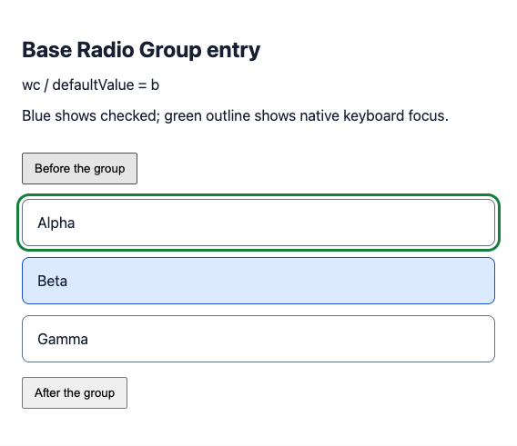
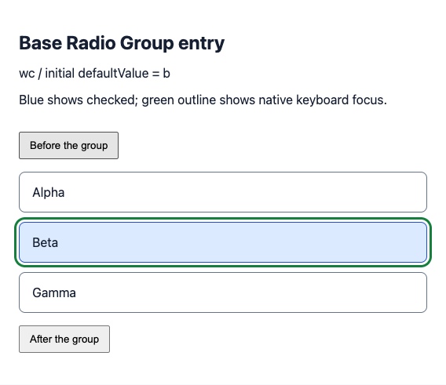
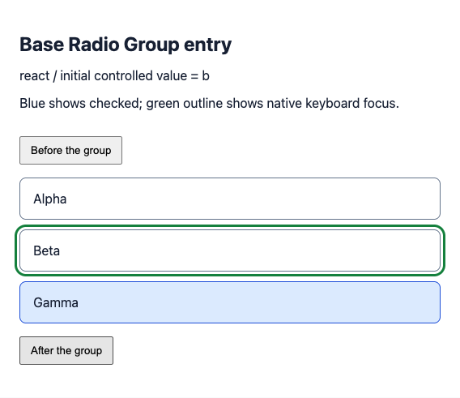

# Base Radio Group initial entry — #668

**Agent's paraphrase of [#668](https://github.com/Proto-UI/Proto-UI/issues/668):** restore the existing selected-or-first initial entry without losing a current preference established by focus, navigation or selection. The [maintainer-approved scope](https://github.com/Proto-UI/Proto-UI/issues/668#issuecomment-5748284579) keeps the Base repair separate from the Shadcn projection in #667.

Baseline: `64e83fef334132bd01bbdb644c881e4b739df888`. Candidate: `8a495da4aa5c170cae98417914af8a27b7b276bc`. Observed 2026-09-20 on macOS, Node 22.23.2, pnpm 10.32.1 and Chromium 153.0.8010.48. All figures show the real public Base Root/Item exports through official WC, React, Vue and Vue 2 Adapters. Blue checked and green native-focus outlines are diagnostic App styling; they do not replace or write the underlying checked, tabindex or focus values.

## Observed transition

The fixture renders Items in order Alpha (`a`), Beta (`b`), Gamma (`c`), with initial `defaultValue=b` or controlled `value=b`. It waits for all checked projections, freezes an initial read, then clicks the preceding App button and presses native Tab. Screenshots are captured before the entry assertions so the baseline failure itself remains visible.

| Observation | Baseline | Candidate |
| --- | --- | --- |
| Initial checked | Beta | Beta |
| Initial tabindex | `0,-1,-1` | `-1,0,-1` |
| Native Tab from preceding button | Alpha | Beta |
| Native Shift+Tab from following button | Not reached after failing entry assertion | Beta |
| Controlled update to `value=c` after entry | Not reached | Gamma checked; Beta retains actual focus and `tabindex=0`; no change event |
| Uncontrolled ArrowRight after entry | Not reached | Gamma checked and focused; exactly one `valueChange(c)` |

The original Root kept the first registered fallback as current when the later selected Item appeared. The candidate separately remembers explicit preference. Actual focus on an already-current Item still records that preference, while the existing selection guard prevents focus alone from selecting it. The behavior is governed by draft `P-BASE-RADIO-GROUP-FOCUS-ENTRY` and `P-BASE-RADIO-GROUP-ITEM-ROVING-PARTICIPATION`; this repair does not activate those entities.

### Same fixture, actual native failure and repair







The baseline and candidate folders contain all eight initial-input/runtime observations. Candidate captures come from the final complete repository test at the stated head; all sixteen images and eight JSON files also matched the independently inspected focused captures byte-for-byte before storage formatting. JSON uses repository formatting with all captured values preserved. The caption was clarified to say **initial** value before the final captures; diagnostic presentation and input steps are unchanged. `provenance.json` records source hashes, and `sha256.json` covers the published packet files.

## Executable reproduction

Use a checkout of the candidate with Node 22 and the repository's pnpm 10.32.1, including bare `pnpm` in child processes. Install from the lockfile and run:

```sh
corepack pnpm@10.32.1 exec vitest run \
  packages/prototypes/base/test/radio-group.test.ts \
  apps/www/test/radio-group-entry.browser.test.ts \
  --maxWorkers=1 --minWorkers=1 --no-file-parallelism
```

The maintained [browser test](https://github.com/HyacinthHaru/Proto-UI/blob/8a495da4aa5c170cae98417914af8a27b7b276bc/apps/www/test/radio-group-entry.browser.test.ts) starts and closes its own local fixture server and emits its capture directory. [Fixture source](https://github.com/HyacinthHaru/Proto-UI/tree/8a495da4aa5c170cae98417914af8a27b7b276bc/apps/www/test/fixtures/radio-group-entry) and [owner-level regressions](https://github.com/HyacinthHaru/Proto-UI/blob/8a495da4aa5c170cae98417914af8a27b7b276bc/packages/prototypes/base/test/radio-group.test.ts) are retained at the candidate commit.

For the failing native comparison, keep the same fixture/test in a disposable checkout and use the baseline's Base Radio Group Root and Item sources. The baseline first-entry assertion must remain failing; do not reorder Items, call focusSelected before entry, or replace the assertion with the observed wrong value. The recorded eight baseline cases each executed native Tab and captured Alpha focused while Beta remained checked.

## Validation and limits

- The initial owner regression failed for controlled/default non-first selection and late registration; the unchanged native-entry expectations failed in all eight baseline runtime/input cases.
- Independent review additionally caught an initial candidate's loss of current after Root focus methods. Three persistent owner cases and four controlled browser Tab-entry assertions failed before correcting the existing Item focus notification order.
- Final focused owner/browser checks: 31 passed. Independent source-resolved probes: 12 passed, including explicit current, structural changes and event ordering.
- Final complete `corepack pnpm@10.32.1 test`: exit 0, 2,379 non-browser tests and 127 browser tests passed; the repository's existing 34 TODO cases remain. Full types: 227 Astro files, zero diagnostics. All 43 public packages built, manifests and nine budgets passed, and 243 documentation pages built. Existing packed React and CLI consumer smoke checks passed (38/43 and 40/43 package closures respectively, with the separate Vue 2 consumer also passing); those general smoke journeys are distinct from the source-resolved Radio Group figures.

**Evidence disposition: complete for the named initial-entry and current-preservation observations; review and merge remain separate.** These are source-resolved Chromium checks, not tarball, SSR, other-browser or general non-Web conformance. The fixture's controlled value update is an App prop update; Tab, Shift+Tab and ArrowRight use native browser input. Group-disabled re-enable and blur/re-entry policy remain outside the approved repair. Broader structural/fallback cases are covered by owner-level tests, not claimed as every browser journey.

The implementation, fixtures, analysis and evidence preparation were AI-assisted using this repository's MIT sources. No human acceptance or publication of a release is implied by this packet.
