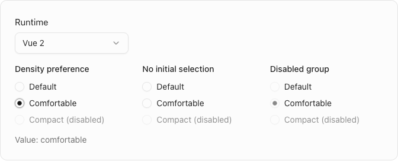
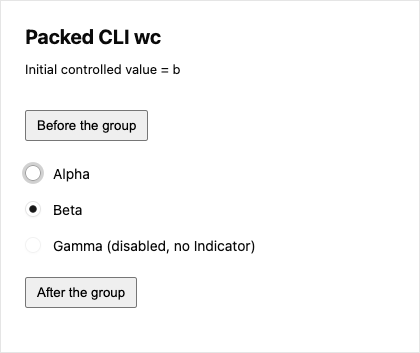

# Shadcn Radio Group final evidence

This packet supports PR #667 and Issue #662. It shows the three-part Shadcn presentation consuming the independently reviewed Base initial-entry repair from #669. The final source commit is `24644469773ee7a67bd3097a8b2e5342b7ec4efc`, based on main `e7961001af1d313b1518be694f866b0e98337b0d`. The draft P/T lifecycle is unchanged.

## Evidence scopes

| Evidence | Executed scope | Source binding |
| --- | --- | --- |
| `preview/` | Original eight public-page cases: WC, React, Vue and Vue 2, each with initial-entry and separate interaction | Final full repository run at `24644469` |
| `consumer/` | Eight installed-package production cases: the four hosts, each controlled and uncontrolled | Packages produced at `465b498d`; all 43 final `24644469` tarballs are byte-identical |
| `provenance/` | Producer commands, package closure/integrity, physical bundler inputs, generated-file invariance, visual inspection and exact tarball comparison | Frozen source and SHA-256 receipts |
| `reproduce/` | Portable preparation, generated-CLI consumers and native capture scripts | No hand editing of generated facades/config/CSS |

The public-page suite preserves its original pre-input tabindex and native Tab assertions. With Comfortable initially selected second, all four hosts expose `[-1,0,-1]`, and Tab enters Comfortable without changing the selection. The separate interaction cases exercise Shift+Tab/Tab, arrow keys and Home/End, empty selection with Enter/Space, pointer cancellation/commit, disabled controls, focus presentation, light/dark and a 320px layout. The final full run passes all eight. The public endpoints use the existing esm.sh runtime URLs; their resolved patch versions are not retained by that suite.



The installed-package fixture keeps fixed item order Alpha/Beta/Gamma with `value=b` or `defaultValue=b`. It uses actual packed CLI `init` and `add` output. The initial native Tab and reverse Tab enter Beta with no selection events. In controlled cases, a pointer request for Alpha emits exactly one `a` event while Beta remains checked; parent updates to `a` and back to `b` preserve explicit Alpha focus/current. In uncontrolled cases ArrowLeft selects Alpha once. Two explicit Indicators render, the disabled third Item has none, Items are 16px and glyphs 8px, Root gap is 12px, dark tint is 0.045, and all narrow cases stay within the viewport. Every case reports no page error or external browser request.



The Web consumer installs 40 Proto UI packages with React/React DOM 19.2.6 and Vue 3.5.29; the isolated Vue 2 consumer installs 38 with Vue 2.6.14. All Proto UI packages resolve to supplied local tarballs, without source symlinks or registry resolutions. The production builds contain 324 and 286 physical input modules respectively, including 299 and 275 installed Proto UI `dist` modules. Root rehashed all 610 physical modules, package locks and generated files; all matched the executed receipts. Vite 6.4.1 and Chromium 153.0.8010.48 are tooling, not product source aliases.

The consumer run used Node 22.23.2, Corepack pnpm 10.32.1 and npm 10.8.2. Producer and execution receipts retain actual versions, times and commands. The final integration only adds the independently merged private spec/Workspace repair; the later full pack at `24644469` proved all 43 archive bytes equal to the consumed pack. This is local candidate-package evidence, not an npm publication or a claim about a registry package with the same version string.

## Reproduce

Use Node 22 and Corepack pnpm 10.32.1. Check out the final source SHA and install its frozen workspace dependencies. From that checkout, use new absolute directories for the pack, prepared consumers and results. The pack command clears its output directory, so never point it at an existing project.

```sh
env -u PROTO_RELEASE_ROOT node scripts/release/publish.mjs --pack --out-dir /tmp/radio-pack
node /path/to/packet/reproduce/prepare-consumer.mjs \
  --repo "$PWD" --head 24644469773ee7a67bd3097a8b2e5342b7ec4efc \
  --release /tmp/radio-pack --out /tmp/radio-consumers
corepack pnpm@10.32.1 exec tsx /path/to/packet/reproduce/capture-consumer.mts \
  --repo "$PWD" --prepared /tmp/radio-consumers --out /tmp/radio-consumers/results
```

The preparation script checks archive integrity and actual installed manifests, runs the packed CLI, and records generated hashes. The capture script builds production bundles without product aliases, audits physical module paths, uses actual keyboard/pointer input and fails on any case violation. The repository supplies build/browser tooling only. `consumers/` contains recorded manifests and locks for inspection; regenerate working consumer files through the helper rather than using the normalized records as an install template.

## Visual review and limits

All 32 installed-consumer PNGs were individually inspected by root. Twelve final public-preview PNGs exactly match the previously inspected focused captures; root individually inspected the other eight. Selected dots, focus transfer, disabled/no-Indicator behavior, both themes and narrow labels remain visible and unclipped. Some immediate updated frames retain the existing CSS transition; they are not presented as settled style endpoints. Every PNG is an unaltered actual component capture.

The historical September 19 packet and record remain available with their initial-entry, HappyDOM 20.14.5 provider and cold Vite discovery failures. The new production evidence does not rerun or reclassify those old environment-specific failures. The separately observed Base group disabled-to-enabled entry gap and blur/re-entry policy remain outside the bounded #668 repair, as disclosed in #669. Forms, invalid state, orientation/loop, Toolbar, SSR, other browsers and non-Web conformance are not newly claimed.

Local paths in JSON have been normalized to the placeholders documented in `path-normalization.json`. Embedded file/receipt hashes retain their original runtime meaning; that ledger records original JSON byte hashes. `SHA256SUMS` hashes the published files after path/format normalization. PNG bytes are unchanged. The source scripts and measured values are retained; no credentials, private prompts or session instructions are included. The evidence branch is retained by the contributor fork and must never be merged into the product tree.
