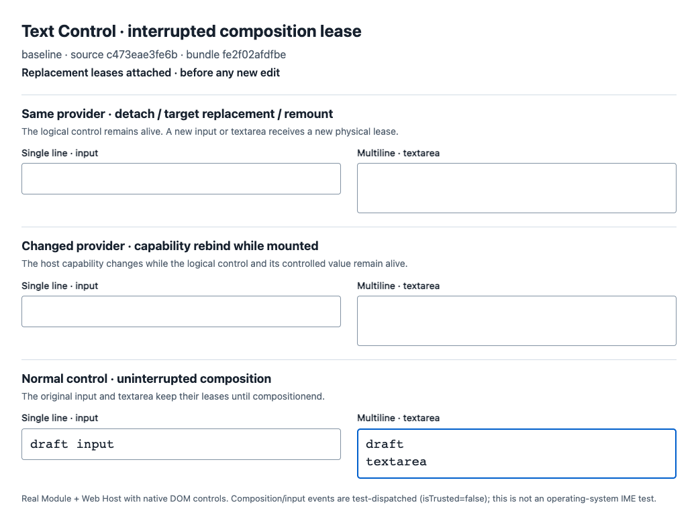
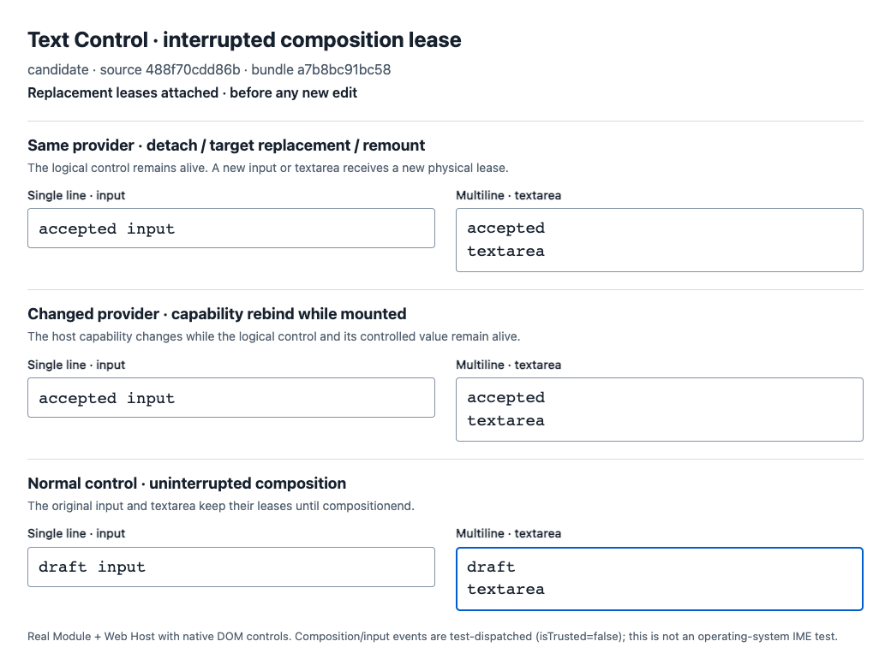

# Text Control composition lease evidence

Product candidate: [`488f70cdd86bef0109eb3faab8fc4cfe0e86f95c`](https://github.com/HyacinthHaru/Proto-UI/commit/488f70cdd86bef0109eb3faab8fc4cfe0e86f95c). Baseline: `c473eae3fe6b66354f5e689fcc1d01241946ed7f`.

Agent’s sanitized request paraphrase: take one additional unclaimed contribution and repair the host-lease composition regression described in [Issue #648](https://github.com/Proto-UI/Proto-UI/issues/648), with bounded changes, tests and actual browser evidence.

## Actual component comparison

The first two rows are the affected input/textarea pairs: same-provider target replacement and changed-provider rebinding. The last row is the uninterrupted composition control. Replacement targets receive their values from the actual Text Control Module and Web Host.





The initial, active composition and normal compositionend captures are included beside these two images. All eight PNGs have been visually inspected.

## Reproduce and inspect raw evidence

[Download the browser source, frozen bundles, traces, assertion logs and source manifests](issue648-browser-evidence-488f70cdd86b.tar.gz). The archive preserves all original measured bytes, includes its own SHA256SUMS and a complete README, and does not include the machine-specific generated browser launcher. GitHub serves this as a download, not a running website.

Use a disposable Proto UI checkout with Node 22, Corepack pnpm 10.32.1 and dependencies from the lockfile. Fetch the candidate branch before following the checkout commands in the archive:

```sh
git -C /path/to/proto-ui-source fetch https://github.com/HyacinthHaru/Proto-UI.git codex/text-control-composition-lease
```

The identical fixture and 109 assertions produce 4 failing replacement cases / 14 failing assertions plus 2 passing controls on the baseline, and 6 passing cases / 109 passing assertions on the candidate. Both have zero page errors. The captured browser is Chromium 153.0.8010.48, Playwright Core 1.58.2, macOS arm64, at 1120×900. All 47 repository bundle inputs were checked against the corresponding Git commit, plus the harness entry; only impl.ts differs between product bundle input sets.

These are actual Chromium DOM controls with test-driven lifecycle/capability transitions and synthetic composition/input events (`isTrusted:false`). This browser scope is complete. Operating-system IME and the interrupted replacement journey through complete Adapters are not claimed. The existing four Adapter integration suites and separate Module tests cover additional boundaries.

## Repository checks and review

[Download searchable validation logs and receipts](validation.tar.gz). Local checkout and temporary-directory paths were replaced with placeholders; original logs are retained locally. No assertion values or outcomes were changed.

- Module regression: baseline 14 fail / 11 pass; candidate 25 pass.
- Module/Web Host, four Adapters and Base Input/Textarea: 8 files / 74 tests pass.
- Types: 230 Astro files, zero errors/warnings/hints.
- Full pnpm test: exit 0; 2,566 main-stage tests pass, 34 existing TODOs, then 26 dedicated browser files / 136 tests pass. The main stage also includes real Chromium Scroll tests.
- All 43 public packages build. React/Vue budget failures already exist on current main; the exact candidate delta and environment appear in the JSON files beside this README. No budget was changed.
- Independent local inspection found one P3 revision-version error, corrected to current 0.3.0-alpha.1. No concrete findings remain on 488f70cd. The final runtime and test bytes equal the reviewed/full-test bytes; the metadata-only correction was followed by authoring, 16 graph/schema tests, regenerated workspace/Agent projections and Agent-document checks.

The first full test overlapped with an independent package build, and a release smoke test encountered a missing Core dist entry. Its failure log is retained. The identical full command passed once the independent build finished, without a source/assertion change. The browser archive also retains launcher preparation errors as infrastructure history.

Local inspection is partial agent review, not a GitHub approval or maintainer acceptance. Required CI and independent maintainer acceptance remain separate. This evidence branch must never be merged into the product.

Codex assisted with implementation, tests and evidence using existing Proto UI MIT source; no third-party/private implementation was supplied and no human code review is claimed.
