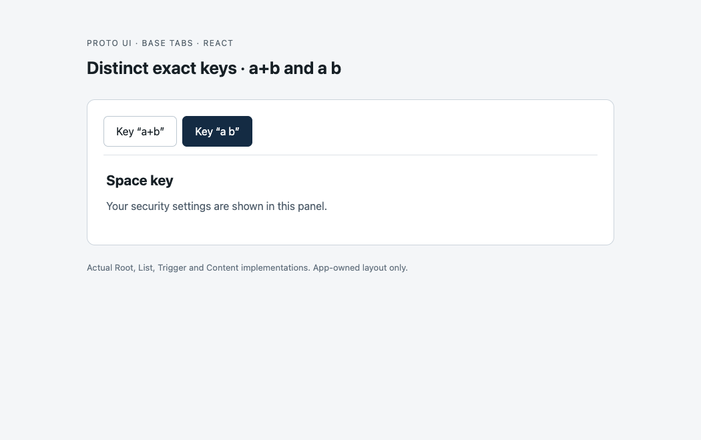

# Issue #549: same-domain anatomy-part relationships

This packet records the implementation candidate for [Issue #549](https://github.com/Proto-UI/Proto-UI/issues/549), under the accepted [#388 checkpoint](https://github.com/Proto-UI/Proto-UI/issues/388#issuecomment-5378970491) and merged [#553 authority](https://github.com/Proto-UI/Proto-UI/pull/553). It covers the structured carrier, exact family/domain/role/key matching, relationship leases, Web identity/token ownership, and reciprocal Tabs migration. It does not deliver Collapsible or Accordion or promote any draft entity.

- Review candidate: `868d3adbd22fae98b8e33ea58a9f3353158c506d`, tree `1cd9e6e5201a77366bef0daf0f3b4e2634e7dc89`.
- Current accepted base: `9d9552bbe0bc747e9b7f2f1ff6f6db3414086424`.
- Original Tabs browser baseline: `b0ed0f5580663ec27c9e9df5e4faad21e59a3d9c`.
- Final feature browser runs actually executed at `fd9fc6b4aa46b2ad18b4ffd685448d36d2ba9ea2`. The only later product commit changes `apps/workspace/test/lifecycle.browser.test.ts`; all feature inputs are byte-identical. These are reused source-bound results, not falsely dated reruns at `868d3adb`.
- Independent local review is **partial / ABSTAIN**, with all three concrete ownership findings resolved. It is not a canonical GitHub review or maintainer approval.
- Runtime, React and Vue package budgets fail on the candidate. Main passes all nine measurements. No budget limit is changed; independent maintainer disposition remains required.

## Executed browser evidence

Chrome `153.0.8010.53`, React `19.2.6`, Vue `3.5.31`, Vue 2 `2.6.14` were used. The fixtures build actual project source and execute real framework/DOM implementations. They do not substitute a data model for the relationship service.

| Fixture | Original baseline | Final candidate | Scope |
| --- | --- | --- | --- |
| WC Tabs | 16 pass / 5 fail | 21 / 21 pass | retained control, lazy A→B→A, colliding escaped keys, missing and duplicate counterparts |
| React Tabs | 16 pass / 5 fail | 21 / 21 pass | same observations and native clicks |
| Vue 3 Tabs | 16 pass / 5 fail | 21 / 21 pass | same observations and native clicks |
| Vue 2 Tabs | 16 pass / 5 fail | 21 / 21 pass | same observations and native clicks |
| Generic authored WC family | not an old-shipped consumer comparison | 22 / 22 pass | public part declarations, live keys/domains, source/target detach, independent host ID changes and disposal |

All **57 final PNGs** were inspected individually. All **57 native AX captures** were reconciled with their DOM observations, with no mismatch. The four Tabs journeys contain 24 trusted clicks; the generic fixture contains 12 trusted host-control clicks. WC Tabs also emits six semantic `CustomEvent` clicks; those are not counted as trusted input. Final fixture, page and console errors are absent.

[Final browser report](reports/final-fd9-report.md) gives exact D/E ordering, source inputs and limitations. [Execution manifest](reports/final-fd9-execution-manifest.json) preserves commands, run times, exit status and input digests. The source rebind receipt distinguishes execution at `fd9` from comparison to the review commit. Individual raw archives contain native mutation records, AX snapshots, DOM observations, results and provenance.

The original Tabs implementation escaped both `a+b` and `a b` into the same ID. After selecting `a b`, the visible Space key panel could have the AX name of the other trigger. Final runs retain the same visible layout but expose the correct `Key “a b”` name and unique target. The screenshots establish the rendered component; the semantic difference is established by saved AX/DOM evidence, not by appearance alone.

| Actual React baseline | Actual React candidate |
| --- | --- |
|  |  |

## Identity ownership and physical replacement

The native ownership fixture runs the real Web projector/registry, Core Runtime/State variation, and existing WC capability provider. It deliberately controls host ID assignments, snapshot epochs, physical binding replacement and host visibility barriers. These are **internal host-contract fixtures**, separate from complete Adapter user journeys.

| Bound source | Same 18 scenarios / 218 checks |
| ------------ | ------------------------------ |
| `8202853c`   | 177 pass / 41 fail             |
| `83e7bd1e`   | 201 pass / 17 fail             |
| `34937f8e`   | 206 pass / 12 fail             |
| `fd9fc6b4`   | 218 pass / 0 fail              |

The 218 checks comprise 141 contract observations and 77 fixture controls. All 300 AX and corresponding DOM documents across these four runs were read and reconciled. Historical failing states remain failing even when AX faithfully agrees with their DOM. No screenshots of logs or invented business UI stand in for these internal claims.

[Ownership report](reports/ownership-native-report.md) describes the original independent findings, real State replay before observer delivery, detach-before-removal, projection-before-reveal, same-epoch physical source/target replacement, old epochs and authored-ID conflicts. The three local source-review findings and their resolved status are retained under [review](review/).

## Validation and budget boundary

[Validation receipt](validation/final-receipt.json) is the final command/result index. Compressed logs retain the earlier BOM pre-suite failure, obsolete release fixture failure, deliberately interrupted `34937f8` browser run, and `fd9` Workspace browser fixture failure. They are not described as completed successful runs. The final Workspace fixture change retains draft admission, version, rejected catalog/plan and conflicting disposition tests; its focused suite passes 7/7.

Local complete testing uses the normal `pnpm test` command and both repository phases, with only `VITEST_MAX_THREADS/FORKS=2` and `VITEST_MIN_THREADS/FORKS=1`. It is not evidence that the default CI worker configuration passed. The main phase includes an actual Chromium Scroll test and must not be called entirely non-browser.

[Budget report](BUDGET.md) binds the unchanged budget script and same-environment base/candidate measurements. Runtime is 65,865 / 64,000 bytes, React 85,351 / 83,500 and Vue 85,093 / 83,500. The other six entries pass. This is the candidate's own additional eager-closure cost, not a pre-existing main failure.

The built documentation has 245 pages. English and Chinese Base Tabs pages were checked at 1440px and 390px, with actual WC selection. Twelve captures are individually inspected under [docs-preview](docs-preview/). They include viewport excerpts rather than complete prose coverage; the mixed-language Chinese heading did not match the optional scroll locator, so those two prose captures show the introduction. DOM text checks confirm the added relationship explanation. Four Pagefind `ERR_ABORTED` requests are retained, with zero page/console errors and no horizontal overflow. Other frameworks are exercised by the separate feature fixtures, not claimed from this WC documentation preview.

## Reproduction and artifact layout

Install this repository's declared dependencies using Node 22 and `corepack pnpm@10.32.1`. Extract [the final harness](harness/final.tar.gz) outside the source checkout. Use a fresh external output directory:

```sh
SOURCE_ROOT=/path/to/exact/checkout OUTPUT_DIR=/path/to/new/wc ADAPTER=wc node tabs-probe.mjs
SOURCE_ROOT=/path/to/exact/checkout OUTPUT_DIR=/path/to/new/react ADAPTER=react node tabs-probe.mjs
SOURCE_ROOT=/path/to/exact/checkout OUTPUT_DIR=/path/to/new/vue ADAPTER=vue node tabs-probe.mjs
SOURCE_ROOT=/path/to/exact/checkout OUTPUT_DIR=/path/to/new/vue2 ADAPTER=vue2 node tabs-probe.mjs
SOURCE_ROOT=/path/to/exact/checkout OUTPUT_DIR=/path/to/new/generic node part-probe.mjs
SOURCE_ROOT=/path/to/exact/checkout OUTPUT_DIR=/path/to/new/ownership EXPECTED_HEAD=fd9fc6b4aa46b2ad18b4ffd685448d36d2ba9ea2 node ownership-probe.mjs
```

The native ownership driver requires its exact source head. Historical source and harness revisions remain separate. Set the documented Chrome executable override if required by the driver. The source resolution follows the actual public package exports; this is source-bundle evidence, distinct from the local review's built-dist/Happy DOM controls.

- `runs/<run>/raw.tar.gz`: complete saved text records for that run, including results, traces, provenance, esbuild metafile and captured AX/DOM. PNG files are directly viewable beside the archive for the formal baseline and final visual runs.
- `harness/*.tar.gz`: exact executed or explicitly historical fixture/runner bytes, retaining original filenames. Archives avoid automatic formatting of historical source.
- `reports/`: narrative and machine-readable aggregate reports. For the formal baseline, final and ownership runs listed above, original `<run>/file.json` names refer to members of that run's raw archive. Superseded intermediate passing integration-3 reports stay local and are not used for the current verdict.
- `review/raw.tar.gz`: the independent local `repro-*` scripts and results referenced by source reviews, with local paths explicitly redacted. Remap those paths before use; these scripts are not claimed to be verbatim runnable uploads. The final native harness is preserved verbatim separately.
- `validation/*.log.gz`: preserved command output; decompress normally with `gzip -dc`.
- `redaction-index.json`: original local SHA-256, published text SHA-256 and archive member mapping. Local paths and verbose PATH environment listings are redacted. Three narrative reports clarify public archive locations and omitted local artifacts; no recorded verdict is changed. Top-level JSON/Markdown may receive repository whitespace formatting. PNG and final executed harness bytes are unchanged.
- `manifest.json`: published file byte hashes, excluding itself. Compressed archives use fixed timestamps. Public packet verification compares downloaded bytes, not only filenames or HTTP success.

Compiled JavaScript dependency bundles and source maps are omitted to keep retained Git assets small; their hashes and input metadata remain. Rebuilding uses the existing lockfile dependencies. No private prompts, credentials, skill packets or user messages are included. This evidence branch belongs to the contributor, is retained for this review, and must never merge into the product branch.

## Explicit limits

These checks do not establish all browsers, operating systems, screen readers, arbitrary native IME timing, complete focus/keyboard conformance, long-term hidden framework behavior, every consumer family, stable lifecycle admission, trusted CI, maintainer approval or actual merge. Generic and ownership host stimuli are declared separately from trusted user clicks. Host ID changes reconcile at actual observer delivery or before the next projection/revocation; setter interception is not claimed. No unselected Shadow, Disclosure, Collapsible or Accordion implementation is included.
