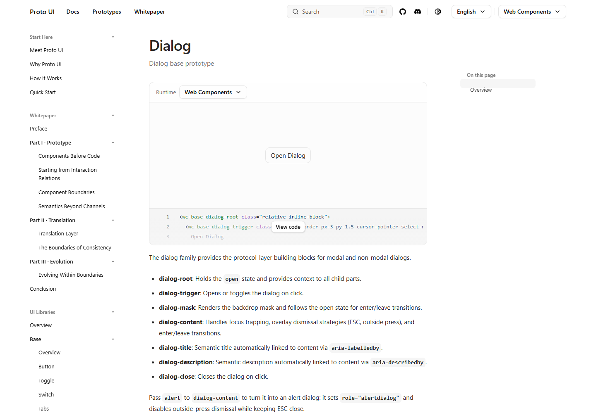
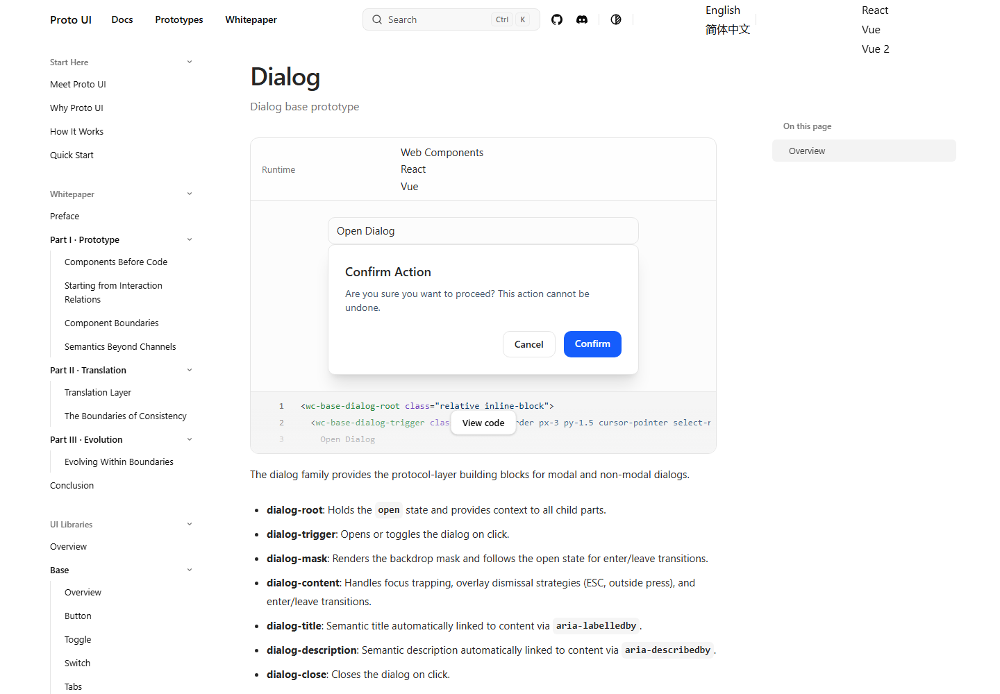
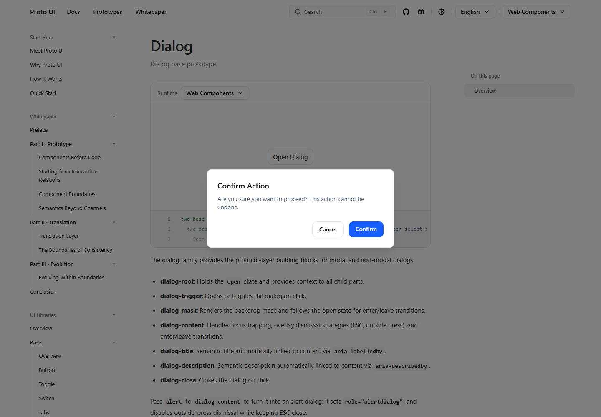
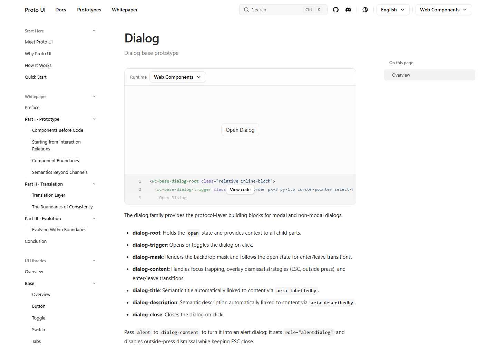

# Issue #663 — Windows production-preview source IDs

This packet records the Windows docs-preview regression in [Issue #663](https://github.com/Proto-UI/Proto-UI/issues/663), baseline `9eb93e9ba96fe1f88e9dade194fa838fbdc2c18f` and candidate `28eccdb24efb76faa9d6f43a4f8aefbe157860ef`. The product change is one normalization of the existing resolver's returned ID, after its native filesystem check, plus two portable regression cases. Core context storage, AsHook semantics, dependencies, budgets and lifecycle are unchanged.

**Agent request paraphrase:** restore ordinary Windows production-build/preview initialization and the existing Base Dialog ARIA and modal-lock behavior. This is attributed to the public Issue and [bounded claim](https://github.com/Proto-UI/Proto-UI/issues/663#issuecomment-5768702294), not a disclosure of private prompts. The original report used historical `ddac15da`; the runs here use current baseline `9eb93e9b`, not that historical checkout or the live site's unknown revision.

## Actual browser reproduction

The unchanged [probe](../../validation/www-source-paths/probe-built-preview.mjs) navigates the actual built `/en/ui-libraries/base/dialog/` route at 1440×1000. Served HTML must exactly match the checkout's production HTML. It uses native pointer clicks on Open Dialog/Cancel, the existing View code Button, and the public runtime Select. It waits for observed entered/detached states and overflow restoration, not a fixed hydration delay. No fixture changes Core state, CSS, attributes, events, or timeouts.

| Run | Source | Environment | Observed outcome |
| --- | --- | --- | --- |
| [Windows ordinary baseline](https://github.com/HyacinthHaru/Proto-UI/actions/runs/35669329935) | `9eb93e9b` | Node 22.23.2, Windows x64, Chrome 152.0.7977.83, Playwright 1.58.2 | Desired-behavior probe exits 1: 13 of 30 reached checks fail; 45 AsHook errors per fresh page, 135 across three loads. WC Content is incorrectly inline, lacks role/aria-modal, and body overflow stays unlocked. |
| [Windows graph diagnostic](https://github.com/HyacinthHaru/Proto-UI/actions/runs/35669782343) | `9eb93e9b` | Same Node/Windows baseline and lockfile | Separately records the two retained client context IDs; browser is intentionally not repeated in this diagnostic run. |
| [Windows ordinary candidate and diagnostic](https://github.com/HyacinthHaru/Proto-UI/actions/runs/35670310173) | `28eccdb2` | Node 22.23.2, Windows x64, Chrome 152.0.7977.83, Playwright 1.58.2 | Probe exits 0, 58/58 checks, zero page/console/AsHook errors. WC, React and Vue actually mount and complete open/Cancel. Native Windows also passes both portable resolver cases. |
| POSIX controls | `9eb93e9b` and `28eccdb2` | Node 22.23.2, macOS arm64, Chrome 153.0.8010.53, Playwright 1.58.2 | Both ordinary production previews pass 58/58, including actual WC/React/Vue mounting. |

A successful baseline **workflow** means its expected product failure was captured; it does not mean the baseline passed. React/Vue baseline labels identify attempted fresh-page journeys. Their runtime Select failed before switching, so the remaining WC DOM is not counted as React/Vue evidence and their downstream Dialog checks are not marked passed. Candidate and baseline execute the same probe; the control-flow difference explains 30 reached checks versus 58.

Raw measured DOM, ARIA, geometry, body overflow/priority, focus, errors, native events and source hashes are in the reports: [Windows baseline](windows/baseline/report.json), [Windows candidate](windows/candidate/report.json), [POSIX baseline](posix/baseline/report.json), [POSIX candidate](posix/candidate/report.json). Observation times are recorded there. The Windows probe's committed LF bytes, converted to checkout CRLF, exactly match its recorded runner hash on both runs.

### Actual component captures

Every published PNG was inspected individually. These are actual production-page captures, not simulated state or log pictures.

| State | Windows baseline `9eb93e9b` | Windows candidate `28eccdb2` |
| --- | --- | --- |
| Initial |  |  |
| After Open Dialog |  |  |
| After Cancel |  |  |

Supplementary candidate captures include [React open](windows/candidate/react-open.png), [Vue open](windows/candidate/vue-open.png), and [working View code](windows/candidate/react-site-button.png); their initial/closed counterparts are adjacent. The POSIX directories retain all ten captures per revision.

## First divergence and repair

The expected boundary is the existing draft [C-AS-HOOK-0001 B/C](https://github.com/Proto-UI/Proto-UI/blob/9eb93e9ba96fe1f88e9dade194fa838fbdc2c18f/spec/contracts/C-AS-HOOK-0001.yaml) and [C-AS-HOOK-0002 A/B/C](https://github.com/Proto-UI/Proto-UI/blob/9eb93e9ba96fe1f88e9dade194fa838fbdc2c18f/spec/contracts/C-AS-HOOK-0002.yaml): an AsHook attaches to its caller within that caller's setup. Dialog expectations come from draft [Content A11Y-ROLE](https://github.com/Proto-UI/Proto-UI/blob/9eb93e9ba96fe1f88e9dade194fa838fbdc2c18f/spec/prototypes/P-BASE-DIALOG-CONTENT.yaml) and [Mask MODAL/PRESENCE](https://github.com/Proto-UI/Proto-UI/blob/9eb93e9ba96fe1f88e9dade194fa838fbdc2c18f/spec/prototypes/P-BASE-DIALOG-MASK.yaml). Content projects `role=dialog` and `aria-modal=true`; active/leaving Mask owns the body lock. These entities remain draft.

In the client graph, package-subpath imports used the website plugin's native Windows path, while relative imports used the normal Vite slash form. Both spellings resolve to exactly the same physical `packages/core/src/internal.ts` bytes, but Rollup keeps distinct IDs:

| Baseline retained client representation | Observed importers/exports | Rendered length |
| --- | --- | --- |
| `D:/a/Proto-UI/Proto-UI/source/packages/core/src/internal.ts` | Core `prototype.ts`/`delay.ts`; getter exports only | 352 |
| `D:\a\Proto-UI\Proto-UI\source\packages\core\src\internal.ts` | Runtime instance, kernel, callbacks, privileged hooks; enter/exit and related exports | 630 |
| Candidate single slash ID | Both importer groups, all eight exports | 878 |

[Baseline graph projection](graphs/baseline-client-context.json), [candidate graph projection](graphs/candidate-client-context.json), and [binding receipt](graphs/baseline-binding.json) retain exact IDs, real paths, source hashes and containing chunks. These are client counts; separate SSR instances and eliminated modules are not counted as duplicate client stacks.

The duplicate module-local arrays explain why the Core reader cannot see the Runtime writer's active setup context. That explanation combines measured identities/importer edges with the unchanged `internal.ts` implementation; no private context value was injected or represented as a runtime observation. The fix normalizes only the resolver's successful return to slash form, allowing both import routes to share the existing module.

The complete diagnostic asset sets differ from their paired ordinary builds in seven unrelated JS entries, so they remain **separate diagnostic variants**. This is not hidden by normalizing hashes. POSIX controls also produced the same seven export-alias/hash changes between two ordinary builds; one observer output exactly matched a subsequent ordinary output across 1,945 assets. [Control record](graphs/posix-observer-controls.json) and [first alias difference](graphs/posix-export-alias-diff.txt) preserve that limitation.

The affected context chunk itself is byte-identical between diagnostic and ordinary output, including the original failing Windows browser run: baseline [adapt.CK8Rsqlm.js](graphs/baseline-adapt.CK8Rsqlm.js.txt), candidate [adapt.B1J8vIjo.js](graphs/candidate-adapt.B1J8vIjo.js.txt). All ten Windows CSS assets are identical between baseline and candidate. Ordinary generation reported a modified CSS working-tree status, but Git diff was empty; candidate generated CSS bytes exactly match the committed LF blob. No semantic stylesheet change is claimed or included.

## Validation and limits

The portable regression executes the actual configured resolver source, using real package exports and a mocked native path/exists boundary. Before the fix the Windows case fails and POSIX passes; afterward both pass, including on native Windows. It does not independently cover all export mappings, filesystem rules, or Vite registration. The ordinary browser builds provide the integration evidence. An earlier attempt to import all Astro integrations in Vitest failed before test collection; its log is retained as harness calibration, not the product red case.

Local validation commands and completed exit codes are recorded in [validation-commands.json](validation-commands.json); final aggregate results are recorded in [validation.json](validation.json). Local full-test execution uses the unchanged default two-stage plan with `VITEST_MAX_THREADS=2`, `VITEST_MIN_THREADS=1`, `VITEST_MAX_FORKS=2`, `VITEST_MIN_FORKS=1`, without CLI test filters or timeout changes. Its main phase includes real Chromium Scroll coverage. The completed local command exits 0: 2,582 main-phase tests, 34 existing TODO, then 26 browser files / 136 tests. Types report 231 files with zero errors/warnings/hints; 43/43 public packages build and all nine budgets pass. Runtime is exactly 60,000/60,000 bytes, with zero margin. Default upstream CI remains a separate acceptance condition.

The browser initiates native pointer input, but its passive observer also sees the Button protocol's outward `CustomEvent("click")`: candidate Windows records 33 trusted events and one untrusted semantic click after the trusted View code pointer/click sequence. The harness does not dispatch that event. Do not label every captured event as trusted. Three `pagefind.js` `ERR_ABORTED` request records across the three candidate page loads remain visible; zero page/console errors does not mean all network requests succeeded.

Evidence is complete only for the stated production-page, source-ID and observed WC/React/Vue journeys. It does not establish Vue 2 repair, other browsers, all docs routes, dev-server behavior, complete keyboard/focus/accessibility conformance, or the historical `ddac15da` environment. The [final independent local report](review/independent-local-review-final.md) is partial/ABSTAIN and is not a GitHub approval. Maintainer review, required CI and actual merge remain separate.

This dedicated evidence branch is retained by HyacinthHaru and must never merge into the product branch. Actions artifacts have 30-day retention and may require login; these pinned Git files provide the durable public fallback. PNG/context-chunk bytes are unchanged. Private local filesystem prefixes are redacted from text; the exact transformation inventory is in [publication-transforms.json](publication-transforms.json), and the final file manifest excludes itself. No private prompt, token, secret or user setting is included.

## Compiled evidence attribution

The two unmodified context-chunk byte snapshots contain Proto UI at the pinned baseline/candidate under its [MIT license](LICENSE-Proto-UI.txt), and existing bundled Floating UI modules: `@floating-ui/utils@0.2.12`, `@floating-ui/core@1.8.0`, `@floating-ui/dom@1.8.0`, all under the identical [MIT license and copyright notice](LICENSE-Floating-UI.txt). Their exact installed module paths appear in the graph projections. They are build evidence, not newly copied third-party implementation in the product fix. The `.js.txt` filenames preserve the emitted bytes without formatting or presenting these snapshots as a hosted application.
