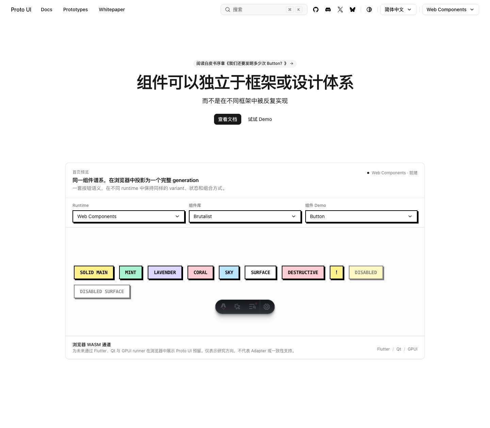
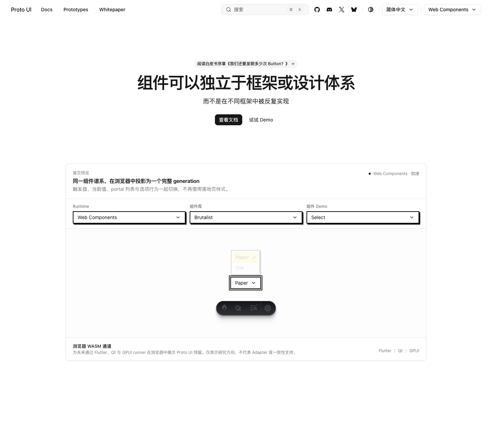

# #688 — GPUI snapshot and projection-input evidence supplement

**Exact-head evidence supplement; canonical CI completed successfully.** Product head is `2b9529fb8236b6051128d857cf4a1309bed91b84`, tree `a6236e383f9e902c64f5a2356a7ccc39db10d4ae`. This packet preserves failures and controls; it does not announce maintainer approval or merge.

Agent request paraphrase: Complete the existing Issue #549 contribution and resolve the actual integration and validation issues encountered.

The GPUI peer now caches pre-view non-null A11y IR and carries it in `projection.install`, avoiding an early standalone snapshot before the host has an installed epoch. The archived initial two-failure control includes one invalid null-on-public-dispose premise. After that premise was corrected, the same 14 tests show 1 fail/13 pass before the fix and 14 pass after it. This is not evidence that a view-detach/null callback was exercised.

The later browser investigation established a narrower input fact: a trusted forced click intended for the Brutalist Switch option actually landed on the retained Button content DIV. No following `valueChange` was recorded in that input buffer. The one-line test correction uses normal click actionability/hit checking and retains every outcome assertion and timeout. Its candidate input control then hit the actual Switch and Select options and recorded matching value changes. The exact animation/flip/geometric mechanism was not isolated.

| Evidence | Recorded outcome and limit |
| --- | --- |
| Two unmodified 8595 full local runs | Each main 2720 pass; browser 136 pass/1 fail; both exit 1. Canonical 8595 green does not erase these failures. |
| Original isolated five-case file | 4 pass/1 fail; independent server, not the full shared-server history. |
| Three earlier diagnostic positives | 2 pass/3 skip; 2 pass/3 skip; 5 pass. Instrumentation/path/filter differences remain; these did not prove a repair. |
| Labelled and captured reds | Separate Switch request, Select request with retained Switch, and input-observed Switch miss with retained Button. Do not conflate their iterations or click-time and post-timeout samples. |
| One-line candidate, uninstrumented focused file | All five cases pass. These actual test bytes equal the final committed test blob. |
| Candidate native observer control | All five cases pass; 18 trusted clicks and 7 WC value changes. Actual source was 8595 + saved candidate + a separately hashed diagnostic patch. Only the saved base candidate bytes bind verbatim to 2b. |

Canonical [CI run 36912872501](https://github.com/Proto-UI/Proto-UI/actions/runs/36912872501) completed with **12/12 repository jobs successful**. The default main stage passed 499 files/2720 tests, with 3 skipped files and 34 TODO; browser passed 27 files/137 tests, including all five original projection tests. Its checkout tree equals the exact 2b product tree. Package checks passed 44/44 builds, 44 manifests and nine budgets; Rust passed 154 with 1 ignored, and actual Node interop passed 1. Test/package logs verify Node22.23.3; interop verifies22.23.2. The complete independent local reconciliation is archived separately from earlier pending reviews. Historical pending receipt fields stay as recorded; [packet.json](packet.json) points to the terminal evidence without rewriting history.

The archive keeps the complete named logs, source/diffs, DOM/AX and observations. [raw-public-map.json](raw-public-map.json) maps every raw source to its final staged bytes and exact duplicate reuse; [records.tar.gz](records.tar.gz) has a member manifest. Complete PATH values and known machine paths are redacted; private authorization/routing records are excluded. Path-redacted source is a **redacted derivative**, not byte-identical executed code or a claim that it runs unchanged. Raw execution hashes remain distinct. [manifest.json](manifest.json) binds every outer file except itself. Final source binding confirms 49 net paths versus f5, with 315 tracked Web inputs, 46 prior feature files and 3 GPUI files unchanged. Extract the archive to inspect its full named logs, source and observations.

The five original PNGs are copied once without editing or re-encoding: four historical images from the finite inventory plus the added candidate image. The two main comparison images below are respectively the genuine post-timeout Button state and the candidate Select state. The candidate Paper/Ink popup is in its closing fade, not a stable open-menu assertion; the original dev toolbar remains.

| Observed input failure | Candidate native control |
| --- | --- |
|  |  |

Other retained originals: [early positive initial](screenshots/projection-scope-diagnostic/passive-captures/initial.png), [early positive final](screenshots/projection-scope-diagnostic/passive-captures/success.png), and [separate Select-request failure retaining Switch](screenshots/projection-scope-diagnostic/minimal-message-failure-capture/capture/failure.png). Each belongs to its own timestamped run, not a post-commit rerun.

Prior immutable evidence is linked only: [17a2 native evidence and 57 PNGs](https://github.com/HyacinthHaru/Proto-UI/tree/4916d8b9fa5ec9cc9c41bea247c7d410f492e680/evidence/2026-09-29/a11y-part-relationships-main-17a2cff9) and [f5/17a2 GPUI composition failure](https://github.com/HyacinthHaru/Proto-UI/tree/c3e9cfc44a1e286dae5ac5daa0fac48cf4a294ff/evidence/2026-10-01/a11y-gpui-composition). Old source heads and dates are not relabeled. Local independent reviews remain partial/ABSTAIN and are not GitHub dispositions.
