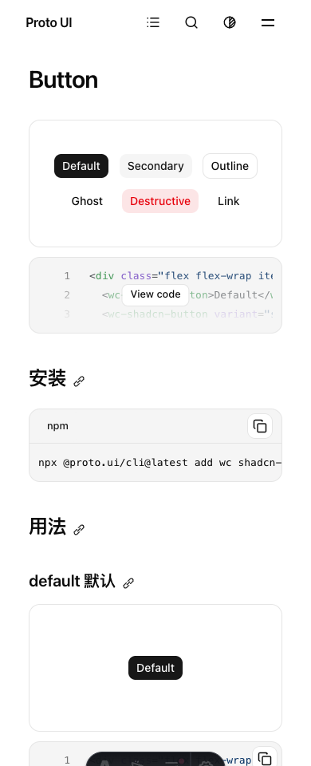
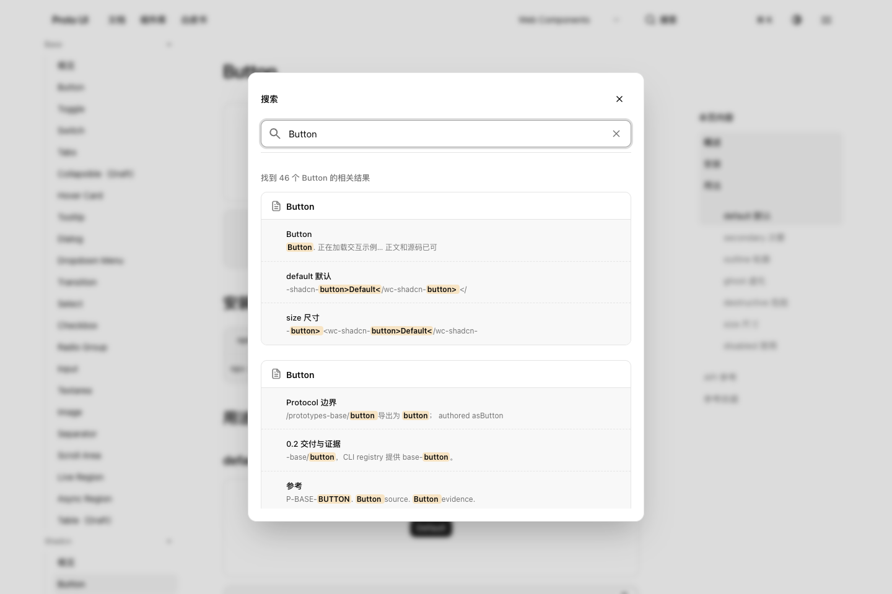
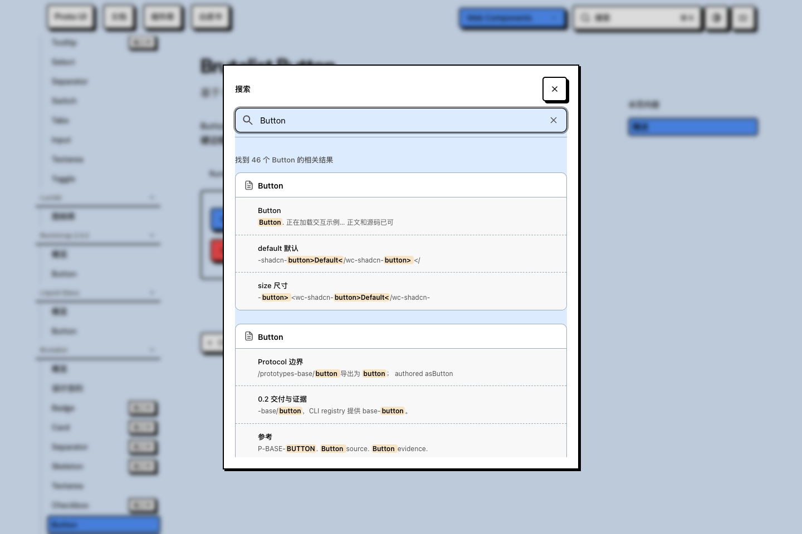
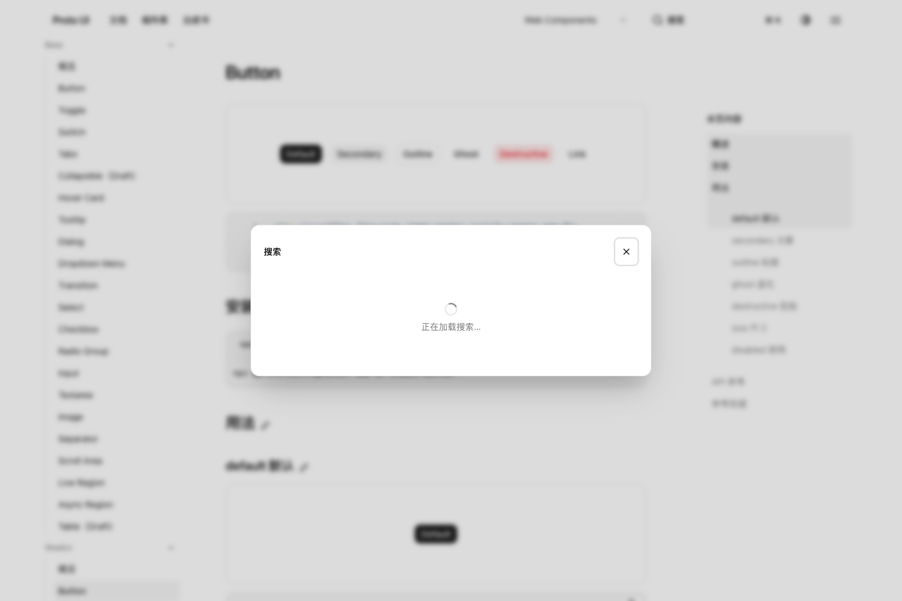

# Search #848: current readiness and cold-open evidence

Agent request paraphrase: address the Search startup regression and directly related readiness/cold-open problems, verify them, and submit the bounded change. Source: [Issue #848](https://github.com/Proto-UI/Proto-UI/issues/848) and current user-directed contributor work. This branch stores evidence only and must never merge into product main.

Application baseline: `c8d0ca8cecd6ac12b27678df40a86722d4795068`. The candidate binding names every changed source hash. All observations below were made on 2026-10-07 in the source worktree before its commit, not on a relabeled historical head. Node 24.21.0, pnpm 10.32.1, macOS arm64, Chrome 154.0.8037.98; Vitest max2/min1.

The restored 1000ms window starts after `networkidle` and grades the current active open command. Baseline current product already passes strict30/30 plus selected5/5. Candidate owner-bound original30/30 and selected5/5 pass. Eight scene records and five repeated light390 records retain true start/deadline/owner/generation. Readiness before the stage gives a negative delta, not a negative duration. These are local dev-command results, not production Pagefind latency or a historical root-cause proof.

`cold-import-red.log` retains the actual Astro-script service test: runtime1/UI0 while runtime is held after successful HEAD. The candidate starts both imports without constructing UI until runtime resolves. `stale-ready-red.log` retains the clock-injected serialized-oracle defect: old owner999ms used for current owner1500ms. Candidate rejects that timestamp. Tests preserve lifecycle, error and cancellation assertions.

`focused-100.log`, `integration-78.log`, `browser-30.log`, types/build/production-graph logs retain their actual result boundaries. The first obsolete serial-import assertion, two incomplete fake-host dataset observations, and private-probe `.ts` ESM setup failure are preserved. They remain failures; subsequent corrected controls do not overwrite them.

The separately owned local production preview used untouched generated Pagefind1.4.0 assets. Fourteen controls passed: five Shadcn cold opens, one Brutalist cold open, and runtime-held/close-held/HEAD503-retry/hover-intent for both. Native Ctrl+K opened the dialog, focused real input, and a Button query returned real same-origin documentation destinations responding200. Runtime GET and HEAD503 are explicit network injections. The real UI bundle returned while runtime GET was held; no input existed until release. Closing prevented late UI and reopening produced one input. Intent prepared without constructing UI. This is a macOS diagnostic, not the Linux-only managed production runner or canonical CI. Five candidate-only runner-send→input observations88/75/79/141/74ms are descriptive, include IPC/observation overhead, and establish no paired speedup.

## Real captures

Original documentation command journey before opening. Readiness is established by the executable oracle, not inferred from pixels.

The real dev dialog shows its production-only search notice. This is not a Pagefind result.

Native dialog and Pagefind visuals remain CSS-owned. These captures show actual candidate queries, not historical failure reproduction.

The UI module request has completed but construction still waits for runtime. The network hold is diagnostic injection; no displayed state was manufactured.

## Data and limitations

`production-native-14.json.gz` decompresses to the full path-sanitized raw result, including the instrumented observer/input timeline. `production-native-summary.json` removes only timeline fields for reading. `raw-public-map.json` binds original private and derived public bytes. PNGs are unmodified original bytes. Public source/logs replace three local path literals; the sanitized `.mts` source is a source walkthrough, not the exact executed bytes or a claim of portable execution. Original raw bytes remain private.

Evidence is complete for these named local command/service controls and five published captures. Official exact-head CI/Linux production recovery, Windows behavior, independent maintainer acceptance and historical delay attribution remain verification debt. The original #848 failure, earlier props A/B and #847 adverse immediate-open result remain unchanged. No whole-repository test, all-Adapter native performance, or universal1s loading guarantee is claimed.

## Publication reconciliation

First evidence commit `700630596c88016f2094a20b9e17f70d984d2c08` included fifteen files; repository ignore rules omitted twelve prepared `.log` files. Anonymous readback correctly failed404. This additive correction includes every retained log, preserves the first commit, and requires a new whole-package byte verification before publication is reported complete.

Independent local source/evidence review found no unresolved concrete finding; one obsolete timeout comment was corrected. See [the local review](independent-review.md). It binds the staged tree subsequently committed as `a96ecf605f15e60f4ea56f0c82ab5cf0ec8a199b`, keeps partial/ABSTAIN, and establishes no GitHub approval.
