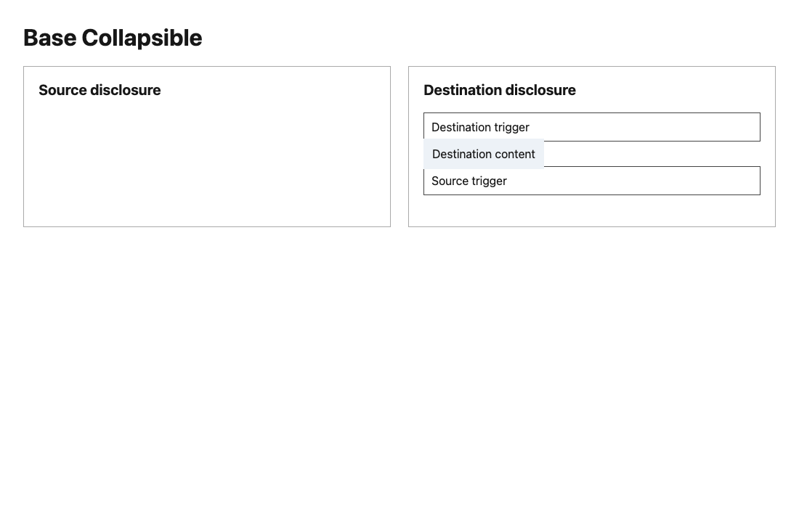
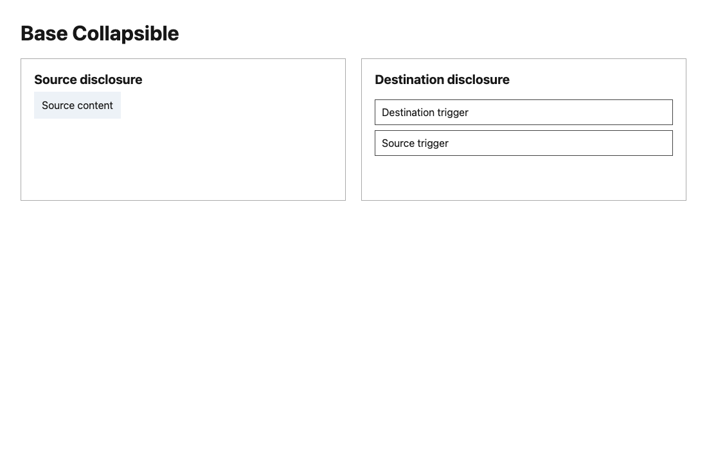
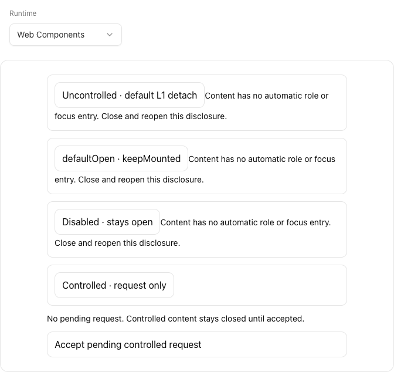
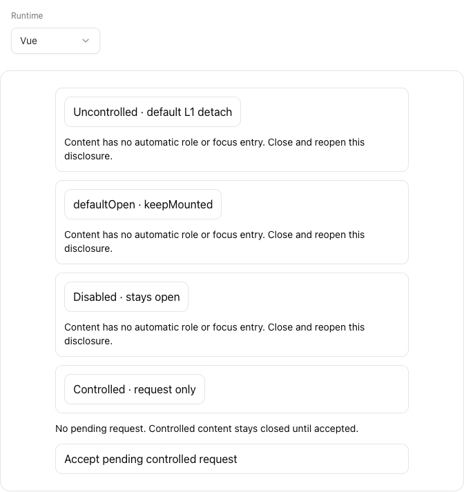
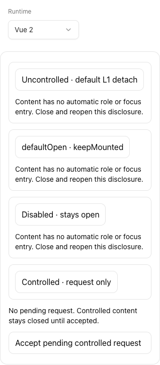

# Anatomy / Runtime lifecycle evidence for #883 C

Source: [`02a653dc`](https://github.com/Proto-UI/Proto-UI/commit/02a653dc0907e262102b2dd6709f2d95fd4d5413), based on exact main `ea197278`. This packet retains original failures and controls. All executed source bytes were later bound to that signed commit; it does not claim postcommit execution or canonical CI success.

The failed-created Runtime returned an error without handing a session to its owner, leaving Delay, State and Anatomy subscriptions alive. The bounded repair retires that instance while caps are readable, and preserves creation plus cleanup/diagnostic errors. The general callback-error policy remains open. Rejected WC reparenting now synchronizes Anatomy before acceptance and restores its former logical parent on rejection. Physical DOM movement remains an authored composition operation.

| Observation | Baseline | Candidate |
| --- | --- | --- |
| Original three-file test selection | 14 failed /27 passed /3 unhandled | 45/45 passed after four additional direct Delay controls |
| Same stronger Runtime controls | 9 failed /12 passed | 21/21 passed within the final focused selection |
| Runtime-only control | 42 passed,3 remaining adoption failures,0 unhandled | Final WC transaction resolves the remaining3 |
| Rejected Trigger / Content / detached-Root Content native move | Source role0, destination2 | Source1,destination1, original state identities retained |
| Actual Source Trigger pointer activation after rejection | Destination opens | Source opens; destination remains closed |
| Extended source selection | Not asserted as a whole baseline run | 803 passed,34 TODO;102 passed files/3 skipped files,max2/min1 |
| Original public browser file | Not rerun as a baseline here | 5/5,WC/React/Vue/Vue2 plus Chinese390px |
| Types / packages | Historical baseline retained separately | 513 Astro0errors/0warnings/6hints;44builds/44manifests |
| Local budgets | Current strict caps retained | 8/9 pass;WC117874/117850,24 over;source canonical CI confirms the same cost; final numeric-head check separate |

The native fixture executes real WC/Base asHooks and native Custom Element reactions at light1100x700. Native errors are captured and their default reporting prevented, with every observed error retained; Chrome does not synchronously throw from append as HappyDOM does. The two pointer clicks are trusted browser inputs; DOM moves and Root presence calls are explicit composition operations. Both bundles bind all318 repository source inputs, with5 third-party/private recipe inputs separate.

## Actual component comparison

The surrounding neutral panels are diagnostic layout, not a new design-language projection. The Source Trigger physically remains in the destination after its authored move; acceptance rejection restores logical ownership rather than moving user DOM behind its back.

The four following captures are the unchanged original public Collapsible journeys, separate from the rejected-adoption fixture. They show exercised source components, not universal visual or accessibility acceptance.

## Scope and evidence debt

`validation.json` binds source, environment, counts, failures and raw/public hash mappings. `native-adoption.json` retains adjacent native observations and inputs; `native-inputs.json` separates all tracked inputs. The immutable archive retains red/green logs, both native recipe setup failures and independent source/edge observations. Public recipes and logs are path/origin-sanitized derivatives; raw hashes bind private originals, not runnable-byte or full platform parity claims.

The first whole coverage run retained2525pass/168fail/1skip, including macOS temp-root realpath mismatches. A six-case path control accidentally used hostNode26 before its full command failed to start; the intended Node24/canonical-temp control is separate. No assertion/checker source was weakened. Source-only matrix inventory2 passed; the subsequent Node24/canonical-temp full original command reports2692pass/1fail/1skip. Its sole remaining failure is the supported Linux sealed-video decoder unavailable on macOS; that gate was not bypassed. Both red runs remain retained.

Local independent review is partial/ABSTAIN with0 concrete finding for the three-file scope, not GitHub approval. Source canonical Linux cost confirms WC117874 and the prior24-byte overage. A separate118000 proposal leaves126 bytes and local9/9passes with identical minified hashes; final numeric-head canonical verification, full main general/all8browser integration, independent maintainer acceptance and remaining A/B/other tracker ownership stay separate. No Issue closure or release is claimed. Evidence branch: NEVER MERGE into product.
