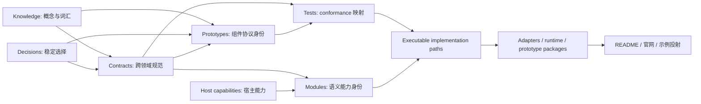

# Proto UI 项目理解：spec 工作区快照

> 此文件由 `scripts/spec/generate-agent-project-understanding.mjs` 生成。请勿手工编辑；修改 spec 或生成器后运行 `corepack pnpm@10.32.1 spec:docs:agent`。

本文面向需要快速建立 Proto UI 全局认知的 Agent。它把当前检出版本中的 spec 实体组织成项目模型、协议边界、验证关系与完整索引，同时明确哪些结论不能由 spec 单独推出。

## 快照身份

| 项目 | 值 |
| --- | --- |
| 当前 spec 版本 | `0.2.0-rc.4` |
| Release channel | `prerelease` |
| Version entity | [`V-PROTO-UI-0004`](../../spec/versions/V-PROTO-UI-0004.yaml) |
| 工作区实体数 | 392 |
| Workspace validation issues | 0 |
| 工作区快照指纹 | `sha256:b3c5db3a4d5bd1f248bf6372707cd39c7c8dfd382e173c92577dde74587a44f8` |
| 已发布 release snapshot digest | `sha256:b88e4c782655e89d3176196c184da1f7b3aab143d019b28334b8c8a1cd83e168` |

工作区快照指纹来自按 ID 排序、按当前版本过滤后的实体内容。它用于判断本文是否与当前检出版本一致；它不替代 `V-*` 中记录的不可变发布快照 digest。

## 阅读与权威边界

当前快照包含 38 个 active、349 个 draft、5 个 deprecated、0 个 removed 实体。

- `active` 可以作为当前稳定保证读取。
- `draft` 是已进入正式目录的当前方向，但不能包装为稳定公共承诺。
- `deprecated` 用于兼容与迁移；读取时应检查替代实体和版本。
- 本文只组织 spec 中已经编目的事实。实现存在但尚未编目的行为不会自动出现在本文。
- `internal/contracts/**` 仍可能包含未完成迁移的约束与解释；它只补充 spec 空白，不覆盖适用实体。
- `internal/records/**` 提供短期方向和工程上下文，但始终是非规范记录。
- 本文列出的 test implementation 状态来自实体声明，并不表示生成本文时重新执行了这些测试。

## 一、项目的协议模型

Proto UI 把组件交互从具体框架实现中抽离为可命名、可组合、可验证、可跨宿主投射的协议实体。当前 catalog 的基本推理链如下：

这张图是阅读顺序，不表示每条边都必须使用同一种 relation。实际关系由 `dependsOn`、`satisfies`、`verifies`、`exercises`、`requires`、`inherits` 等字段表达。

当前 schema 没有 adapter 或 compiler 实体类型。Adapter 已存在于实现与旧契约层，但其完整 profile 不能从 catalog 自动推断；Compiler 也不应被描述成当前已编目的交付能力。

### 实体职责与成熟度

| 类型 | 总数 | active | draft | deprecated | 有 statement | 有 criteria | 有 open questions |
| --- | --: | --: | --: | --: | --: | --: | --: |
| `knowledge` | 5 | 0 | 5 | 0 | 5 | 5 | 0 |
| `decision` | 49 | 6 | 41 | 2 | 34 | 19 | 3 |
| `contract` | 144 | 15 | 126 | 3 | 141 | 141 | 22 |
| `prototype` | 92 | 0 | 92 | 0 | 92 | 92 | 32 |
| `module` | 5 | 1 | 4 | 0 | 0 | 0 | 0 |
| `host-cap` | 4 | 0 | 4 | 0 | 2 | 2 | 0 |
| `test` | 120 | 12 | 108 | 0 | 0 | 0 | 4 |
| `version` | 4 | 4 | 0 | 0 | 4 | 4 | 0 |

### 实体级关系分布

| Relation     | 边数 |
| ------------ | ---: |
| `relates`    |  222 |
| `dependsOn`  |  771 |
| `inherits`   |   28 |
| `references` |    7 |
| `refines`    |   18 |
| `satisfies`  |   27 |
| `verifies`   |  354 |
| `explains`   |   36 |
| `exercises`  |  198 |
| `requires`   |    4 |
| `owns`       |    1 |

关系统计只计算实体顶层 relation；criterion 内的 `dependsOn` 和 `references` 仍保留在各实体源文件中。

## 二、知识基础

Knowledge 实体提供跨领域概念模型。Agent 在修改具体 API 或行为前，应先确认相关术语在这里的含义。

### [`K-COMPONENT-ACTOR-0001`](../../spec/knowledge/K-COMPONENT-ACTOR-0001.yaml) Component interaction targets define actor identities

- 状态：`draft`；since：`0.1.0`；criteria：4
- 摘要：Proto UI classifies component interaction targets by their role in relation to the component, not by product-team role or implementation form.

Proto UI 按照交互对象与组件发生关系的方式，区分 User、Maker、Other Component，以及 host/environment 相关对象。

关键准则：

- `K-COMPONENT-ACTOR-0001-A`：User 指直接感知并操作组件的对象。
- `K-COMPONENT-ACTOR-0001-B`：Maker 指组装、配置、消费组件的人、系统、应用代码或上层业务逻辑。
- `K-COMPONENT-ACTOR-0001-C`：Other Component 指与当前组件共享环境、传递语义或建立协作关系的其他组件。
- `K-COMPONENT-ACTOR-0001-D`：Host/environment 相关对象可以与组件发生交互，但默认不属于 Proto UI 核心可移植性保证的主轴。

### [`K-COMPONENT-INTERACTION-0001`](../../spec/knowledge/K-COMPONENT-INTERACTION-0001.yaml) A component is an interactive subject

- 状态：`draft`；since：`0.1.0`；criteria：3
- 摘要：Proto UI treats a component as a stable interactive subject before treating it as a host-specific implementation.

组件首先是一个相对稳定的交互主体；它能够与外部对象交换信息，并在这些关系中保持可识别的身份。

关键准则：

- `K-COMPONENT-INTERACTION-0001-A`：组件不能只被理解为某个宿主中的代码形态；代码形态只是交互主体在特定宿主中的实现方式之一。
- `K-COMPONENT-INTERACTION-0001-B`：如果抹掉组件与人、应用、其他组件或环境之间的关系，剩下的只是实现，而不是完整的可交互单位。
- `K-COMPONENT-INTERACTION-0001-C`：Proto UI 的原型描述必须始终指向一个会成立的交互主体，而不是一组可脱离主体存在的局部能力。

### [`K-DESIGN-TRADEOFF-0001`](../../spec/knowledge/K-DESIGN-TRADEOFF-0001.yaml) Semantic consistency has priority over authoring convenience

- 状态：`draft`；since：`0.1.0`；criteria：4
- 摘要：Proto UI prioritizes semantic consistency, including portability, over user, maker, and prototype author convenience when these goals conflict.

Proto UI 的设计取舍顺序是语义一致性优先；当语义一致性、User 体验、Maker 体验和原型 Author 体验冲突时，语义一致性排在最前。

关键准则：

- `K-DESIGN-TRADEOFF-0001-A`：Proto UI 的取舍顺序为：语义一致性 > User 体验 > Maker 体验 > 原型 Author 体验。
- `K-DESIGN-TRADEOFF-0001-B`：语义一致性要求同一个原型在不同适配结果中仍然保持同一个交互主体身份。
- `K-DESIGN-TRADEOFF-0001-C`：可移植性是语义一致性的重要组成部分；依赖不可移植的数据会削弱跨宿主语义一致性的保证。
- `K-DESIGN-TRADEOFF-0001-D`：协议层默认优先采用可序列化表达，即使这会降低某些原型作者的表达便利性。

### [`K-INFORMATION-CHANNEL-0001`](../../spec/knowledge/K-INFORMATION-CHANNEL-0001.yaml) Information channels are derived from actor relationships

- 状态：`draft`；since：`0.1.0`；criteria：4
- 摘要：Proto UI organizes component capabilities by first asking who exchanges information with the component and then asking which capabilities express that exchange.

信息通路不是 API 名字的分类，而是从组件与交互对象之间的信息交换关系中推导出的组织原则。

关键准则：

- `K-INFORMATION-CHANNEL-0001-A`：判断一条通路时，必须先看组件正在和谁交换信息，再看这种交换需要怎样的能力表达。
- `K-INFORMATION-CHANNEL-0001-B`：新通路不能只是已有通路的技术别名或 API surface 变体；它需要对应一种稳定且重要的交互对象身份或关系方向。
- `K-INFORMATION-CHANNEL-0001-C`：AI Agent 等新参与者只有在不能沿 User、Maker、Other Component 或 host/environment 身份被吸收时，才可能构成新的哲学使用者身份。
- `K-INFORMATION-CHANNEL-0001-D`：Host/environment 相关交换可以被承认和维护，但默认不构成核心可移植通路。

### [`K-PROTOTYPE-COMPOSITION-0001`](../../spec/knowledge/K-PROTOTYPE-COMPOSITION-0001.yaml) Proto UI excludes prototype-level template composition

- 状态：`draft`；since：`0.1.0`；criteria：3
- 摘要：Proto UI keeps prototype composition outside the core template language to preserve protocol boundaries.

Proto UI 不把“在 template 中嵌套另一个 prototype”作为 core template language 的能力。Prototype 生态负责编写交互主体与语义，Adapter/Compiler 生态负责宿主映射；组件间组合应发生在宿主层或上层框架/编译层，而不是通过 template 直接引用其他 prototype。

关键准则：

- `K-PROTOTYPE-COMPOSITION-0001-A`：Template language 描述 Root Node 内部结构，不描述 prototype-to-prototype composition。
- `K-PROTOTYPE-COMPOSITION-0001-B`：允许 template 直接嵌套 prototype 会模糊 Prototype 生态与 Adapter/Compiler 生态的边界。
- `K-PROTOTYPE-COMPOSITION-0001-C`：若上层框架提供更方便的组件组合语法，该语法必须在框架/编译/宿主层解决，而不是扩展 core template protocol。

## 三、契约域

Contract 是规范性规则的主要载体。下表按 ID 的主领域聚合；“被 T 验证”统计来自指向该 contract 的顶层 `verifies` relation。完整准则、版本关系和来源请进入实体文件。

### A11Y（1）

| Entity | 状态 | 标题 | Criteria | 被 T 验证 | 摘要 |
| --- | --- | --- | --: | --: | --- |
| [`C-A11Y-0001`](../../spec/contracts/C-A11Y-0001.yaml) | `draft` | Accessibility exposes projectable semantic objects | 10 | 1 | The a11y domain records projectable semantic object facts such as identity, role, name, description, state, action, relation, and semantic tree behavior. |

### ADAPTER（1）

| Entity | 状态 | 标题 | Criteria | 被 T 验证 | 摘要 |
| --- | --- | --- | --: | --: | --- |
| [`C-ADAPTER-TYPES-0001`](../../spec/contracts/C-ADAPTER-TYPES-0001.yaml) | `draft` | TypeScript adapters preserve the Prototype public surface | 5 | 1 | Official TypeScript adapter entrypoints preserve Prototype props, outward signals, and instance exposes instead of erasing generated host components to any. |

### ANATOMY（13）

| Entity | 状态 | 标题 | Criteria | 被 T 验证 | 摘要 |
| --- | --- | --- | --: | --: | --- |
| [`C-ANATOMY-0001`](../../spec/contracts/C-ANATOMY-0001.yaml) | `draft` | Anatomy is structural semantics, not an information channel | 4 | 0 | Anatomy describes structural roles and relations inside a compound prototype family without becoming an information channel, composer, assembler, or instance registry. |
| [`C-ANATOMY-0002`](../../spec/contracts/C-ANATOMY-0002.yaml) | `draft` | Anatomy family specs are static definitions | 5 | 1 | A stable anatomy family is defined by a reference-identity family token that carries its canonical spec, including the required root role. |
| [`C-ANATOMY-0003`](../../spec/contracts/C-ANATOMY-0003.yaml) | `draft` | Setup family registration is not author-facing | 4 | 1 | `def.anatomy.family` is not part of the prototype-author API; anatomy family specs must be defined by static family tokens. |
| [`C-ANATOMY-0004`](../../spec/contracts/C-ANATOMY-0004.yaml) | `draft` | Anatomy claim declares a role | 5 | 1 | An anatomy claim is a setup-only declaration that the current prototype instance takes one role in one family. |
| [`C-ANATOMY-0005`](../../spec/contracts/C-ANATOMY-0005.yaml) | `draft` | Anatomy domains are scoped by root claims | 4 | 1 | A root claim establishes the runtime domain in which same-family parts can observe each other. |
| [`C-ANATOMY-0006`](../../spec/contracts/C-ANATOMY-0006.yaml) | `draft` | Anatomy profiles refine a family | 5 | 1 | A profile is a named refinement inside one family, not inheritance, derivation, or arbitrary override. |
| [`C-ANATOMY-0007`](../../spec/contracts/C-ANATOMY-0007.yaml) | `draft` | Anatomy requirements check asHook capabilities | 5 | 1 | The v0 anatomy requirement form checks declared asHook capabilities for role claims without injecting behavior. |
| [`C-ANATOMY-0008`](../../spec/contracts/C-ANATOMY-0008.yaml) | `draft` | Runtime queries return safe part views | 4 | 1 | Anatomy runtime queries are runtime-only and may return only limited part views for actual same-domain parts. |
| [`C-ANATOMY-0009`](../../spec/contracts/C-ANATOMY-0009.yaml) | `draft` | Part views read explicit exposes | 5 | 1 | Anatomy may read only capabilities explicitly exposed by same-domain parts through Expose. |
| [`C-ANATOMY-0010`](../../spec/contracts/C-ANATOMY-0010.yaml) | `draft` | Anatomy diagnostics separate family and profile failures | 4 | 1 | Anatomy diagnostics distinguish broken family baselines from unmet profile refinements. |
| [`C-ANATOMY-ORDER-0001`](../../spec/contracts/C-ANATOMY-ORDER-0001.yaml) | `draft` | Anatomy order is a host-ordered structural view | 4 | 1 | `run.anatomy.order` provides runtime-only host-ordered projections of same-domain parts without becoming collection semantics. |
| [`C-ANATOMY-ORDER-0002`](../../spec/contracts/C-ANATOMY-ORDER-0002.yaml) | `draft` | Anatomy order exposes self position and version | 4 | 1 | Anatomy order can expose ordered role projections, self adjacency, and an order signature version. |
| [`C-ANATOMY-ORDER-0003`](../../spec/contracts/C-ANATOMY-ORDER-0003.yaml) | `draft` | Anatomy part subscriptions observe live structural membership | 5 | 1 | `def.anatomy.subscribeParts` registers a setup-only callback for live changes to one role projection in the current anatomy domain. |

### ANCHORED（1）

| Entity | 状态 | 标题 | Criteria | 被 T 验证 | 摘要 |
| --- | --- | --- | --: | --: | --- |
| [`C-ANCHORED-POSITIONING-0001`](../../spec/contracts/C-ANCHORED-POSITIONING-0001.yaml) | `draft` | Anchored positioning is host-mediated geometry with bounded lifetime | 6 | 1 | Proto modules declare anchor-relative placement while a host capability measures, resolves collisions, writes coordinates, and observes geometry only while the floating view is active. |

### AS-COLLECTION（2）

| Entity | 状态 | 标题 | Criteria | 被 T 验证 | 摘要 |
| --- | --- | --- | --: | --: | --- |
| [`C-AS-COLLECTION-0001`](../../spec/contracts/C-AS-COLLECTION-0001.yaml) | `draft` | asCollection declares an explicit ordered Proto UI item set | 5 | 1 | asCollection is the privileged no-arg asHook for declaring that the current prototype instance provides an explicitly declared ordered collection of Proto UI items. |
| [`C-AS-COLLECTION-ITEM-0001`](../../spec/contracts/C-AS-COLLECTION-ITEM-0001.yaml) | `draft` | asCollectionItem declares an explicit item in a Proto UI collection | 4 | 1 | asCollectionItem is the privileged no-arg asHook for declaring that the current prototype instance participates as an item in an explicitly declared Proto UI collection. |

### AS-FOCUS（4）

| Entity | 状态 | 标题 | Criteria | 被 T 验证 | 摘要 |
| --- | --- | --- | --: | --: | --- |
| [`C-AS-FOCUS-ENTRY-0001`](../../spec/contracts/C-AS-FOCUS-ENTRY-0001.yaml) | `draft` | asFocusEntry declares a host-mediated focus entry region | 7 | 1 | asFocusEntry is a privileged no-arg singleton asHook for declaring that the current prototype instance is an enterable focus region whose concrete entry target is resolved by host capability from an entry policy. |
| [`C-AS-FOCUS-ROVING-0001`](../../spec/contracts/C-AS-FOCUS-ROVING-0001.yaml) | `draft` | asFocusRoving owns sibling-local focus navigation | 11 | 1 | asFocusRoving is the author-facing privileged no-arg asHook for sibling-local roving navigation and replaces the old asFocusGroup concept. |
| [`C-AS-FOCUS-SCOPE-0001`](../../spec/contracts/C-AS-FOCUS-SCOPE-0001.yaml) | `draft` | asFocusScope declares a focus coordination boundary | 5 | 2 | asFocusScope is a privileged no-arg singleton asHook for boundary-level focus coordination, including entry, restore, empty container policy, and access to an internal roving handle through its returned handle. |
| [`C-AS-FOCUS-SCOPE-0002`](../../spec/contracts/C-AS-FOCUS-SCOPE-0002.yaml) | `draft` | Focus scope activation gates focus and restores the previous owner | 9 | 1 | A focus scope may exist inactive in the logical tree; activation captures previous focus, moves focus into the scope, gates outside focus requests, and deactivation restores the captured owner. |

### AS-FOCUSABLE（1）

| Entity | 状态 | 标题 | Criteria | 被 T 验证 | 摘要 |
| --- | --- | --- | --: | --: | --- |
| [`C-AS-FOCUSABLE-0001`](../../spec/contracts/C-AS-FOCUSABLE-0001.yaml) | `draft` | asFocusable declares a no-arg singleton focus target | 7 | 1 | asFocusable is a privileged no-arg once asHook that declares the caller as a focus target and returns state-backed focus facts plus target-level focus requests. |

### AS-HOOK（10）

| Entity | 状态 | 标题 | Criteria | 被 T 验证 | 摘要 |
| --- | --- | --- | --: | --: | --- |
| [`C-AS-HOOK-0001`](../../spec/contracts/C-AS-HOOK-0001.yaml) | `draft` | asHook is a subjectless prototype form attached to the caller | 4 | 1 | asHook is a special prototype form for inheriting interaction identity and reusable protocol behavior without creating an independent interaction subject. |
| [`C-AS-HOOK-0002`](../../spec/contracts/C-AS-HOOK-0002.yaml) | `draft` | asHook callers are setup-only | 4 | 1 | asHook can only be applied during the caller prototype setup and must not be invoked from render or runtime callbacks. |
| [`C-AS-HOOK-0003`](../../spec/contracts/C-AS-HOOK-0003.yaml) | `draft` | defineAsHook accepts a prototype-compatible spec | 4 | 1 | defineAsHook must accept the standard no-arg prototype definition shape, where name remains the prototype spec name and setup follows the prototype setup contract. |
| [`C-AS-HOOK-0004`](../../spec/contracts/C-AS-HOOK-0004.yaml) | `draft` | asHook applies once by default | 4 | 1 | The default repeat policy for the same asHook identity on one caller prototype is once; later same-identity applications are skipped unless a more specific contract defines another policy. |
| [`C-AS-HOOK-0005`](../../spec/contracts/C-AS-HOOK-0005.yaml) | `draft` | asHook effects attach to the caller and module conflicts stay module-owned | 5 | 1 | Effects declared by an asHook through setup APIs must attach to the caller prototype; asHooks may depend on any def sub-API, while duplicate detection and conflict handling remain owned by each module. |
| [`C-AS-HOOK-0006`](../../spec/contracts/C-AS-HOOK-0006.yaml) | `draft` | asHook result exposes setup-only disposers and analyzable artifacts | 6 | 1 | AsHookResult is the caller result synthesized from captured setup effects, and may expose handles, artifacts, child asHook entries, render fragments, and setup-only disposers. |
| [`C-AS-HOOK-0007`](../../spec/contracts/C-AS-HOOK-0007.yaml) | `draft` | asHook state handles project to borrowed views | 8 | 1 | State handles introduced by an asHook must be exposed to the caller as borrowed views keyed by state declaration names, and nested asHook state handles must stay inside child asHook entries rather than being flattened into the outer result. |
| [`C-AS-HOOK-0008`](../../spec/contracts/C-AS-HOOK-0008.yaml) | `draft` | asHook trace is readonly diagnostic metadata | 4 | 1 | Applied asHooks must leave readonly trace metadata for diagnostics and capability checks without becoming writable author-facing state. |
| [`C-AS-HOOK-0009`](../../spec/contracts/C-AS-HOOK-0009.yaml) | `draft` | authored asHook may project a stable custom caller handle | 6 | 1 | An ordinary authored asHook may project its captured AsHookResult into one custom caller handle without changing the prototype-compatible setup return channel. |
| [`C-AS-HOOK-PRIVILEGED-0001`](../../spec/contracts/C-AS-HOOK-PRIVILEGED-0001.yaml) | `draft` | Privileged asHooks expose restricted module-port capabilities | 6 | 1 | Privileged asHooks may use non-author-facing module ports or host-sensitive capabilities, and each privileged asHook must define its own caller shape, returned handle/API, repeat, configuration, and safety rules. |

### AS-OVERLAY（1）

| Entity | 状态 | 标题 | Criteria | 被 T 验证 | 摘要 |
| --- | --- | --- | --: | --: | --- |
| [`C-AS-OVERLAY-0001`](../../spec/contracts/C-AS-OVERLAY-0001.yaml) | `draft` | asOverlay coordinates logical open state with one Presence driver | 15 | 1 | asOverlay is a privileged no-argument once hook whose logical open state delegates structural view presence to exactly one immediate or bound Presence driver. |

### AS-TRANSITION（1）

| Entity | 状态 | 标题 | Criteria | 被 T 验证 | 摘要 |
| --- | --- | --- | --: | --: | --- |
| [`C-AS-TRANSITION-0001`](../../spec/contracts/C-AS-TRANSITION-0001.yaml) | `draft` | asTransition governs perceptual phases over lifecycle ViewIntent | 14 | 1 | asTransition is a no-argument once hook whose host-neutral state machine retains the current view while leaving, detaches only after close completion, and materializes a view before entering. |

### AS-TRIGGER（1）

| Entity | 状态 | 标题 | Criteria | 被 T 验证 | 摘要 |
| --- | --- | --- | --: | --: | --- |
| [`C-AS-TRIGGER-0001`](../../spec/contracts/C-AS-TRIGGER-0001.yaml) | `draft` | asTrigger merges continuous nested trigger event routes to the outermost trigger | 9 | 1 | asTrigger is a privileged asHook that makes nested trigger prototypes share one activation event route, owned by the outermost continuous trigger in the direct host parent chain. |

### BOUNDARY（1）

| Entity | 状态 | 标题 | Criteria | 被 T 验证 | 摘要 |
| --- | --- | --- | --: | --: | --- |
| [`C-BOUNDARY-0001`](../../spec/contracts/C-BOUNDARY-0001.yaml) | `draft` | Boundary observes host interactions and classifies one shared interaction domain | 7 | 1 | Boundary keeps sample transport separate from multi-region classification and publishes one ternary outside-derived signal for higher-level consumers. |

### CONTEXT（12）

| Entity | 状态 | 标题 | Criteria | 被 T 验证 | 摘要 |
| --- | --- | --- | --: | --: | --- |
| [`C-CONTEXT-0001`](../../spec/contracts/C-CONTEXT-0001.yaml) | `draft` | Context is the official inter-component information channel | 4 | 0 | Context is Proto UI's official Component-to-Component information channel and the only information channel dedicated to inter-component communication. |
| [`C-CONTEXT-0002`](../../spec/contracts/C-CONTEXT-0002.yaml) | `draft` | Context providers establish communication scopes | 4 | 0 | A context provider establishes a scoped context value, but successful updates may be initiated by either the provider or participants subscribed to that scope. |
| [`C-CONTEXT-0003`](../../spec/contracts/C-CONTEXT-0003.yaml) | `draft` | ContextKey identity is created by core | 4 | 1 | ContextKey is the stable identity token for a context channel and should be created through a core factory with debug metadata. |
| [`C-CONTEXT-0004`](../../spec/contracts/C-CONTEXT-0004.yaml) | `draft` | Context resolves through nearest scope owner | 4 | 1 | Context resolution binds a participant to the nearest provider or equivalent scope owner for the requested ContextKey. |
| [`C-CONTEXT-0005`](../../spec/contracts/C-CONTEXT-0005.yaml) | `draft` | Context provide is setup-only and creates the initial value | 5 | 1 | `def.context.provide` declares a context scope during setup and installs its initial JSON object value without creating a separate provider updater API. |
| [`C-CONTEXT-0006`](../../spec/contracts/C-CONTEXT-0006.yaml) | `draft` | Context subscription intent is required or optional | 5 | 1 | Context subscriptions are setup-only intent declarations; `subscribe` declares a required context dependency, while `trySubscribe` declares an optional context dependency. |
| [`C-CONTEXT-0007`](../../spec/contracts/C-CONTEXT-0007.yaml) | `draft` | Context read surfaces follow subscription intent | 5 | 1 | Runtime and render-time readonly context reads must follow prior subscription intent; required reads throw on missing context, while optional reads return null. |
| [`C-CONTEXT-0008`](../../spec/contracts/C-CONTEXT-0008.yaml) | `draft` | Context runtime update targets an explicit key and value | 5 | 1 | Runtime context updates must explicitly name the ContextKey and next value or updater; `update` requires certainty, while `tryUpdate` models optional context availability. |
| [`C-CONTEXT-0009`](../../spec/contracts/C-CONTEXT-0009.yaml) | `draft` | Context values are top-level JSON objects | 5 | 1 | Context values must be JSON-compatible records, with top-level null reserved for optional absence rather than provided values. |
| [`C-CONTEXT-0010`](../../spec/contracts/C-CONTEXT-0010.yaml) | `draft` | Context callbacks observe semantic updates deterministically | 5 | 1 | Context update callbacks must observe successful semantic updates with correct next/prev values and deterministic ordering, while runtime and adapters may retain scheduling flexibility. |
| [`C-CONTEXT-0011`](../../spec/contracts/C-CONTEXT-0011.yaml) | `draft` | Context rebinding and disconnection are resolved at read and update time | 5 | 1 | Context scope changes may rebind participants to different providers; v0 exposes correctness through reads, updates, and callbacks rather than connection-change notifications. |
| [`C-CONTEXT-0012`](../../spec/contracts/C-CONTEXT-0012.yaml) | `draft` | Context lifecycle cleanup and diagnostics are distinguishable | 5 | 1 | Context providers and subscriptions are bound to the component instance lifecycle, and context failures should be distinguishable for diagnostics. |

### CORE（9）

| Entity | 状态 | 标题 | Criteria | 被 T 验证 | 摘要 |
| --- | --- | --- | --: | --: | --- |
| [`C-CORE-CHANNEL-0001`](../../spec/contracts/C-CORE-CHANNEL-0001.yaml) | `draft` | Core portable channels are identity-derived and protocol-governed | 4 | 0 | Proto UI core portable channels must be derived from interaction-target identity and governed as protocol-level semantic channels. |
| [`C-CORE-SYNTAX-0001`](../../spec/contracts/C-CORE-SYNTAX-0001.yaml) | `draft` | Setup-time capabilities are exposed through the definition handle | 4 | 0 | Core syntax exposes `setup`-time planning capabilities through a `definition handle` rather than a `runtime handle`. |
| [`C-CORE-SYNTAX-0002`](../../spec/contracts/C-CORE-SYNTAX-0002.yaml) | `draft` | Runtime capabilities are exposed through the `run handle` | 6 | 0 | Core syntax exposes `runtime` execution capabilities through a `run handle` bound to the current runtime invocation. |
| [`C-CORE-SYNTAX-0003`](../../spec/contracts/C-CORE-SYNTAX-0003.yaml) | `draft` | Prototype definitions expose a named setup entry | 4 | 1 | A Proto UI prototype definition is a named object whose primary executable body is `setup(def)`. |
| [`C-CORE-SYNTAX-0004`](../../spec/contracts/C-CORE-SYNTAX-0004.yaml) | `draft` | Setup receives `def` and may produce render | 4 | 1 | Prototype `setup` receives the definition handle and returns either a render function or `void`. |
| [`C-CORE-SYNTAX-0005`](../../spec/contracts/C-CORE-SYNTAX-0005.yaml) | `draft` | Render functions return TemplateChildren | 4 | 1 | A render function is the setup-produced runtime function that receives a renderer handle and returns `TemplateChildren`. |
| [`C-CORE-SYNTAX-0006`](../../spec/contracts/C-CORE-SYNTAX-0006.yaml) | `draft` | Renderer handle is the render-time syntax surface | 6 | 1 | Render-time template construction and render input reads are exposed through the renderer handle. |
| [`C-CORE-SYNTAX-0007`](../../spec/contracts/C-CORE-SYNTAX-0007.yaml) | `draft` | Setup-only removal remains setup-only | 4 | 1 | A removal or undo function returned by a setup-only API must not become a runtime escape hatch unless a separate runtime API explicitly defines that behavior. |
| [`C-CORE-VALUE-0001`](../../spec/contracts/C-CORE-VALUE-0001.yaml) | `draft` | Prototype-level semantics use `null` as the only canonical empty value | 0 | 0 | Prototype-level values should receive `null` as the canonical empty value even when a host can express other empty values. |

### DELAY（1）

| Entity | 状态 | 标题 | Criteria | 被 T 验证 | 摘要 |
| --- | --- | --- | --: | --: | --- |
| [`C-DELAY-0001`](../../spec/contracts/C-DELAY-0001.yaml) | `draft` | Core delay schedules lifecycle-bound runtime callbacks | 13 | 1 | Core `delay` is a runtime-only primitive that requests a lifecycle-bound callback after a minimum duration through host-neutral scheduling. |

### EVENT（12）

| Entity | 状态 | 标题 | Criteria | 被 T 验证 | 摘要 |
| --- | --- | --- | --: | --: | --- |
| [`C-EVENT-0001`](../../spec/contracts/C-EVENT-0001.yaml) | `draft` | Event is the user-to-component information channel | 3 | 0 | Event carries user interaction information into a Component. |
| [`C-EVENT-0002`](../../spec/contracts/C-EVENT-0002.yaml) | `draft` | Event defines setup-time listener registration and runtime callback dispatch | 11 | 2 | `def.event` registers listeners during setup; Event currently exposes no prototype-author runtime API, while registered callbacks are dispatched during runtime callback execution. |
| [`C-EVENT-0003`](../../spec/contracts/C-EVENT-0003.yaml) | `draft` | Event registrations bind to root and global interaction targets | 5 | 1 | `def.event.on` binds to the component root interaction target, while `def.event.onGlobal` binds to an adapter-defined global interaction target. |
| [`C-EVENT-0004`](../../spec/contracts/C-EVENT-0004.yaml) | `draft` | Empty event registration is a binding no-op | 5 | 1 | Binding event listeners with no registrations must be a no-op and must not require root or global targets. |
| [`C-EVENT-0005`](../../spec/contracts/C-EVENT-0005.yaml) | `draft` | Event registrations are unique and not deduplicated | 4 | 1 | Each event registration call creates a distinct listener registration, even when type, callback, and options are identical. |
| [`C-EVENT-0006`](../../spec/contracts/C-EVENT-0006.yaml) | `draft` | EventListenerToken is the precise removal handle | 6 | 1 | Each event registration returns an EventListenerToken, and `def.event.off(token)` removes exactly that registration. |
| [`C-EVENT-0007`](../../spec/contracts/C-EVENT-0007.yaml) | `draft` | Event bindings are cleaned up with component lifecycle | 5 | 1 | Event bindings must unbind on component teardown, and target replacement must be transparent to prototype authors. |
| [`C-EVENT-TOKEN-0001`](../../spec/contracts/C-EVENT-TOKEN-0001.yaml) | `draft` | Event tokens expose stable diagnostic metadata | 6 | 0 | EventListenerToken metadata describes the registration for diagnostics only and must not affect matching, dispatch, or removal behavior. |
| [`C-EVENT-TYPE-0001`](../../spec/contracts/C-EVENT-TYPE-0001.yaml) | `draft` | EventTypeV0 is a layered semantic event model | 4 | 1 | Event types are divided into portable core events, optional medium events, and host-bound escape hatches. |
| [`C-EVENT-TYPE-0002`](../../spec/contracts/C-EVENT-TYPE-0002.yaml) | `draft` | Protocol core events model portable interaction intent | 7 | 1 | Protocol core events such as `press.*` and `key.*` describe portable interaction intent rather than concrete host events. |
| [`C-EVENT-TYPE-0003`](../../spec/contracts/C-EVENT-TYPE-0003.yaml) | `draft` | Optional medium events are conditionally supported semantic events | 5 | 1 | Optional medium events describe interaction-medium semantics that adapters may support, but supported events must obey their semantic contract. |
| [`C-EVENT-TYPE-0004`](../../spec/contracts/C-EVENT-TYPE-0004.yaml) | `draft` | host event types are host-bound escape hatches | 5 | 1 | `host:*` event types are host-bound escape hatches that keep event lifecycle guarantees but give up portable event semantics. |

### EXPOSE（11）

| Entity | 状态 | 标题 | Criteria | 被 T 验证 | 摘要 |
| --- | --- | --- | --: | --: | --- |
| [`C-EXPOSE-0001`](../../spec/contracts/C-EXPOSE-0001.yaml) | `draft` | Expose is the component-to-app-maker information channel | 5 | 1 | Expose is the Component-to-App-Maker channel through which a component promises outward values, states, APIs, and signals to its caller. |
| [`C-EXPOSE-0002`](../../spec/contracts/C-EXPOSE-0002.yaml) | `draft` | Expose declares outward capability promises | 4 | 1 | Expose declarations describe the outward capability surface a component promises to provide to the App Maker. |
| [`C-EXPOSE-0003`](../../spec/contracts/C-EXPOSE-0003.yaml) | `draft` | Expose registration is setup-only | 5 | 1 | Expose entries are registered during setup; runtime may use declared expose surfaces but must not mutate the expose registry. |
| [`C-EXPOSE-0004`](../../spec/contracts/C-EXPOSE-0004.yaml) | `draft` | Expose keys form an instance exposes record | 6 | 1 | Expose entries are identified by stable non-empty string keys and presented to the App Maker as an instance-level exposes record. |
| [`C-EXPOSE-0005`](../../spec/contracts/C-EXPOSE-0005.yaml) | `draft` | Classified expose APIs declare value, state, method, and signal surfaces | 6 | 1 | Classified expose APIs add semantic categories over the base registration model without changing core registration, key, or lifecycle rules. |
| [`C-EXPOSE-0006`](../../spec/contracts/C-EXPOSE-0006.yaml) | `draft` | Expose value represents read-only outward information | 5 | 1 | Expose value declares that a component provides a value-like piece of outward information to the App Maker. |
| [`C-EXPOSE-0007`](../../spec/contracts/C-EXPOSE-0007.yaml) | `draft` | Expose method represents an App-Maker-callable capability | 6 | 1 | Expose method declares that a component provides an outward capability the App Maker may invoke through an adapter-defined calling surface. |
| [`C-EXPOSE-0008`](../../spec/contracts/C-EXPOSE-0008.yaml) | `draft` | Expose entries are bound to instance lifecycle | 5 | 2 | Expose entries are valid only while the component instance remains under runtime responsibility and must be cleared or invalidated after dispose. |
| [`C-EXPOSE-EVENT-0001`](../../spec/contracts/C-EXPOSE-EVENT-0001.yaml) | `draft` | Expose event represents outward signals | 6 | 1 | Expose event declares and emits Component-to-App-Maker outward signals; it is not the User-to-Component Event channel. |
| [`C-EXPOSE-EVENT-0002`](../../spec/contracts/C-EXPOSE-EVENT-0002.yaml) | `draft` | Expose event payload semantics remain minimal in v0 | 5 | 1 | Expose event payload specs currently provide only minimal payload hints; stronger portable payload guarantees remain open. |
| [`C-EXPOSE-STATE-0001`](../../spec/contracts/C-EXPOSE-STATE-0001.yaml) | `draft` | Expose state projects internal state as an App-Maker-facing view | 8 | 1 | Expose-state projects an internal state slot to the App Maker as a read-only external state handle with value access, subscription, and state spec metadata. |

### FEEDBACK（7）

| Entity | 状态 | 标题 | Criteria | 被 T 验证 | 摘要 |
| --- | --- | --- | --: | --: | --- |
| [`C-FEEDBACK-0001`](../../spec/contracts/C-FEEDBACK-0001.yaml) | `draft` | Feedback is the component-to-user information channel | 5 | 0 | Feedback is the Component-to-User channel that carries perceivable information. |
| [`C-FEEDBACK-0002`](../../spec/contracts/C-FEEDBACK-0002.yaml) | `draft` | Feedback separates setup planning from runtime effects | 5 | 0 | Feedback APIs must distinguish setup-time feedback planning from runtime feedback effects. |
| [`C-FEEDBACK-STYLE-0001`](../../spec/contracts/C-FEEDBACK-STYLE-0001.yaml) | `draft` | feedback.style is the visual feedback surface | 5 | 2 | `feedback.style` describes visual feedback that can change component appearance without triggering render or changing template structure. |
| [`C-FEEDBACK-STYLE-0002`](../../spec/contracts/C-FEEDBACK-STYLE-0002.yaml) | `draft` | Setup style plans are setup-only and reversible during setup | 5 | 1 | Setup-time `feedback.style` records style plans, and each setup plan contribution can be removed only during setup. |
| [`C-FEEDBACK-STYLE-0003`](../../spec/contracts/C-FEEDBACK-STYLE-0003.yaml) | `draft` | feedback.style values are style token sets | 5 | 2 | `feedback.style` values are sets of author-side Proto UI style tokens, currently based on a subset of Tailwind atomic-class syntax. |
| [`C-FEEDBACK-STYLE-0004`](../../spec/contracts/C-FEEDBACK-STYLE-0004.yaml) | `draft` | Author style tokens must not carry state or selector logic | 5 | 1 | Prototype-author-side `feedback.style` tokens must describe style only and must not encode state, event, selector, or host-realization dependencies. |
| [`C-FEEDBACK-STYLE-0005`](../../spec/contracts/C-FEEDBACK-STYLE-0005.yaml) | `draft` | Runtime style patch is the final pre-translation feedback.style escape hatch | 8 | 1 | `run.feedback.style.patch`, `suppress`, and `clearPatch` modify the current runtime style patch layer before style translation. |

### FOCUS（2）

| Entity | 状态 | 标题 | Criteria | 被 T 验证 | 摘要 |
| --- | --- | --- | --: | --: | --- |
| [`C-FOCUS-0001`](../../spec/contracts/C-FOCUS-0001.yaml) | `draft` | Focus is a host-mediated logical interaction target domain | 7 | 1 | Focus is a system domain for coordinating logical interaction targets, requests, facts, topology, and policy; it is not owned by state, event, expose, adapter, or any single asHook alone. |
| [`C-FOCUS-0002`](../../spec/contracts/C-FOCUS-0002.yaml) | `draft` | Focus topology is resolved through host logical parent relationships first | 4 | 1 | Focus membership and ownership should use the host logical parent chain as the primary topology source, with token/key membership only as compatibility or escape hatch. |

### LIFECYCLE（8）

| Entity | 状态 | 标题 | Criteria | 被 T 验证 | 摘要 |
| --- | --- | --- | --: | --: | --- |
| [`C-LIFECYCLE-0001`](../../spec/contracts/C-LIFECYCLE-0001.yaml) | `draft` | Prototype execution separates setup-time planning from runtime execution | 6 | 0 | `setup` materializes one Proto instance; `runtime` covers its alive period, including detached mount intervals. |
| [`C-LIFECYCLE-0002`](../../spec/contracts/C-LIFECYCLE-0002.yaml) | `draft` | Prototype-visible lifecycle callbacks follow canonical runtime order | 8 | 1 | Proto UI exposes one instance lifetime containing zero or more repeatable mount epochs before terminal disposal. |
| [`C-LIFECYCLE-0003`](../../spec/contracts/C-LIFECYCLE-0003.yaml) | `draft` | Runtime update flow has explicit render entry points | 9 | 1 | Render and commit are runtime-owned effects that may only be entered through explicit lifecycle update paths. |
| [`C-LIFECYCLE-0004`](../../spec/contracts/C-LIFECYCLE-0004.yaml) | `draft` | Runtime and adapters emit epoch-aware lifecycle events | 6 | 1 | Structured lifecycle events describe instance phases, repeatable mount epochs, update revisions, and terminal disposal. |
| [`C-LIFECYCLE-0005`](../../spec/contracts/C-LIFECYCLE-0005.yaml) | `draft` | Prototype lifecycle API surface uses setup-time callback registration | 7 | 1 | Prototype-visible lifecycle syntax registers instance and repeatable mount callbacks during setup. |
| [`C-LIFECYCLE-0006`](../../spec/contracts/C-LIFECYCLE-0006.yaml) | `draft` | Proto instances own repeatable host-view mount epochs | 4 | 1 | Instance lifetime is independent from repeatable host-view attachment while remaining owned by one lifecycle owner. |
| [`C-LIFECYCLE-0007`](../../spec/contracts/C-LIFECYCLE-0007.yaml) | `draft` | Every Proto instance has one terminal lifecycle owner | 4 | 1 | A host component or explicit retained-session manager owns terminal Proto instance disposal. |
| [`C-LIFECYCLE-0008`](../../spec/contracts/C-LIFECYCLE-0008.yaml) | `active` | View intent governs L1 materialization without owning lifecycle facts | 10 | 2 | An alive Proto instance may update desired view presence from callback-time run APIs while RuntimeSession and the adapter owner retain authority over actual view phases and terminal disposal. |

### PROPS（14）

| Entity | 状态 | 标题 | Criteria | 被 T 验证 | 摘要 |
| --- | --- | --- | --: | --: | --- |
| [`C-PROPS-0001`](../../spec/contracts/C-PROPS-0001.yaml) | `active` | Props is the app-maker-to-component configuration channel | 0 | 0 | Props carries configuration data from the App Maker into a Component. |
| [`C-PROPS-0002`](../../spec/contracts/C-PROPS-0002.yaml) | `active` | Props defines setup-time declaration and runtime access surfaces | 6 | 1 | Props exposes declaration and watcher registration through `def.props`, and runtime read access through `run.props`. |
| [`C-PROPS-0003`](../../spec/contracts/C-PROPS-0003.yaml) | `active` | Props values must be JSON values | 5 | 1 | Props values must be JSON values so that the props channel remains serializable, portable, and semantically consistent across hosts. |
| [`C-PROPS-0004`](../../spec/contracts/C-PROPS-0004.yaml) | `active` | Prop semantic state is classified per key | 5 | 1 | `missing`, `empty`, `non-empty`, and `invalid` states are evaluated for each individual prop key. |
| [`C-PROPS-0005`](../../spec/contracts/C-PROPS-0005.yaml) | `active` | Setup-time prop declarations are mergeable plans | 0 | 0 | `Setup`-time props `define` calls contribute to a planned configurable prop surface and can be merged before `runtime` execution. |
| [`C-PROPS-0006`](../../spec/contracts/C-PROPS-0006.yaml) | `active` | Prop declaration descriptors have constrained shape | 8 | 1 | Incoming prop declarations must satisfy the minimal v0 descriptor shape for `type`, `empty`, enum `options`, `range`, and JSON-valued `default`. |
| [`C-PROPS-0007`](../../spec/contracts/C-PROPS-0007.yaml) | `active` | Prop declaration merge preserves evolution safety | 8 | 1 | Prop declaration merging must reject breaking narrowing and keep widening changes traceable. |
| [`C-PROPS-0008`](../../spec/contracts/C-PROPS-0008.yaml) | `active` | Runtime props resolution produces a declared-key resolved snapshot | 7 | 1 | `Resolved props` contain all and only declared keys, never expose `undefined`, and use `null` as the canonical empty value. |
| [`C-PROPS-0009`](../../spec/contracts/C-PROPS-0009.yaml) | `active` | Missing, empty, and invalid prop values resolve through state-specific fallback | 9 | 1 | `Missing` input releases prior host values, while provided-empty and invalid values may recover through `prevValid` before defaults. |
| [`C-PROPS-0010`](../../spec/contracts/C-PROPS-0010.yaml) | `active` | Failed declaration merge must not partially apply | 3 | 1 | Blocking diagnostics during `setup`-time prop declaration merge reject the merge transaction without partially applying changes. |
| [`C-PROPS-0011`](../../spec/contracts/C-PROPS-0011.yaml) | `active` | Resolved props watchers observe resolved snapshot changes | 10 | 1 | Resolved props watchers fire from declared-key `resolved snapshot` diffs, skip `hydration`, may observe coalesced update windows, and preserve shared registration order. |
| [`C-PROPS-0012`](../../spec/contracts/C-PROPS-0012.yaml) | `active` | Raw props APIs expose raw input as an escape hatch | 12 | 1 | `Raw props` APIs expose the adapter-supplied pre-resolution props snapshot as an escape hatch without extending portable props semantics. |
| [`C-PROPS-0013`](../../spec/contracts/C-PROPS-0013.yaml) | `active` | Props watcher callbacks follow runtime `run handle` binding | 5 | 1 | Props watcher callbacks refine core runtime callback binding by requiring `run.props.*` to align with the current watcher dispatch window. |
| [`C-PROPS-0014`](../../spec/contracts/C-PROPS-0014.yaml) | `active` | applyRawProps updates the props channel without implicit render commit | 5 | 1 | Applying `raw props` through the controller may update props state and trigger watchers, but should not itself imply render commit. |

### RULE（10）

| Entity | 状态 | 标题 | Criteria | 被 T 验证 | 摘要 |
| --- | --- | --- | --: | --: | --- |
| [`C-RULE-0001`](../../spec/contracts/C-RULE-0001.yaml) | `draft` | Rule is not an information channel | 4 | 0 | Rule expresses condition-to-intent relationships and must not be treated as a Proto UI information channel. |
| [`C-RULE-0002`](../../spec/contracts/C-RULE-0002.yaml) | `draft` | Rule is optional but recommended when expressive enough | 4 | 0 | Rule does not increase the prototype syntax expressive ceiling, but it is the recommended path when behavior fits its declarative condition-to-intent model. |
| [`C-RULE-0003`](../../spec/contracts/C-RULE-0003.yaml) | `draft` | RuleIR must be serializable | 4 | 1 | Rule declarations must compile into fully serializable RuleIR rather than retaining functions, host references, runtime closures, or live handles. |
| [`C-RULE-0004`](../../spec/contracts/C-RULE-0004.yaml) | `draft` | def.rule is a setup-only declaration API | 4 | 1 | `def.rule(spec)` declares rules during setup and must not create runtime rule declarations. |
| [`C-RULE-EXTENSION-0001`](../../spec/contracts/C-RULE-EXTENSION-0001.yaml) | `draft` | Rule extensions may add secondary when, intent, or execution paths | 4 | 0 | Rule is intentionally extension-friendly; patch modules may add inputs, intents, or optimized execution paths without weakening core RuleIR serialization or semantics. |
| [`C-RULE-INTENT-0001`](../../spec/contracts/C-RULE-INTENT-0001.yaml) | `draft` | Rule intent records analyzable operations | 4 | 1 | Rule `intent` records declarative operations for later execution and must not run arbitrary callbacks or host-specific side effects during setup. |
| [`C-RULE-INTENT-FEEDBACK-STYLE-0001`](../../spec/contracts/C-RULE-INTENT-FEEDBACK-STYLE-0001.yaml) | `draft` | feedback.style is the stable v0 Rule intent | 5 | 3 | `i.feedback.style.use(...)` is the stable v0 Rule intent channel and produces feedback style token intent without widening feedback.style token semantics. |
| [`C-RULE-RUNTIME-0001`](../../spec/contracts/C-RULE-RUNTIME-0001.yaml) | `draft` | Rule evaluation produces a Plan or equivalent optimized execution | 5 | 2 | Runtime evaluates RuleIR against current inputs, collects active intent in declaration order, and produces a semantic Plan unless an extension executes an equivalent optimized path. |
| [`C-RULE-WHEN-0001`](../../spec/contracts/C-RULE-WHEN-0001.yaml) | `draft` | Rule when expressions are pure conditions | 5 | 2 | Rule `when` expressions evaluate observable inputs into booleans without side effects, event matching, deep comparison, or custom comparators. |
| [`C-RULE-WHEN-0002`](../../spec/contracts/C-RULE-WHEN-0002.yaml) | `draft` | Rule when inputs are module-backed observable values | 5 | 2 | Rule core does not create input sources; each `when` input surface must be backed by another module or extension and define its own dependency identity and read semantics. |

### STATE（15）

| Entity | 状态 | 标题 | Criteria | 被 T 验证 | 摘要 |
| --- | --- | --- | --: | --: | --- |
| [`C-STATE-0001`](../../spec/contracts/C-STATE-0001.yaml) | `draft` | State is the host-neutral internal state expression | 3 | 0 | State defines, stores, and records component-internal state changes without being an information channel or a side-effect mechanism. |
| [`C-STATE-0002`](../../spec/contracts/C-STATE-0002.yaml) | `draft` | State definition is setup-only | 6 | 1 | The author-facing state definition API is `def.state.*`, and it may only define named state slots during setup. |
| [`C-STATE-0003`](../../spec/contracts/C-STATE-0003.yaml) | `draft` | State slot is accessed through capability views | 4 | 1 | Prototype authors and App Makers do not receive the raw state source; they receive capability views over the state slot. |
| [`C-STATE-0004`](../../spec/contracts/C-STATE-0004.yaml) | `draft` | State view APIs obey setup and runtime phase boundaries | 5 | 2 | State view operations have explicit phase boundaries: `get` is phase-neutral, `setDefault` and `watch` are setup-only, and `set` is runtime-only. |
| [`C-STATE-0005`](../../spec/contracts/C-STATE-0005.yaml) | `draft` | State mutation does not implicitly render | 4 | 1 | State mutation records a value change without implicitly scheduling render or commit. |
| [`C-STATE-0006`](../../spec/contracts/C-STATE-0006.yaml) | `draft` | State definitions use finite host-neutral value specs | 5 | 1 | State definition APIs admit a finite set of host-neutral state kinds whose values remain within JSON-compatible domains. |
| [`C-STATE-0007`](../../spec/contracts/C-STATE-0007.yaml) | `draft` | Owned state view represents direct prototype ownership | 5 | 2 | An owned state view is returned for state directly created and fully controlled by the current prototype, and deliberately does not expose `watch`. |
| [`C-STATE-0008`](../../spec/contracts/C-STATE-0008.yaml) | `draft` | Borrowed state view represents shared control | 5 | 1 | A borrowed state view represents a state that is not directly created by the current prototype but may still be controlled by it. |
| [`C-STATE-0009`](../../spec/contracts/C-STATE-0009.yaml) | `draft` | Observed state view represents read-only observation | 5 | 1 | An observed state view is used when the current prototype may observe a state but has no authority to control it. |
| [`C-STATE-0010`](../../spec/contracts/C-STATE-0010.yaml) | `draft` | State watch is setup-only auxiliary observation | 5 | 1 | `watch` observes non-owned or not-fully-owned state changes, but it is not a reactive rendering system. |
| [`C-STATE-0011`](../../spec/contracts/C-STATE-0011.yaml) | `draft` | StateEvent records value changes and disconnects | 5 | 1 | State watchers receive `next` events for value transitions and `disconnect` events for lifecycle disconnection. |
| [`C-STATE-0012`](../../spec/contracts/C-STATE-0012.yaml) | `draft` | State views are bound to instance lifecycle | 5 | 1 | State views remain usable while the instance is alive and become invalid after dispose. |
| [`C-STATE-INTERACTION-0001`](../../spec/contracts/C-STATE-INTERACTION-0001.yaml) | `deprecated` | Official interaction and accessibility semantic states are borrowed in v0 | 6 | 1 | `def.state.fromInteraction` and `fromAccessibility` return shared borrowed views for official semantic state slots in v0, but these accessors are deprecated compatibility APIs. |
| [`C-STATE-INTERACTION-0002`](../../spec/contracts/C-STATE-INTERACTION-0002.yaml) | `deprecated` | Interaction state declaration introduces runtime-managed interaction wiring | 7 | 1 | Declaring interaction state may implicitly introduce event subscriptions and host interaction wiring managed by Proto UI runtime modules and adapters, but `fromInteraction` declarations are deprecated compatibility APIs. |
| [`C-STATE-INTERACTION-0003`](../../spec/contracts/C-STATE-INTERACTION-0003.yaml) | `deprecated` | Interaction state identity is shared per interaction subject and semantic type | 5 | 1 | Repeated deprecated `fromInteraction` declarations of the same interaction state type for the same interaction subject must return the same state reference while the compatibility API remains. |

### TEMPLATE（6）

| Entity | 状态 | 标题 | Criteria | 被 T 验证 | 摘要 |
| --- | --- | --- | --: | --: | --- |
| [`C-TEMPLATE-0001`](../../spec/contracts/C-TEMPLATE-0001.yaml) | `draft` | Template output describes root children | 3 | 1 | Template output describes the structural children rendered inside the host root, not the host root itself. |
| [`C-TEMPLATE-0002`](../../spec/contracts/C-TEMPLATE-0002.yaml) | `draft` | Template nodes are structural nodes | 4 | 1 | Template nodes are structural units that may compose children and carry style, but do not carry component-level channels. |
| [`C-TEMPLATE-0003`](../../spec/contracts/C-TEMPLATE-0003.yaml) | `draft` | `el()` constructs TemplateNodes with style-only props | 5 | 1 | Renderer `el()` constructs TemplateNodes using fixed argument dispatch and a minimal `TemplateProps` shape. |
| [`C-TEMPLATE-0004`](../../spec/contracts/C-TEMPLATE-0004.yaml) | `draft` | Template children normalize to a portable shape | 7 | 1 | `TemplateChildren` normalization uses deep flattening, `null` as empty, and rejects boolean or nested `undefined` children. |
| [`C-TEMPLATE-0005`](../../spec/contracts/C-TEMPLATE-0005.yaml) | `draft` | Template slot is anonymous and singular | 5 | 1 | The v0 template slot is an anonymous reserved node, appears at most once, and carries no params or props. |
| [`C-TEMPLATE-0006`](../../spec/contracts/C-TEMPLATE-0006.yaml) | `draft` | Adapters reject PrototypeRef template types | 4 | 1 | Official adapters and compilers must actively reject `PrototypeRef` when it appears as a template node type. |

## 四、官方 Prototype 协议

Prototype 实体描述官方协议身份，而不是某个框架组件的偶然实现。Base 通常表达基础协议，Shadcn 等 design-language 实体可通过 `inherits.prototypes` 表达继承与差异。

### BASE（31）

| Entity | 状态 | 标题 | 继承 | Anatomy | Criteria | 关联 T |
| --- | --- | --- | --- | --- | --: | --: |
| [`P-BASE-BUTTON`](../../spec/prototypes/P-BASE-BUTTON.yaml) | `draft` | Base Button is a focusable command control | — | — | 30 | 2 |
| [`P-BASE-CHECKBOX`](../../spec/prototypes/P-BASE-CHECKBOX.yaml) | `draft` | Base Checkbox is a checked input control with optional mixed display state | — | 2 roles / 0 profiles | 52 | 2 |
| [`P-BASE-CHECKBOX-INDICATOR`](../../spec/prototypes/P-BASE-CHECKBOX-INDICATOR.yaml) | `draft` | Base Checkbox Indicator is a context-driven checkbox indicator | — | — | 17 | 2 |
| [`P-BASE-DIALOG`](../../spec/prototypes/P-BASE-DIALOG.yaml) | `draft` | Base Dialog is a root-owned modal dialog protocol | — | 9 roles / 0 profiles | 10 | 3 |
| [`P-BASE-DIALOG-CLOSE`](../../spec/prototypes/P-BASE-DIALOG-CLOSE.yaml) | `draft` | Base Dialog Close requests dismissal | — | — | 5 | 3 |
| [`P-BASE-DIALOG-CONTENT`](../../spec/prototypes/P-BASE-DIALOG-CONTENT.yaml) | `draft` | Base Dialog Content owns the active dialog surface | — | — | 7 | 3 |
| [`P-BASE-DIALOG-DESCRIPTION`](../../spec/prototypes/P-BASE-DIALOG-DESCRIPTION.yaml) | `draft` | Base Dialog Description describes Dialog Content | — | — | 3 | 3 |
| [`P-BASE-DIALOG-MASK`](../../spec/prototypes/P-BASE-DIALOG-MASK.yaml) | `draft` | Base Dialog Mask projects modal occlusion and hit participation | — | — | 5 | 3 |
| [`P-BASE-DIALOG-TITLE`](../../spec/prototypes/P-BASE-DIALOG-TITLE.yaml) | `draft` | Base Dialog Title labels Dialog Content | — | — | 3 | 3 |
| [`P-BASE-DIALOG-TRIGGER`](../../spec/prototypes/P-BASE-DIALOG-TRIGGER.yaml) | `draft` | Base Dialog Trigger requests modal visibility | — | — | 6 | 3 |
| [`P-BASE-DROPDOWN-MENU`](../../spec/prototypes/P-BASE-DROPDOWN-MENU.yaml) | `draft` | Base Dropdown Menu is a root-owned action-menu protocol | — | 4 roles / 0 profiles | 11 | 3 |
| [`P-BASE-DROPDOWN-MENU-CONTENT`](../../spec/prototypes/P-BASE-DROPDOWN-MENU-CONTENT.yaml) | `draft` | Base Dropdown Menu Content is a transitional positioned menu surface | — | — | 8 | 3 |
| [`P-BASE-DROPDOWN-MENU-ITEM`](../../spec/prototypes/P-BASE-DROPDOWN-MENU-ITEM.yaml) | `draft` | Base Dropdown Menu Item is a transiently active menu action | — | — | 7 | 3 |
| [`P-BASE-DROPDOWN-MENU-TRIGGER`](../../spec/prototypes/P-BASE-DROPDOWN-MENU-TRIGGER.yaml) | `draft` | Base Dropdown Menu Trigger is an accessible menu-button command | — | — | 5 | 3 |
| [`P-BASE-HOVER-CARD`](../../spec/prototypes/P-BASE-HOVER-CARD.yaml) | `draft` | Base Hover Card is a delayed link-preview protocol | — | 3 roles / 0 profiles | 12 | 3 |
| [`P-BASE-HOVER-CARD-CONTENT`](../../spec/prototypes/P-BASE-HOVER-CARD-CONTENT.yaml) | `draft` | Base Hover Card Content is a transitional non-modal preview surface | — | — | 11 | 3 |
| [`P-BASE-HOVER-CARD-TRIGGER`](../../spec/prototypes/P-BASE-HOVER-CARD-TRIGGER.yaml) | `draft` | Base Hover Card Trigger publishes preview intent | — | — | 6 | 3 |
| [`P-BASE-SELECT`](../../spec/prototypes/P-BASE-SELECT.yaml) | `draft` | Base Select is a root-owned select-only single-selection protocol | — | 5 roles / 0 profiles | 10 | 3 |
| [`P-BASE-SELECT-CONTENT`](../../spec/prototypes/P-BASE-SELECT-CONTENT.yaml) | `draft` | Base Select Content is a transitional positioned listbox surface | — | — | 8 | 3 |
| [`P-BASE-SELECT-ITEM`](../../spec/prototypes/P-BASE-SELECT-ITEM.yaml) | `draft` | Base Select Item is a selectable collection option | — | — | 7 | 3 |
| [`P-BASE-SELECT-TRIGGER`](../../spec/prototypes/P-BASE-SELECT-TRIGGER.yaml) | `draft` | Base Select Trigger is an accessible select-only combobox command | — | — | 6 | 3 |
| [`P-BASE-SELECT-VALUE`](../../spec/prototypes/P-BASE-SELECT-VALUE.yaml) | `draft` | Base Select Value is a render-consumed committed-value display | — | — | 8 | 3 |
| [`P-BASE-SWITCH`](../../spec/prototypes/P-BASE-SWITCH.yaml) | `draft` | Base Switch is a root-owned on/off value control | — | 2 roles / 0 profiles | 53 | 3 |
| [`P-BASE-SWITCH-THUMB`](../../spec/prototypes/P-BASE-SWITCH-THUMB.yaml) | `draft` | Base Switch Thumb is a context-driven switch indicator | — | — | 15 | 3 |
| [`P-BASE-TABS`](../../spec/prototypes/P-BASE-TABS.yaml) | `draft` | Base Tabs is a compound single-selection protocol | — | 5 roles / 0 profiles | 38 | 3 |
| [`P-BASE-TABS-CONTENT`](../../spec/prototypes/P-BASE-TABS-CONTENT.yaml) | `draft` | Base Tabs Content is a value-matched tabpanel part | — | — | 17 | 4 |
| [`P-BASE-TABS-INDICATOR`](../../spec/prototypes/P-BASE-TABS-INDICATOR.yaml) | `draft` | Base Tabs Indicator is a context-driven tabs indicator | — | — | 16 | 2 |
| [`P-BASE-TABS-LIST`](../../spec/prototypes/P-BASE-TABS-LIST.yaml) | `draft` | Base Tabs List is the tab trigger collection and roving focus container | — | — | 16 | 4 |
| [`P-BASE-TABS-TRIGGER`](../../spec/prototypes/P-BASE-TABS-TRIGGER.yaml) | `draft` | Base Tabs Trigger is a value-matched tab activation item | — | — | 27 | 4 |
| [`P-BASE-TOGGLE`](../../spec/prototypes/P-BASE-TOGGLE.yaml) | `draft` | Base Toggle is a button-like persistent active control | — | — | 37 | 3 |
| [`P-BASE-TRANSITION`](../../spec/prototypes/P-BASE-TRANSITION.yaml) | `draft` | Base Transition governs host-neutral perceptual presence | — | — | 12 | 2 |

### BRUTALIST（30）

| Entity | 状态 | 标题 | 继承 | Anatomy | Criteria | 关联 T |
| --- | --- | --- | --- | --- | --: | --: |
| [`P-BRUTALIST-BUTTON`](../../spec/prototypes/P-BRUTALIST-BUTTON.yaml) | `draft` | Brutalist Button inherits Base Button and layers a dual-theme Neo-Brutalist visual API | `P-BASE-BUTTON` | — | 3 | 3 |
| [`P-BRUTALIST-DIALOG`](../../spec/prototypes/P-BRUTALIST-DIALOG.yaml) | `draft` | Brutalist Dialog Root inherits Base modal ownership | `P-BASE-DIALOG` | — | 3 | 2 |
| [`P-BRUTALIST-DIALOG-CLOSE`](../../spec/prototypes/P-BRUTALIST-DIALOG-CLOSE.yaml) | `draft` | Brutalist Dialog Close inherits Base close behavior and layers a square close surface | `P-BASE-DIALOG-CLOSE` | — | 3 | 2 |
| [`P-BRUTALIST-DIALOG-CLOSE-ICON`](../../spec/prototypes/P-BRUTALIST-DIALOG-CLOSE-ICON.yaml) | `draft` | Brutalist Dialog Close Icon inherits Base close behavior and layers a default X close surface | `P-BASE-DIALOG-CLOSE` | — | 3 | 2 |
| [`P-BRUTALIST-DIALOG-CONTENT`](../../spec/prototypes/P-BRUTALIST-DIALOG-CONTENT.yaml) | `draft` | Brutalist Dialog Content inherits Base content and layers a hard-shadowed modal panel | `P-BASE-DIALOG-CONTENT` | — | 3 | 3 |
| [`P-BRUTALIST-DIALOG-DESCRIPTION`](../../spec/prototypes/P-BRUTALIST-DIALOG-DESCRIPTION.yaml) | `draft` | Brutalist Dialog Description inherits Base description relations and layers mono description typography | `P-BASE-DIALOG-DESCRIPTION` | — | 3 | 2 |
| [`P-BRUTALIST-DIALOG-FOOTER`](../../spec/prototypes/P-BRUTALIST-DIALOG-FOOTER.yaml) | `draft` | Brutalist Dialog Footer is an optional layout-only anatomy part | — | — | 3 | 2 |
| [`P-BRUTALIST-DIALOG-HEADER`](../../spec/prototypes/P-BRUTALIST-DIALOG-HEADER.yaml) | `draft` | Brutalist Dialog Header is an optional layout-only anatomy part | — | — | 3 | 2 |
| [`P-BRUTALIST-DIALOG-MASK`](../../spec/prototypes/P-BRUTALIST-DIALOG-MASK.yaml) | `draft` | Brutalist Dialog Mask inherits Base modal masking and projects a flat overlay without blur | `P-BASE-DIALOG-MASK` | — | 3 | 2 |
| [`P-BRUTALIST-DIALOG-TITLE`](../../spec/prototypes/P-BRUTALIST-DIALOG-TITLE.yaml) | `draft` | Brutalist Dialog Title inherits Base title relations and layers heavy heading typography | `P-BASE-DIALOG-TITLE` | — | 3 | 2 |
| [`P-BRUTALIST-DIALOG-TRIGGER`](../../spec/prototypes/P-BRUTALIST-DIALOG-TRIGGER.yaml) | `draft` | Brutalist Dialog Trigger inherits Base trigger behavior and layers a hard-shadowed command surface | `P-BASE-DIALOG-TRIGGER` | — | 3 | 2 |
| [`P-BRUTALIST-DROPDOWN-MENU`](../../spec/prototypes/P-BRUTALIST-DROPDOWN-MENU.yaml) | `draft` | Brutalist Dropdown Menu Root inherits Base action-menu ownership | `P-BASE-DROPDOWN-MENU` | — | 3 | 2 |
| [`P-BRUTALIST-DROPDOWN-MENU-CONTENT`](../../spec/prototypes/P-BRUTALIST-DROPDOWN-MENU-CONTENT.yaml) | `draft` | Brutalist Dropdown Menu Content inherits Base menu overlay behavior and layers a hard-shadowed panel | `P-BASE-DROPDOWN-MENU-CONTENT` | — | 3 | 2 |
| [`P-BRUTALIST-DROPDOWN-MENU-ITEM`](../../spec/prototypes/P-BRUTALIST-DROPDOWN-MENU-ITEM.yaml) | `draft` | Brutalist Dropdown Menu Item inherits Base menu item behavior and layers mono active styling | `P-BASE-DROPDOWN-MENU-ITEM` | — | 3 | 2 |
| [`P-BRUTALIST-DROPDOWN-MENU-TRIGGER`](../../spec/prototypes/P-BRUTALIST-DROPDOWN-MENU-TRIGGER.yaml) | `draft` | Brutalist Dropdown Menu Trigger inherits Base menu-button behavior and layers a hard-shadowed command surface | `P-BASE-DROPDOWN-MENU-TRIGGER` | — | 3 | 2 |
| [`P-BRUTALIST-HOVER-CARD`](../../spec/prototypes/P-BRUTALIST-HOVER-CARD.yaml) | `draft` | Brutalist Hover Card Root inherits Base Hover Card ownership | `P-BASE-HOVER-CARD` | — | 3 | 2 |
| [`P-BRUTALIST-HOVER-CARD-CONTENT`](../../spec/prototypes/P-BRUTALIST-HOVER-CARD-CONTENT.yaml) | `draft` | Brutalist Hover Card Content inherits Base preview content and layers a hard-shadowed panel | `P-BASE-HOVER-CARD-CONTENT` | — | 3 | 2 |
| [`P-BRUTALIST-HOVER-CARD-TRIGGER`](../../spec/prototypes/P-BRUTALIST-HOVER-CARD-TRIGGER.yaml) | `draft` | Brutalist Hover Card Trigger inherits Base preview intent and layers a command-like surface | `P-BASE-HOVER-CARD-TRIGGER` | — | 3 | 2 |
| [`P-BRUTALIST-SELECT`](../../spec/prototypes/P-BRUTALIST-SELECT.yaml) | `draft` | Brutalist Select Root inherits Base Select ownership | `P-BASE-SELECT` | — | 3 | 2 |
| [`P-BRUTALIST-SELECT-CONTENT`](../../spec/prototypes/P-BRUTALIST-SELECT-CONTENT.yaml) | `draft` | Brutalist Select Content inherits Base Select Content and layers a hard-shadowed listbox panel | `P-BASE-SELECT-CONTENT` | — | 3 | 2 |
| [`P-BRUTALIST-SELECT-ITEM`](../../spec/prototypes/P-BRUTALIST-SELECT-ITEM.yaml) | `draft` | Brutalist Select Item inherits Base Select Item and layers selected option styling | `P-BASE-SELECT-ITEM` | — | 3 | 2 |
| [`P-BRUTALIST-SELECT-TRIGGER`](../../spec/prototypes/P-BRUTALIST-SELECT-TRIGGER.yaml) | `draft` | Brutalist Select Trigger inherits Base Select Trigger and layers a hard-shadowed combobox command | `P-BASE-SELECT-TRIGGER` | — | 3 | 2 |
| [`P-BRUTALIST-SELECT-VALUE`](../../spec/prototypes/P-BRUTALIST-SELECT-VALUE.yaml) | `draft` | Brutalist Select Value inherits Base Select Value and renders committed-value text | `P-BASE-SELECT-VALUE` | — | 3 | 2 |
| [`P-BRUTALIST-SWITCH`](../../spec/prototypes/P-BRUTALIST-SWITCH.yaml) | `draft` | Brutalist Switch Root inherits Base Switch and layers a square track surface | `P-BASE-SWITCH` | — | 3 | 2 |
| [`P-BRUTALIST-SWITCH-THUMB`](../../spec/prototypes/P-BRUTALIST-SWITCH-THUMB.yaml) | `draft` | Brutalist Switch Thumb inherits Base Switch Thumb and layers a square indicator surface | `P-BASE-SWITCH-THUMB` | — | 3 | 2 |
| [`P-BRUTALIST-TABS`](../../spec/prototypes/P-BRUTALIST-TABS.yaml) | `draft` | Brutalist Tabs Root inherits Base Tabs and owns the family layout surface | `P-BASE-TABS` | — | 3 | 2 |
| [`P-BRUTALIST-TABS-CONTENT`](../../spec/prototypes/P-BRUTALIST-TABS-CONTENT.yaml) | `draft` | Brutalist Tabs Content inherits Base Tabs Content and layers a hard-shadowed panel | `P-BASE-TABS-CONTENT` | — | 3 | 2 |
| [`P-BRUTALIST-TABS-LIST`](../../spec/prototypes/P-BRUTALIST-TABS-LIST.yaml) | `draft` | Brutalist Tabs List inherits Base Tabs List and layers a ruled tab strip | `P-BASE-TABS-LIST` | — | 3 | 2 |
| [`P-BRUTALIST-TABS-TRIGGER`](../../spec/prototypes/P-BRUTALIST-TABS-TRIGGER.yaml) | `draft` | Brutalist Tabs Trigger inherits Base Tabs Trigger and layers selected block styling | `P-BASE-TABS-TRIGGER` | — | 3 | 2 |
| [`P-BRUTALIST-TOGGLE`](../../spec/prototypes/P-BRUTALIST-TOGGLE.yaml) | `draft` | Brutalist Toggle inherits Base Toggle and layers a square active-control surface | `P-BASE-TOGGLE` | — | 3 | 2 |

### LUCIDE（1）

| Entity | 状态 | 标题 | 继承 | Anatomy | Criteria | 关联 T |
| --- | --- | --- | --- | --- | --: | --: |
| [`P-LUCIDE-ICON`](../../spec/prototypes/P-LUCIDE-ICON.yaml) | `draft` | Lucide Icon projects one upstream glyph protocol through generated Proto UI SVG | — | — | 9 | 2 |

### SHADCN（30）

| Entity | 状态 | 标题 | 继承 | Anatomy | Criteria | 关联 T |
| --- | --- | --- | --- | --- | --: | --: |
| [`P-SHADCN-BUTTON`](../../spec/prototypes/P-SHADCN-BUTTON.yaml) | `draft` | Shadcn Button inherits Base Button and layers a pinned visual API subset | `P-BASE-BUTTON` | — | 10 | 2 |
| [`P-SHADCN-DIALOG`](../../spec/prototypes/P-SHADCN-DIALOG.yaml) | `draft` | Shadcn Dialog Root inherits Base modal ownership and adds the current host layout | `P-BASE-DIALOG` | — | 6 | 2 |
| [`P-SHADCN-DIALOG-CLOSE`](../../spec/prototypes/P-SHADCN-DIALOG-CLOSE.yaml) | `draft` | Shadcn Dialog Close inherits Base close-command behavior without visual styling | `P-BASE-DIALOG-CLOSE` | — | 9 | 2 |
| [`P-SHADCN-DIALOG-CLOSE-ICON`](../../spec/prototypes/P-SHADCN-DIALOG-CLOSE-ICON.yaml) | `draft` | Shadcn Dialog CloseIcon is the independent default X close surface | `P-BASE-DIALOG-CLOSE` | — | 3 | 2 |
| [`P-SHADCN-DIALOG-CONTENT`](../../spec/prototypes/P-SHADCN-DIALOG-CONTENT.yaml) | `draft` | Shadcn Dialog Content inherits Base modal content and adds a narrowed animated panel surface | `P-BASE-DIALOG-CONTENT` | — | 8 | 3 |
| [`P-SHADCN-DIALOG-DESCRIPTION`](../../spec/prototypes/P-SHADCN-DIALOG-DESCRIPTION.yaml) | `draft` | Shadcn Dialog Description inherits Base description relations and adds muted typography | `P-BASE-DIALOG-DESCRIPTION` | — | 6 | 2 |
| [`P-SHADCN-DIALOG-FOOTER`](../../spec/prototypes/P-SHADCN-DIALOG-FOOTER.yaml) | `draft` | Shadcn Dialog Footer is an optional layout-only anatomy part | — | — | 2 | 2 |
| [`P-SHADCN-DIALOG-HEADER`](../../spec/prototypes/P-SHADCN-DIALOG-HEADER.yaml) | `draft` | Shadcn Dialog Header is an optional layout-only anatomy part | — | — | 2 | 2 |
| [`P-SHADCN-DIALOG-MASK`](../../spec/prototypes/P-SHADCN-DIALOG-MASK.yaml) | `draft` | Shadcn Dialog Mask inherits Base modal masking and adds a narrowed animated overlay surface | `P-BASE-DIALOG-MASK` | — | 8 | 3 |
| [`P-SHADCN-DIALOG-TITLE`](../../spec/prototypes/P-SHADCN-DIALOG-TITLE.yaml) | `draft` | Shadcn Dialog Title inherits Base labeling and adds current heading typography | `P-BASE-DIALOG-TITLE` | — | 6 | 2 |
| [`P-SHADCN-DIALOG-TRIGGER`](../../spec/prototypes/P-SHADCN-DIALOG-TRIGGER.yaml) | `draft` | Shadcn Dialog Trigger inherits Base command behavior and adds button variants | `P-BASE-DIALOG-TRIGGER` | — | 9 | 2 |
| [`P-SHADCN-DROPDOWN-MENU`](../../spec/prototypes/P-SHADCN-DROPDOWN-MENU.yaml) | `draft` | Shadcn Dropdown Menu Root inherits Base action-menu ownership | `P-BASE-DROPDOWN-MENU` | — | 5 | 2 |
| [`P-SHADCN-DROPDOWN-MENU-CONTENT`](../../spec/prototypes/P-SHADCN-DROPDOWN-MENU-CONTENT.yaml) | `draft` | Shadcn Dropdown Menu Content inherits Base menu overlay behavior and adds the current animated surface | `P-BASE-DROPDOWN-MENU-CONTENT` | — | 9 | 2 |
| [`P-SHADCN-DROPDOWN-MENU-ITEM`](../../spec/prototypes/P-SHADCN-DROPDOWN-MENU-ITEM.yaml) | `draft` | Shadcn Dropdown Menu Item inherits Base menu-command behavior and adds visual variants | `P-BASE-DROPDOWN-MENU-ITEM` | — | 9 | 2 |
| [`P-SHADCN-DROPDOWN-MENU-TRIGGER`](../../spec/prototypes/P-SHADCN-DROPDOWN-MENU-TRIGGER.yaml) | `draft` | Shadcn Dropdown Menu Trigger inherits Base command behavior and adds an optional indicator extension | `P-BASE-DROPDOWN-MENU-TRIGGER` | — | 9 | 2 |
| [`P-SHADCN-HOVER-CARD`](../../spec/prototypes/P-SHADCN-HOVER-CARD.yaml) | `draft` | Shadcn Hover Card Root inherits Base ownership and adds its current host layout | `P-BASE-HOVER-CARD` | — | 6 | 2 |
| [`P-SHADCN-HOVER-CARD-CONTENT`](../../spec/prototypes/P-SHADCN-HOVER-CARD-CONTENT.yaml) | `draft` | Shadcn Hover Card Content inherits Base overlay behavior and adds the current animated surface | `P-BASE-HOVER-CARD-CONTENT` | — | 9 | 2 |
| [`P-SHADCN-HOVER-CARD-TRIGGER`](../../spec/prototypes/P-SHADCN-HOVER-CARD-TRIGGER.yaml) | `draft` | Shadcn Hover Card Trigger inherits Base preview intent and adds link-like styling | `P-BASE-HOVER-CARD-TRIGGER` | — | 8 | 2 |
| [`P-SHADCN-SELECT`](../../spec/prototypes/P-SHADCN-SELECT.yaml) | `draft` | Shadcn Select Root inherits Base select-only ownership | `P-BASE-SELECT` | — | 5 | 2 |
| [`P-SHADCN-SELECT-CONTENT`](../../spec/prototypes/P-SHADCN-SELECT-CONTENT.yaml) | `draft` | Shadcn Select Content inherits Base listbox overlay and adds position, motion, and surface | `P-BASE-SELECT-CONTENT` | — | 10 | 2 |
| [`P-SHADCN-SELECT-ITEM`](../../spec/prototypes/P-SHADCN-SELECT-ITEM.yaml) | `draft` | Shadcn Select Item inherits Base option behavior and adds current styling and a selected check | `P-BASE-SELECT-ITEM` | — | 9 | 2 |
| [`P-SHADCN-SELECT-TRIGGER`](../../spec/prototypes/P-SHADCN-SELECT-TRIGGER.yaml) | `draft` | Shadcn Select Trigger inherits Base combobox behavior and adds size, styling, and chevron | `P-BASE-SELECT-TRIGGER` | — | 10 | 2 |
| [`P-SHADCN-SELECT-VALUE`](../../spec/prototypes/P-SHADCN-SELECT-VALUE.yaml) | `draft` | Shadcn Select Value inherits Base display derivation and renders the current text | `P-BASE-SELECT-VALUE` | — | 7 | 2 |
| [`P-SHADCN-SWITCH`](../../spec/prototypes/P-SHADCN-SWITCH.yaml) | `draft` | Shadcn Switch Root inherits Base Switch and adds the current track surface | `P-BASE-SWITCH` | — | 9 | 2 |
| [`P-SHADCN-SWITCH-THUMB`](../../spec/prototypes/P-SHADCN-SWITCH-THUMB.yaml) | `draft` | Shadcn Switch Thumb inherits the Base indicator and adds its current visual surface | `P-BASE-SWITCH-THUMB` | — | 7 | 2 |
| [`P-SHADCN-TABS`](../../spec/prototypes/P-SHADCN-TABS.yaml) | `draft` | Shadcn Tabs Root inherits Base Tabs and adds the current layout surface | `P-BASE-TABS` | — | 7 | 2 |
| [`P-SHADCN-TABS-CONTENT`](../../spec/prototypes/P-SHADCN-TABS-CONTENT.yaml) | `draft` | Shadcn Tabs Content inherits Base Tabs Content and adds the current panel surface | `P-BASE-TABS-CONTENT` | — | 8 | 2 |
| [`P-SHADCN-TABS-LIST`](../../spec/prototypes/P-SHADCN-TABS-LIST.yaml) | `draft` | Shadcn Tabs List inherits Base Tabs List and adds the current collection surface | `P-BASE-TABS-LIST` | — | 7 | 2 |
| [`P-SHADCN-TABS-TRIGGER`](../../spec/prototypes/P-SHADCN-TABS-TRIGGER.yaml) | `draft` | Shadcn Tabs Trigger inherits Base Tabs Trigger and adds current tab styling | `P-BASE-TABS-TRIGGER` | — | 8 | 2 |
| [`P-SHADCN-TOGGLE`](../../spec/prototypes/P-SHADCN-TOGGLE.yaml) | `draft` | Shadcn Toggle inherits Base Toggle and layers a pinned visual API subset | `P-BASE-TOGGLE` | — | 9 | 2 |

## 五、Module 与 Host Capability

Module 实体是语义能力的稳定身份锚点；Host Capability 表达宿主可提供或可接受的能力。实体数不应机械追随 package 数或 capability token 数，而应形成有准则、有关系、有验证证据的语义切片。

### Modules

| Entity | 状态 | 标题 | Satisfies contracts | Criteria | 摘要 |
| --- | --- | --- | --- | --: | --- |
| [`M-A11Y-0001`](../../spec/modules/M-A11Y-0001.yaml) | `draft` | A11y module records semantic object IR | `C-A11Y-0001` | 0 | The a11y module provides the prototype author API and runtime IR storage for host-projectable accessibility semantic objects. |
| [`M-COLLECTION-0001`](../../spec/modules/M-COLLECTION-0001.yaml) | `draft` | Collection module projects explicit ordered item sets | `C-AS-COLLECTION-0001` `C-AS-COLLECTION-ITEM-0001` | 0 | The collection module provides the internal port backing asCollection and asCollectionItem with ordered item snapshots, item position facts, metadata reads, and anatomy-order integration. |
| [`M-EVENT-0001`](../../spec/modules/M-EVENT-0001.yaml) | `draft` | Event module owns protocol event dispatch and default-action control requests | `C-EVENT-0001` `C-EVENT-0002` `C-EVENT-0003` `C-EVENT-0004` `C-EVENT-0005` `C-EVENT-0006` `C-EVENT-0007` `C-EVENT-TYPE-0002` | 0 | The event module owns protocol event registration/dispatch and provides the internal port used by foundation modules to request host-mediated default-action cancellation. |
| [`M-POSITIONING-0001`](../../spec/modules/M-POSITIONING-0001.yaml) | `draft` | Positioning module owns anchored host-session lifetime | `C-ANCHORED-POSITIONING-0001` | 0 | The Positioning module converts an anchor and floating declaration into one host positioning lease, retains only categorical resolved placement, and revokes the lease with view or prototype lifetime. |
| [`M-PROPS-0001`](../../spec/modules/M-PROPS-0001.yaml) | `active` | Props module | `C-PROPS-0001` `C-PROPS-0002` `C-PROPS-0003` `C-PROPS-0004` `C-PROPS-0005` `C-PROPS-0006` `C-PROPS-0007` `C-PROPS-0008` `C-PROPS-0009` `C-PROPS-0010` `C-PROPS-0011` `C-PROPS-0012` `C-PROPS-0013` `C-PROPS-0014` | 0 | Owns the semantic model for host-facing props. |

### Host capabilities

| Entity | 状态 | 标题 | Related contracts | Criteria | 摘要 |
| --- | --- | --- | --- | --: | --- |
| [`HC-A11Y-0001`](../../spec/host-caps/HC-A11Y-0001.yaml) | `draft` | Host can project accessibility semantics | `C-A11Y-0001` | 2 | The host can receive Proto UI accessibility semantic object IR and project it to its accessibility surface. |
| [`HC-ANCHORED-POSITION-0001`](../../spec/host-caps/HC-ANCHORED-POSITION-0001.yaml) | `draft` | Host measures and maintains anchored floating geometry | `C-ANCHORED-POSITIONING-0001` | 0 | The host attaches a bounded positioning lease that measures anchor and floating targets, resolves collision policy, writes non-transform coordinates, and observes relevant geometry changes. |
| [`HC-DEFAULT-ACTION-0001`](../../spec/host-caps/HC-DEFAULT-ACTION-0001.yaml) | `draft` | Host can cancel default interaction actions | `C-EVENT-TYPE-0002` `C-FOCUS-0001` | 3 | The host can receive Proto UI default-action cancellation requests for an interaction sample and project them to its native default-action mechanism. |
| [`HC-PORTAL-0001`](../../spec/host-caps/HC-PORTAL-0001.yaml) | `draft` | Host supports detached portal mounting | — | 0 | The host can render UI outside the local structural parent. |

## 六、关键决策

Decision 实体固定已经稳定下来的设计与治理选择。它们解释“为什么如此”，但具体行为仍应追溯到相应 contract、prototype 和 test。

### A11Y（2）

| Entity | 状态 | 标题 | Criteria | 摘要 |
| --- | --- | --- | --: | --- |
| [`D-A11Y-PART-RELATIONSHIP-PROJECTION-0001`](../../spec/decisions/D-A11Y-PART-RELATIONSHIP-PROJECTION-0001.yaml) | `draft` | Anatomy part relationships must be projectable as accessibility relationships | 6 | Proto UI needs a contract-level way for prototypes to declare semantic relationships between anatomy parts so Web adapters can project ARIA relationships such as `aria-controls` and `aria-labelledby` without guessing component-specific structure. |
| [`D-A11Y-SEMANTIC-DOMAIN-0001`](../../spec/decisions/D-A11Y-SEMANTIC-DOMAIN-0001.yaml) | `draft` | Accessibility is a semantic object domain | 3 | Proto UI models accessibility as host-projectable semantic objects instead of Web ARIA attributes or platform-specific accessibility API calls. |

### ADAPTER（1）

| Entity | 状态 | 标题 | Criteria | 摘要 |
| --- | --- | --- | --: | --- |
| [`D-ADAPTER-EVENT-OWNER-FALLBACK-0001`](../../spec/decisions/D-ADAPTER-EVENT-OWNER-FALLBACK-0001.yaml) | `draft` | Adapter event owner fallback needs an explicit contract surface | 3 | Event routers may need a host-specific fallback when the native event target cannot be mapped to a Proto UI instance, but that rule belongs to adapter contract governance rather than component prototypes. |

### ANATOMY（4）

| Entity | 状态 | 标题 | Criteria | 摘要 |
| --- | --- | --- | --: | --- |
| [`D-ANATOMY-FAMILY-DERIVE-0001`](../../spec/decisions/D-ANATOMY-FAMILY-DERIVE-0001.yaml) | `draft` | Anatomy family derivation is not introduced in v0 | 0 | Anatomy v0 uses same-family profiles for refinement and recommends a new family when profile refinement is insufficient. |
| [`D-ANATOMY-MISSING-POLICY-0001`](../../spec/decisions/D-ANATOMY-MISSING-POLICY-0001.yaml) | `draft` | Anatomy missing query policy remains privileged | 0 | Anatomy missing-domain query policy is useful for privileged structural projections, but is not yet stabilized as ordinary author-facing API. |
| [`D-ANATOMY-PARTVIEW-TARGET-0001`](../../spec/decisions/D-ANATOMY-PARTVIEW-TARGET-0001.yaml) | `draft` | Anatomy PartView target exposure must be removed or internalized | 0 | Author-facing Anatomy PartView must not expose root targets or host references; root target access is allowed only as module-internal implementation state. |
| [`D-ANATOMY-REQUIREMENT-EXTENSION-0001`](../../spec/decisions/D-ANATOMY-REQUIREMENT-EXTENSION-0001.yaml) | `draft` | Anatomy requirements are limited to asHook in v0 | 0 | Future Anatomy requirement forms may exist, but v0 only stabilizes asHook capability checks. |

### AS-CHILD（1）

| Entity | 状态 | 标题 | Criteria | 摘要 |
| --- | --- | --- | --: | --- |
| [`D-AS-CHILD-OMISSION-0001`](../../spec/decisions/D-AS-CHILD-OMISSION-0001.yaml) | `draft` | Proto UI intentionally omits asChild compatibility APIs | 5 | Proto UI keeps interaction-route composition under component-author and role-system ownership, so upstream-derived prototypes intentionally omit asChild rather than exposing a weaker event-proxy analogue. |

### AS-HOOK（9）

| Entity | 状态 | 标题 | Criteria | 摘要 |
| --- | --- | --- | --: | --- |
| [`D-AS-HOOK-CALLER-NAME-0001`](../../spec/decisions/D-AS-HOOK-CALLER-NAME-0001.yaml) | `draft` | asHook caller binding name validation remains tooling debt | 0 | asHook prototype spec names use prototype naming rules, while author-facing caller bindings should be asXxx; validating that binding shape requires tooling rather than runtime name checks. |
| [`D-AS-HOOK-CAPTURE-BUCKET-0001`](../../spec/decisions/D-AS-HOOK-CAPTURE-BUCKET-0001.yaml) | `draft` | asHook capture buckets are implementation detail | 0 | Current runtime capture buckets do not map one-to-one to semantic modules, so contracts should describe captured effects, artifacts, and disposers rather than internal bucket names. |
| [`D-AS-HOOK-CONFIGURABLE-AUTHORED-0001`](../../spec/decisions/D-AS-HOOK-CONFIGURABLE-AUTHORED-0001.yaml) | `draft` | Configurable authored asHook remains governed design space | 0 | Ordinary configurable authored asHook remains future design space; current defineAsHook v0 exposes no options, mode, or configure API. |
| [`D-AS-HOOK-DEFINE-HOOK-0001`](../../spec/decisions/D-AS-HOOK-DEFINE-HOOK-0001.yaml) | `draft` | defineHook and useHook remain unresolved authoring API design | 0 | The project has an implemented defineHook API and use-style internal hooks, but whether Proto UI should stabilize a separate useHook/defineUseHook concept instead of ordinary user functions remains undecided; useCollection remains a quarantined privileged-boundary case, not a resolved classification. |
| [`D-AS-HOOK-DISPOSER-PHASE-0001`](../../spec/decisions/D-AS-HOOK-DISPOSER-PHASE-0001.yaml) | `draft` | asHook setup-effect disposers are setup-only | 0 | asHook should expose disposers for setup-introduced effects where possible, but those disposers must not become runtime cleanup or lifecycle disposer APIs. |
| [`D-AS-HOOK-NO-ARG-ONCE-0001`](../../spec/decisions/D-AS-HOOK-NO-ARG-ONCE-0001.yaml) | `draft` | Authored asHook callers are no-arg and once-only in v0 | 0 | Ordinary authored asHooks defined through defineAsHook have no caller parameters and use first-call-wins semantics; configuration must be exposed through returned handles or future governed APIs. |
| [`D-AS-HOOK-PRIVILEGED-DEFINE-0001`](../../spec/decisions/D-AS-HOOK-PRIVILEGED-DEFINE-0001.yaml) | `draft` | Privileged asHooks use an internal define helper | 0 | Official privileged asHooks should be implemented through an internal helper that provides def syntax plus restricted facade and module-port context without exposing that capability to prototype authors. |
| [`D-AS-HOOK-PRIVILEGED-NO-ARG-MIGRATION-0001`](../../spec/decisions/D-AS-HOOK-PRIVILEGED-NO-ARG-MIGRATION-0001.yaml) | `draft` | Privileged asHooks must migrate toward no-arg callers | 0 | Privileged asHooks that still accept patch/options parameters are an open migration fracture; the intended direction is no-arg callers with setup-time configuration exposed through returned handles or explicit configuration APIs. |
| [`D-AS-HOOK-STATE-HANDLE-NAMING-0001`](../../spec/decisions/D-AS-HOOK-STATE-HANDLE-NAMING-0001.yaml) | `draft` | asHook state handles are named by state declarations | 9 | asHook state handle projection should use stable names declared by state definitions, should not infer names from expose.state, and should preserve nested asHook result structure instead of flattening nested state handles. |

### BASE（2）

| Entity | 状态 | 标题 | Criteria | 摘要 |
| --- | --- | --- | --: | --- |
| [`D-BASE-PROTOTYPE-INDEPENDENCE-0001`](../../spec/decisions/D-BASE-PROTOTYPE-INDEPENDENCE-0001.yaml) | `draft` | Base prototypes stay independently consumable | 4 | Base prototype protocols should stay independently consumable; shared hooks with protocol names must serve their owning prototype protocol rather than becoming cross-prototype substrate. |
| [`D-BASE-TABS-L1-MATERIALIZATION-0001`](../../spec/decisions/D-BASE-TABS-L1-MATERIALIZATION-0001.yaml) | `active` | Base Tabs Content defaults to lazy L1 materialization | 0 | Inactive Base Tabs Content will default to no view, detach on exit, and preserve its Proto instance; keepMounted remains the explicit full-view retention option. |

### CLI（2）

| Entity | 状态 | 标题 | Criteria | 摘要 |
| --- | --- | --- | --: | --- |
| [`D-CLI-BRUTALIST-PRESET-CLOSURE-0001`](../../spec/decisions/D-CLI-BRUTALIST-PRESET-CLOSURE-0001.yaml) | `draft` | CLI Brutalist preset is a generated closure of official prototype style tokens | 3 | The CLI carries an install-time Brutalist token preset for first-run and offline use, generated deterministically from official Brutalist prototype sources instead of maintained as an independent token list. |
| [`D-CLI-SHADCN-PRESET-CLOSURE-0001`](../../spec/decisions/D-CLI-SHADCN-PRESET-CLOSURE-0001.yaml) | `draft` | CLI Shadcn preset is a generated closure of official prototype style tokens | 3 | The CLI keeps an install-time Shadcn token preset for first-run and offline use, but generates that manifest deterministically from official Shadcn prototype sources instead of maintaining an independent token list. |

### COLLECTION（1）

| Entity | 状态 | 标题 | Criteria | 摘要 |
| --- | --- | --- | --: | --- |
| [`D-COLLECTION-FOCUS-ROVING-RELATIONSHIP-0001`](../../spec/decisions/D-COLLECTION-FOCUS-ROVING-RELATIONSHIP-0001.yaml) | `draft` | Collection and focus roving share ordered member projection but are not the same abstraction | 3 | Collection should model explicitly declared Proto UI item sets, while focus roving may optionally consume collection but must also support non-collection focus candidate sources. |

### COMPONENT（1）

| Entity | 状态 | 标题 | Criteria | 摘要 |
| --- | --- | --- | --: | --- |
| [`D-COMPONENT-PRESET-MATERIALIZATION-0001`](../../spec/decisions/D-COMPONENT-PRESET-MATERIALIZATION-0001.yaml) | `draft` | Component presets materialize replaceable defaults outside Anatomy | 5 | Component presets declare deterministic replaceable default parts that CLI or adapters materialize before Anatomy validates the resulting real structure. |

### CONTEXT（3）

| Entity | 状态 | 标题 | Criteria | 摘要 |
| --- | --- | --- | --: | --- |
| [`D-CONTEXT-NOTIFICATION-SCHEDULING-0001`](../../spec/decisions/D-CONTEXT-NOTIFICATION-SCHEDULING-0001.yaml) | `draft` | Context callback scheduling preserves semantic delivery without requiring synchronous dispatch | 0 | Context callbacks must observe successful semantic updates with deterministic next/prev values, but v0 does not require all adapters to dispatch synchronously. |
| [`D-CONTEXT-PROVIDER-SELF-SUBSCRIBE-0001`](../../spec/decisions/D-CONTEXT-PROVIDER-SELF-SUBSCRIBE-0001.yaml) | `draft` | Context provider self-subscription remains self-inclusive in v0 | 0 | The current v0 behavior resolves provider self-subscription to the provider's own context scope; subscribing to an outer same-key scope remains a future API question. |
| [`D-CONTEXT-UPDATE-API-0001`](../../spec/decisions/D-CONTEXT-UPDATE-API-0001.yaml) | `draft` | Context keeps separate update and tryUpdate APIs in v0 | 0 | Context v0 keeps `update(key, next)` and `tryUpdate(key, next)` as separate runtime APIs so authors explicitly distinguish required and optional context availability. |

### DEFAULT（1）

| Entity | 状态 | 标题 | Criteria | 摘要 |
| --- | --- | --- | --: | --- |
| [`D-DEFAULT-ACTION-CONTROL-0001`](../../spec/decisions/D-DEFAULT-ACTION-CONTROL-0001.yaml) | `draft` | Default action control is host-mediated interaction policy | 4 | Proto UI should model cancellation of host default interaction actions as an internal host-mediated policy capability rather than exposing Web preventDefault directly to prototype authors. |

### EXPOSE（3）

| Entity | 状态 | 标题 | Criteria | 摘要 |
| --- | --- | --- | --: | --- |
| [`D-EXPOSE-EVENT-NAMING-0001`](../../spec/decisions/D-EXPOSE-EVENT-NAMING-0001.yaml) | `draft` | Expose event naming remains outward-signal debt | 0 | The current API name `expose.event` is kept for v0, while its semantics are described as an outward signal to avoid confusing it with the User-to-Component Event channel. |
| [`D-EXPOSE-METHOD-CALL-0001`](../../spec/decisions/D-EXPOSE-METHOD-CALL-0001.yaml) | `draft` | Expose method invocation shape remains open | 0 | Expose methods are App-Maker-callable capabilities in v0, but the portable invocation shape is not yet fixed as direct function calls or message invocation. |
| [`D-EXPOSE-VALUE-PORTABILITY-0001`](../../spec/decisions/D-EXPOSE-VALUE-PORTABILITY-0001.yaml) | `draft` | Expose value portability remains open | 0 | Expose values are not yet constrained to JSON-compatible values; whether to split portable values from host-local escape hatches remains undecided. |

### FOCUS（3）

| Entity | 状态 | 标题 | Criteria | 摘要 |
| --- | --- | --- | --: | --- |
| [`D-FOCUS-ENTRY-DELEGATION-0001`](../../spec/decisions/D-FOCUS-ENTRY-DELEGATION-0001.yaml) | `draft` | Focus entry delegation is distinct from focus target identity | 5 | Proto UI should model region-level focus entry delegation separately from focus target identity so prototypes such as Tabs Content can use descendant-first entry with fallback self without pretending the region itself owns focus facts. |
| [`D-FOCUS-ROVING-NAVIGATION-OWNERSHIP-0001`](../../spec/decisions/D-FOCUS-ROVING-NAVIGATION-OWNERSHIP-0001.yaml) | `draft` | Focus Roving owns sibling-local navigation while triggers own activation | 4 | Sibling-local keyboard navigation belongs to Focus Roving, while concrete triggers and items should keep ownership of activation, selection requests, and component-specific state synchronization. |
| [`D-FOCUS-STATE-INTERACTION-BOUNDARY-0001`](../../spec/decisions/D-FOCUS-STATE-INTERACTION-BOUNDARY-0001.yaml) | `draft` | Focus facts are owned by the focus privileged domain | 0 | Focus-related facts such as focused and focusVisible are state-backed facts owned by focus privileged asHooks instead of state-interaction; state-interaction keeps hover, press, and disabled interaction wiring. |

### GLOBAL（1）

| Entity | 状态 | 标题 | Criteria | 摘要 |
| --- | --- | --- | --: | --- |
| [`D-GLOBAL-RELEASE-VERSION-0001`](../../spec/decisions/D-GLOBAL-RELEASE-VERSION-0001.yaml) | `active` | Global exact release versions | 5 | Public Proto UI packages and spec releases use one exact ecosystem version. |

### NO（1）

| Entity | 状态 | 标题 | Criteria | 摘要 |
| --- | --- | --- | --: | --- |
| [`D-NO-FUNCTION-PROPS-0001`](../../spec/decisions/D-NO-FUNCTION-PROPS-0001.yaml) | `active` | Function props are excluded from the props contract | 0 | Function values are host-local behavior and should not be part of serialized props records. |

### PROPS（2）

| Entity | 状态 | 标题 | Criteria | 摘要 |
| --- | --- | --- | --: | --- |
| [`D-PROPS-MERGE-BLOCKING-0001`](../../spec/decisions/D-PROPS-MERGE-BLOCKING-0001.yaml) | `active` | Props declaration merge conflicts are blocking errors | 0 | Props declaration merge conflicts must fail the current `define()` call as blocking errors instead of preserving prior declarations after console errors. |
| [`D-PROPS-WATCHER-ORDER-0001`](../../spec/decisions/D-PROPS-WATCHER-ORDER-0001.yaml) | `active` | Resolved props watchers preserve registration order | 0 | Resolved `watchAll` and keyed `watch(keys)` callbacks share one registration order instead of giving `watchAll` a dispatch priority. |

### PROTOTYPE（1）

| Entity | 状态 | 标题 | Criteria | 摘要 |
| --- | --- | --- | --: | --- |
| [`D-PROTOTYPE-ENTITY-NAMING-0001`](../../spec/decisions/D-PROTOTYPE-ENTITY-NAMING-0001.yaml) | `draft` | Prototype contract entities use singleton P-prefixed protocol identities | 8 | Prototype-level contract catalog entries use the singleton `P-{PROTOCOL}` entity family, while statically named JS/TS authoring entries use `*.proto.*` declaration files as the machine-discoverable catalog boundary. |

### RULE（5）

| Entity | 状态 | 标题 | Criteria | 摘要 |
| --- | --- | --- | --: | --- |
| [`D-RULE-CONTEXT-PATH-0001`](../../spec/decisions/D-RULE-CONTEXT-PATH-0001.yaml) | `draft` | Rule context path access remains implementation debt | 0 | Rule currently supports whole context value dependencies through `w.ctx(key)`; static context path access is deferred. |
| [`D-RULE-HANDLE-DISPOSE-0001`](../../spec/decisions/D-RULE-HANDLE-DISPOSE-0001.yaml) | `draft` | RuleHandle.dispose conflicts with setup-only removal boundary | 0 | Current `RuleHandle.dispose()` behavior can be called after setup, but setup-only removal should not become a runtime escape hatch without a dedicated runtime API. |
| [`D-RULE-IR-SERIALIZABLE-0001`](../../spec/decisions/D-RULE-IR-SERIALIZABLE-0001.yaml) | `draft` | RuleIR serialization requires implementation cleanup | 0 | RuleIR is required to be serializable, but current implementation paths may still retain live handles and need migration to serializable identities plus side tables. |
| [`D-RULE-META-NAMING-0001`](../../spec/decisions/D-RULE-META-NAMING-0001.yaml) | `draft` | Rule host-environment input naming remains unsettled | 0 | The current `meta` Rule input is treated as secondary scope because host/environment configuration may need a more systematic abstraction. |
| [`D-RULE-STATE-INTENT-0001`](../../spec/decisions/D-RULE-STATE-INTENT-0001.yaml) | `draft` | Rule state intent remains implementation debt | 0 | `intent.state` is a planned Rule intent channel, but its layer stack, rollback, baseline, and reason semantics are not implemented as v0 guarantees. |

### STATE（3）

| Entity | 状态 | 标题 | Criteria | 摘要 |
| --- | --- | --- | --: | --- |
| [`D-STATE-INTERACTION-VIEW-0001`](../../spec/decisions/D-STATE-INTERACTION-VIEW-0001.yaml) | `deprecated` | Interaction semantic state borrowed accessors are deprecated | 0 | `fromInteraction` and `fromAccessibility` returned borrowed views in early v0, but the accessor model is now deprecated in favor of protocol-owned state handles returned by asHooks. |
| [`D-STATE-SEMANTIC-ACCESSORS-DEPRECATION-0001`](../../spec/decisions/D-STATE-SEMANTIC-ACCESSORS-DEPRECATION-0001.yaml) | `active` | State semantic accessors are deprecated | 5 | `def.state.fromInteraction` and `def.state.fromAccessibility` are deprecated compatibility accessors and should be removed in the 0.2 or 0.3 line after cataloged prototypes migrate to protocol-owned state handles. |
| [`D-STATE-VALIDATION-0001`](../../spec/decisions/D-STATE-VALIDATION-0001.yaml) | `draft` | State value validation remains implementation debt | 0 | State specs define host-neutral value domains, but full runtime validation is not yet treated as an implemented v0 guarantee. |

### TRIGGER（1）

| Entity | 状态 | 标题 | Criteria | 摘要 |
| --- | --- | --- | --: | --- |
| [`D-TRIGGER-GROUP-SURFACE-0001`](../../spec/decisions/D-TRIGGER-GROUP-SURFACE-0001.yaml) | `draft` | Continuous triggers share behavior ownership and one host interaction surface | 5 | Continuous trigger chains retain one outer behavior route while projecting focus and accessibility through one default inner host surface. |

### USE（1）

| Entity | 状态 | 标题 | Criteria | 摘要 |
| --- | --- | --- | --: | --- |
| [`D-USE-FOCUS-ROVING-DEPRECATION-0001`](../../spec/decisions/D-USE-FOCUS-ROVING-DEPRECATION-0001.yaml) | `deprecated` | useFocusRoving was removed after the asFocusRoving migration | 3 | useFocusRoving was removed in 0.2 after Dropdown Menu and Select assigned sibling-local movement and default-action control to asFocusRoving. |

### WEB（1）

| Entity | 状态 | 标题 | Criteria | 摘要 |
| --- | --- | --- | --: | --- |
| [`D-WEB-STYLE-BASELINE-0001`](../../spec/decisions/D-WEB-STYLE-BASELINE-0001.yaml) | `draft` | Web physical CSS provides a scoped Proto UI box-model baseline | 3 | Proto UI-generated Web CSS applies border-box only to styled Proto UI elements and their pseudo-elements, preserving component dimensions without installing a document-wide reset or coupling the baseline to a theme. |

## 七、Conformance 与测试映射

Test 实体连接可寻址 case、被验证的实体准则和仓库中的 executable implementation。`verifies` 表示验证责任，`exercises` 只表示经过某个表面，不能等同于完整验证。

### Implementation 状态

| Status    | 数量 |
| --------- | ---: |
| `active`  |   18 |
| `passing` |  259 |
| `planned` |   14 |

### Implementation 类型

| Kind              | 数量 |
| ----------------- | ---: |
| `adapter-test`    |   73 |
| `fixture`         |   17 |
| `module-test`     |  133 |
| `runtime-test`    |   70 |
| `workspace-check` |    8 |

### Test entities

### A11Y（1）

| Entity | 状态 | 标题 | Cases | Implementations | Verifies | Exercises |
| --- | --- | --- | --: | --- | --- | --- |
| [`T-A11Y-0001`](../../spec/tests/T-A11Y-0001.yaml) | `draft` | A11y semantic object contract tests | 4 | `passing` 3 | `C-A11Y-0001` `HC-A11Y-0001` | — |

### ADAPTER（1）

| Entity | 状态 | 标题 | Cases | Implementations | Verifies | Exercises |
| --- | --- | --- | --: | --- | --- | --- |
| [`T-ADAPTER-TYPES-0001`](../../spec/tests/T-ADAPTER-TYPES-0001.yaml) | `draft` | Adapter public type projection tests | 4 | `passing` 5 | `C-ADAPTER-TYPES-0001` | — |

### ANATOMY（4）

| Entity | 状态 | 标题 | Cases | Implementations | Verifies | Exercises |
| --- | --- | --- | --: | --- | --- | --- |
| [`T-ANATOMY-0001`](../../spec/tests/T-ANATOMY-0001.yaml) | `draft` | Anatomy family spec and claim tests | 3 | `passing` 3 | `C-ANATOMY-0002` `C-ANATOMY-0003` `C-ANATOMY-0004` | — |
| [`T-ANATOMY-0002`](../../spec/tests/T-ANATOMY-0002.yaml) | `draft` | Anatomy domain and runtime part view tests | 4 | `passing` 3 | `C-ANATOMY-0005` `C-ANATOMY-0008` `C-ANATOMY-0009` | — |
| [`T-ANATOMY-0003`](../../spec/tests/T-ANATOMY-0003.yaml) | `draft` | Anatomy profile requirement and diagnostic tests | 3 | `passing` 1 | `C-ANATOMY-0006` `C-ANATOMY-0007` `C-ANATOMY-0010` | — |
| [`T-ANATOMY-ORDER-0001`](../../spec/tests/T-ANATOMY-ORDER-0001.yaml) | `draft` | Anatomy order view tests | 5 | `passing` 3 | `C-ANATOMY-ORDER-0001` `C-ANATOMY-ORDER-0002` `C-ANATOMY-ORDER-0003` | `C-ANATOMY-0005` |

### ANCHORED（1）

| Entity | 状态 | 标题 | Cases | Implementations | Verifies | Exercises |
| --- | --- | --- | --: | --- | --- | --- |
| [`T-ANCHORED-POSITIONING-0001`](../../spec/tests/T-ANCHORED-POSITIONING-0001.yaml) | `draft` | Anchored positioning contract and host integration tests | 4 | `passing` 3 | `C-ANCHORED-POSITIONING-0001` | `M-POSITIONING-0001` `HC-ANCHORED-POSITION-0001` |

### AS-HOOK（3）

| Entity | 状态 | 标题 | Cases | Implementations | Verifies | Exercises |
| --- | --- | --- | --: | --- | --- | --- |
| [`T-AS-HOOK-0001`](../../spec/tests/T-AS-HOOK-0001.yaml) | `draft` | asHook definition, setup, repeat, and trace tests | 6 | `passing` 2 | `C-AS-HOOK-0001` `C-AS-HOOK-0002` `C-AS-HOOK-0003` `C-AS-HOOK-0004` `C-AS-HOOK-0008` `C-AS-HOOK-0009` | `D-AS-HOOK-CALLER-NAME-0001` `D-AS-HOOK-NO-ARG-ONCE-0001` |
| [`T-AS-HOOK-0002`](../../spec/tests/T-AS-HOOK-0002.yaml) | `draft` | asHook result, captured effects, and state projection tests | 5 | `passing` 1 | `C-AS-HOOK-0005` `C-AS-HOOK-0006` `C-AS-HOOK-0007` | `D-AS-HOOK-CAPTURE-BUCKET-0001` `D-AS-HOOK-DISPOSER-PHASE-0001` `D-AS-HOOK-STATE-HANDLE-NAMING-0001` |
| [`T-AS-HOOK-PRIVILEGED-0001`](../../spec/tests/T-AS-HOOK-PRIVILEGED-0001.yaml) | `draft` | Privileged asHook tests | 3 | `passing` 4 | `C-AS-HOOK-PRIVILEGED-0001` | — |

### AS-OVERLAY（1）

| Entity | 状态 | 标题 | Cases | Implementations | Verifies | Exercises |
| --- | --- | --- | --: | --- | --- | --- |
| [`T-AS-OVERLAY-0001`](../../spec/tests/T-AS-OVERLAY-0001.yaml) | `draft` | Overlay logical state, Presence binding, and resource lifetime tests | 11 | `passing` 7 | `C-AS-OVERLAY-0001` `C-LIFECYCLE-0008` | `D-AS-HOOK-PRIVILEGED-NO-ARG-MIGRATION-0001` |

### AS-TRANSITION（1）

| Entity | 状态 | 标题 | Cases | Implementations | Verifies | Exercises |
| --- | --- | --- | --: | --- | --- | --- |
| [`T-AS-TRANSITION-0001`](../../spec/tests/T-AS-TRANSITION-0001.yaml) | `active` | asTransition perceptual phase and ViewIntent integration tests | 8 | `passing` 4 | `C-AS-TRANSITION-0001` | `C-DELAY-0001` `C-LIFECYCLE-0008` |

### AS-TRIGGER（1）

| Entity | 状态 | 标题 | Cases | Implementations | Verifies | Exercises |
| --- | --- | --- | --: | --- | --- | --- |
| [`T-AS-TRIGGER-0001`](../../spec/tests/T-AS-TRIGGER-0001.yaml) | `draft` | asTrigger nested event route contract tests | 7 | `passing` 5 | `C-AS-TRIGGER-0001` | — |

### BASE（31）

| Entity | 状态 | 标题 | Cases | Implementations | Verifies | Exercises |
| --- | --- | --- | --: | --- | --- | --- |
| [`T-BASE-BUTTON-0001`](../../spec/tests/T-BASE-BUTTON-0001.yaml) | `draft` | Base Button protocol contract tests | 6 | `passing` 1 | — | `P-BASE-BUTTON` |
| [`T-BASE-CHECKBOX-0001`](../../spec/tests/T-BASE-CHECKBOX-0001.yaml) | `draft` | Base Checkbox root protocol contract tests | 9 | `passing` 1 | `P-BASE-CHECKBOX` | `P-BASE-CHECKBOX` |
| [`T-BASE-CHECKBOX-INDICATOR-0001`](../../spec/tests/T-BASE-CHECKBOX-INDICATOR-0001.yaml) | `draft` | Base Checkbox Indicator protocol contract tests | 4 | `passing` 1 | `P-BASE-CHECKBOX-INDICATOR` | `P-BASE-CHECKBOX-INDICATOR` |
| [`T-BASE-DIALOG-0001`](../../spec/tests/T-BASE-DIALOG-0001.yaml) | `draft` | Base Dialog root and compound protocol contract tests | 4 | `passing` 2 | `P-BASE-DIALOG` | `P-BASE-DIALOG` |
| [`T-BASE-DIALOG-CLOSE-0001`](../../spec/tests/T-BASE-DIALOG-CLOSE-0001.yaml) | `draft` | Base Dialog Close protocol contract tests | 1 | `passing` 2 | `P-BASE-DIALOG-CLOSE` | `P-BASE-DIALOG-CLOSE` |
| [`T-BASE-DIALOG-CONTENT-0001`](../../spec/tests/T-BASE-DIALOG-CONTENT-0001.yaml) | `draft` | Base Dialog Content protocol contract tests | 2 | `passing` 2 | `P-BASE-DIALOG-CONTENT` | `P-BASE-DIALOG-CONTENT` |
| [`T-BASE-DIALOG-DESCRIPTION-0001`](../../spec/tests/T-BASE-DIALOG-DESCRIPTION-0001.yaml) | `draft` | Base Dialog Description protocol contract tests | 2 | `passing` 2 | `P-BASE-DIALOG-DESCRIPTION` | `P-BASE-DIALOG-DESCRIPTION` |
| [`T-BASE-DIALOG-MASK-0001`](../../spec/tests/T-BASE-DIALOG-MASK-0001.yaml) | `draft` | Base Dialog Mask protocol contract tests | 2 | `passing` 1 | `P-BASE-DIALOG-MASK` | `P-BASE-DIALOG-MASK` |
| [`T-BASE-DIALOG-TITLE-0001`](../../spec/tests/T-BASE-DIALOG-TITLE-0001.yaml) | `draft` | Base Dialog Title protocol contract tests | 1 | `passing` 1 | `P-BASE-DIALOG-TITLE` | `P-BASE-DIALOG-TITLE` |
| [`T-BASE-DIALOG-TRIGGER-0001`](../../spec/tests/T-BASE-DIALOG-TRIGGER-0001.yaml) | `draft` | Base Dialog Trigger protocol contract tests | 2 | `passing` 2 | `P-BASE-DIALOG-TRIGGER` | `P-BASE-DIALOG-TRIGGER` |
| [`T-BASE-DROPDOWN-MENU-0001`](../../spec/tests/T-BASE-DROPDOWN-MENU-0001.yaml) | `draft` | Base Dropdown Menu Root and compound protocol tests | 4 | `passing` 2 | `P-BASE-DROPDOWN-MENU` | `P-BASE-DROPDOWN-MENU` |
| [`T-BASE-DROPDOWN-MENU-CONTENT-0001`](../../spec/tests/T-BASE-DROPDOWN-MENU-CONTENT-0001.yaml) | `draft` | Base Dropdown Menu Content protocol tests | 4 | `passing` 2 | `P-BASE-DROPDOWN-MENU-CONTENT` | `P-BASE-DROPDOWN-MENU-CONTENT` |
| [`T-BASE-DROPDOWN-MENU-ITEM-0001`](../../spec/tests/T-BASE-DROPDOWN-MENU-ITEM-0001.yaml) | `draft` | Base Dropdown Menu Item protocol tests | 4 | `passing` 1 | `P-BASE-DROPDOWN-MENU-ITEM` | `P-BASE-DROPDOWN-MENU-ITEM` |
| [`T-BASE-DROPDOWN-MENU-TRIGGER-0001`](../../spec/tests/T-BASE-DROPDOWN-MENU-TRIGGER-0001.yaml) | `draft` | Base Dropdown Menu Trigger protocol tests | 3 | `passing` 1 | `P-BASE-DROPDOWN-MENU-TRIGGER` | `P-BASE-DROPDOWN-MENU-TRIGGER` |
| [`T-BASE-HOVER-CARD-0001`](../../spec/tests/T-BASE-HOVER-CARD-0001.yaml) | `draft` | Base Hover Card Root and compound protocol tests | 7 | `passing` 5 | `P-BASE-HOVER-CARD` | `P-BASE-HOVER-CARD` |
| [`T-BASE-HOVER-CARD-CONTENT-0001`](../../spec/tests/T-BASE-HOVER-CARD-CONTENT-0001.yaml) | `draft` | Base Hover Card Content protocol tests | 3 | `passing` 2 | `P-BASE-HOVER-CARD-CONTENT` | `P-BASE-HOVER-CARD-CONTENT` |
| [`T-BASE-HOVER-CARD-TRIGGER-0001`](../../spec/tests/T-BASE-HOVER-CARD-TRIGGER-0001.yaml) | `draft` | Base Hover Card Trigger protocol tests | 2 | `passing` 1 | `P-BASE-HOVER-CARD-TRIGGER` | `P-BASE-HOVER-CARD-TRIGGER` |
| [`T-BASE-SELECT-0001`](../../spec/tests/T-BASE-SELECT-0001.yaml) | `draft` | Base Select Root and compound protocol tests | 4 | `passing` 4 | `P-BASE-SELECT` | `P-BASE-SELECT` |
| [`T-BASE-SELECT-CONTENT-0001`](../../spec/tests/T-BASE-SELECT-CONTENT-0001.yaml) | `draft` | Base Select Content protocol tests | 5 | `passing` 3 | `P-BASE-SELECT-CONTENT` | `P-BASE-SELECT-CONTENT` |
| [`T-BASE-SELECT-ITEM-0001`](../../spec/tests/T-BASE-SELECT-ITEM-0001.yaml) | `draft` | Base Select Item protocol tests | 5 | `passing` 1 | `P-BASE-SELECT-ITEM` | `P-BASE-SELECT-ITEM` |
| [`T-BASE-SELECT-TRIGGER-0001`](../../spec/tests/T-BASE-SELECT-TRIGGER-0001.yaml) | `draft` | Base Select Trigger protocol tests | 3 | `passing` 1 | `P-BASE-SELECT-TRIGGER` | `P-BASE-SELECT-TRIGGER` |
| [`T-BASE-SELECT-VALUE-0001`](../../spec/tests/T-BASE-SELECT-VALUE-0001.yaml) | `draft` | Base Select Value value-class protocol tests | 3 | `passing` 1 | `P-BASE-SELECT-VALUE` | `P-BASE-SELECT-VALUE` |
| [`T-BASE-SWITCH-0001`](../../spec/tests/T-BASE-SWITCH-0001.yaml) | `draft` | Base Switch root protocol contract tests | 8 | `passing` 1 | `P-BASE-SWITCH` | `P-BASE-SWITCH` |
| [`T-BASE-SWITCH-THUMB-0001`](../../spec/tests/T-BASE-SWITCH-THUMB-0001.yaml) | `draft` | Base Switch Thumb indicator protocol contract tests | 4 | `passing` 1 | `P-BASE-SWITCH-THUMB` | `P-BASE-SWITCH-THUMB` |
| [`T-BASE-TABS-0001`](../../spec/tests/T-BASE-TABS-0001.yaml) | `draft` | Base Tabs root and compound protocol contract tests | 5 | `passing` 3 | `P-BASE-TABS` | `P-BASE-TABS` `P-BASE-TABS-LIST` `P-BASE-TABS-TRIGGER` `P-BASE-TABS-CONTENT` |
| [`T-BASE-TABS-CONTENT-0001`](../../spec/tests/T-BASE-TABS-CONTENT-0001.yaml) | `draft` | Base Tabs Content protocol contract tests | 3 | `passing` 3 | `P-BASE-TABS-CONTENT` | `P-BASE-TABS-CONTENT` |
| [`T-BASE-TABS-INDICATOR-0001`](../../spec/tests/T-BASE-TABS-INDICATOR-0001.yaml) | `draft` | Base Tabs Indicator protocol contract tests | 2 | `passing` 1 | `P-BASE-TABS-INDICATOR` | `P-BASE-TABS-INDICATOR` |
| [`T-BASE-TABS-LIST-0001`](../../spec/tests/T-BASE-TABS-LIST-0001.yaml) | `draft` | Base Tabs List protocol contract tests | 5 | `passing` 3 | `P-BASE-TABS-LIST` `D-FOCUS-ROVING-NAVIGATION-OWNERSHIP-0001` | `P-BASE-TABS-LIST` |
| [`T-BASE-TABS-TRIGGER-0001`](../../spec/tests/T-BASE-TABS-TRIGGER-0001.yaml) | `draft` | Base Tabs Trigger protocol contract tests | 3 | `passing` 1 | `P-BASE-TABS-TRIGGER` | `P-BASE-TABS-TRIGGER` |
| [`T-BASE-TOGGLE-0001`](../../spec/tests/T-BASE-TOGGLE-0001.yaml) | `draft` | Base Toggle protocol contract tests | 6 | `passing` 1 | `P-BASE-TOGGLE` | `P-BASE-TOGGLE` |
| [`T-BASE-TRANSITION-0001`](../../spec/tests/T-BASE-TRANSITION-0001.yaml) | `draft` | Base Transition prototype protocol contract tests | 5 | `passing` 1 | `P-BASE-TRANSITION` | `C-AS-TRANSITION-0001` `C-LIFECYCLE-0008` `C-DELAY-0001` `P-BASE-TRANSITION` |

### BOUNDARY（1）

| Entity | 状态 | 标题 | Cases | Implementations | Verifies | Exercises |
| --- | --- | --- | --: | --- | --- | --- |
| [`T-BOUNDARY-0001`](../../spec/tests/T-BOUNDARY-0001.yaml) | `draft` | Boundary observation, classification, stacking, and cleanup tests | 7 | `passing` 2 | `C-BOUNDARY-0001` | — |

### BRUTALIST（8）

| Entity | 状态 | 标题 | Cases | Implementations | Verifies | Exercises |
| --- | --- | --- | --: | --- | --- | --- |
| [`T-BRUTALIST-BUTTON-0001`](../../spec/tests/T-BRUTALIST-BUTTON-0001.yaml) | `draft` | Brutalist Button dual-theme visual contract tests | 1 | `passing` 1 | `P-BRUTALIST-BUTTON` | `P-BRUTALIST-BUTTON` |
| [`T-BRUTALIST-DIALOG-0001`](../../spec/tests/T-BRUTALIST-DIALOG-0001.yaml) | `draft` | Brutalist Dialog family visual contract tests | 10 | `passing` 1 | `P-BRUTALIST-DIALOG` `P-BRUTALIST-DIALOG-TRIGGER` `P-BRUTALIST-DIALOG-MASK` `P-BRUTALIST-DIALOG-CONTENT` `P-BRUTALIST-DIALOG-TITLE` `P-BRUTALIST-DIALOG-DESCRIPTION` `P-BRUTALIST-DIALOG-CLOSE` `P-BRUTALIST-DIALOG-CLOSE-ICON` `P-BRUTALIST-DIALOG-HEADER` `P-BRUTALIST-DIALOG-FOOTER` | `P-BRUTALIST-DIALOG` `P-BRUTALIST-DIALOG-TRIGGER` `P-BRUTALIST-DIALOG-MASK` `P-BRUTALIST-DIALOG-CONTENT` `P-BRUTALIST-DIALOG-TITLE` `P-BRUTALIST-DIALOG-DESCRIPTION` `P-BRUTALIST-DIALOG-CLOSE` `P-BRUTALIST-DIALOG-CLOSE-ICON` `P-BRUTALIST-DIALOG-HEADER` `P-BRUTALIST-DIALOG-FOOTER` |
| [`T-BRUTALIST-DROPDOWN-MENU-0001`](../../spec/tests/T-BRUTALIST-DROPDOWN-MENU-0001.yaml) | `draft` | Brutalist Dropdown Menu family visual contract tests | 4 | `passing` 1 | `P-BRUTALIST-DROPDOWN-MENU` `P-BRUTALIST-DROPDOWN-MENU-TRIGGER` `P-BRUTALIST-DROPDOWN-MENU-CONTENT` `P-BRUTALIST-DROPDOWN-MENU-ITEM` | `P-BRUTALIST-DROPDOWN-MENU` `P-BRUTALIST-DROPDOWN-MENU-TRIGGER` `P-BRUTALIST-DROPDOWN-MENU-CONTENT` `P-BRUTALIST-DROPDOWN-MENU-ITEM` |
| [`T-BRUTALIST-HOVER-CARD-0001`](../../spec/tests/T-BRUTALIST-HOVER-CARD-0001.yaml) | `draft` | Brutalist Hover Card family visual contract tests | 3 | `passing` 1 | `P-BRUTALIST-HOVER-CARD` `P-BRUTALIST-HOVER-CARD-TRIGGER` `P-BRUTALIST-HOVER-CARD-CONTENT` | `P-BRUTALIST-HOVER-CARD` `P-BRUTALIST-HOVER-CARD-TRIGGER` `P-BRUTALIST-HOVER-CARD-CONTENT` |
| [`T-BRUTALIST-SELECT-0001`](../../spec/tests/T-BRUTALIST-SELECT-0001.yaml) | `draft` | Brutalist Select family visual contract tests | 5 | `passing` 1 | `P-BRUTALIST-SELECT` `P-BRUTALIST-SELECT-TRIGGER` `P-BRUTALIST-SELECT-VALUE` `P-BRUTALIST-SELECT-CONTENT` `P-BRUTALIST-SELECT-ITEM` | `P-BRUTALIST-SELECT` `P-BRUTALIST-SELECT-TRIGGER` `P-BRUTALIST-SELECT-VALUE` `P-BRUTALIST-SELECT-CONTENT` `P-BRUTALIST-SELECT-ITEM` |
| [`T-BRUTALIST-SWITCH-0001`](../../spec/tests/T-BRUTALIST-SWITCH-0001.yaml) | `draft` | Brutalist Switch family visual contract tests | 2 | `passing` 1 | `P-BRUTALIST-SWITCH` `P-BRUTALIST-SWITCH-THUMB` | `P-BRUTALIST-SWITCH` `P-BRUTALIST-SWITCH-THUMB` |
| [`T-BRUTALIST-TABS-0001`](../../spec/tests/T-BRUTALIST-TABS-0001.yaml) | `draft` | Brutalist Tabs family visual contract tests | 4 | `passing` 1 | `P-BRUTALIST-TABS` `P-BRUTALIST-TABS-LIST` `P-BRUTALIST-TABS-TRIGGER` `P-BRUTALIST-TABS-CONTENT` | `P-BRUTALIST-TABS` `P-BRUTALIST-TABS-LIST` `P-BRUTALIST-TABS-TRIGGER` `P-BRUTALIST-TABS-CONTENT` |
| [`T-BRUTALIST-TOGGLE-0001`](../../spec/tests/T-BRUTALIST-TOGGLE-0001.yaml) | `draft` | Brutalist Toggle visual contract tests | 1 | `passing` 1 | `P-BRUTALIST-TOGGLE` | `P-BRUTALIST-TOGGLE` |

### CLI（2）

| Entity | 状态 | 标题 | Cases | Implementations | Verifies | Exercises |
| --- | --- | --- | --: | --- | --- | --- |
| [`T-CLI-BRUTALIST-PRESET-CLOSURE-0001`](../../spec/tests/T-CLI-BRUTALIST-PRESET-CLOSURE-0001.yaml) | `draft` | CLI Brutalist preset source-closure tests | 3 | `passing` 2 | `D-CLI-BRUTALIST-PRESET-CLOSURE-0001` | `P-BRUTALIST-BUTTON` `P-BRUTALIST-DIALOG-CONTENT` |
| [`T-CLI-SHADCN-PRESET-CLOSURE-0001`](../../spec/tests/T-CLI-SHADCN-PRESET-CLOSURE-0001.yaml) | `draft` | CLI Shadcn preset source-closure tests | 3 | `passing` 3 | `D-CLI-SHADCN-PRESET-CLOSURE-0001` | `P-SHADCN-DIALOG-CONTENT` `P-SHADCN-DIALOG-MASK` |

### COLLECTION（1）

| Entity | 状态 | 标题 | Cases | Implementations | Verifies | Exercises |
| --- | --- | --- | --: | --- | --- | --- |
| [`T-COLLECTION-0001`](../../spec/tests/T-COLLECTION-0001.yaml) | `draft` | Collection runtime contract tests | 3 | `passing` 1 | `C-AS-COLLECTION-0001` `C-AS-COLLECTION-ITEM-0001` `D-COLLECTION-FOCUS-ROVING-RELATIONSHIP-0001` | — |

### CONTEXT（2）

| Entity | 状态 | 标题 | Cases | Implementations | Verifies | Exercises |
| --- | --- | --- | --: | --- | --- | --- |
| [`T-CONTEXT-0001`](../../spec/tests/T-CONTEXT-0001.yaml) | `draft` | Context identity, scope, and provider tests | 4 | `active` 1 `passing` 2 | `C-CONTEXT-0003` `C-CONTEXT-0004` `C-CONTEXT-0005` `C-CONTEXT-0009` | `C-CONTEXT-0001` `C-CONTEXT-0002` |
| [`T-CONTEXT-0002`](../../spec/tests/T-CONTEXT-0002.yaml) | `draft` | Context subscription, read, update, and lifecycle tests | 6 | `active` 1 `passing` 4 | `C-CONTEXT-0006` `C-CONTEXT-0007` `C-CONTEXT-0008` `C-CONTEXT-0010` `C-CONTEXT-0011` `C-CONTEXT-0012` | — |

### CORE（1）

| Entity | 状态 | 标题 | Cases | Implementations | Verifies | Exercises |
| --- | --- | --- | --: | --- | --- | --- |
| [`T-CORE-SYNTAX-0001`](../../spec/tests/T-CORE-SYNTAX-0001.yaml) | `draft` | Prototype setup and render syntax tests | 7 | `active` 1 `passing` 2 | `C-CORE-SYNTAX-0003` `C-CORE-SYNTAX-0004` `C-CORE-SYNTAX-0005` `C-CORE-SYNTAX-0006` | `C-LIFECYCLE-0003` |

### DELAY（1）

| Entity | 状态 | 标题 | Cases | Implementations | Verifies | Exercises |
| --- | --- | --- | --: | --- | --- | --- |
| [`T-DELAY-0001`](../../spec/tests/T-DELAY-0001.yaml) | `draft` | Core delay runtime scheduling tests | 9 | `passing` 1 `planned` 1 | `C-DELAY-0001` | `C-LIFECYCLE-0001` `C-LIFECYCLE-0002` |

### EVENT（2）

| Entity | 状态 | 标题 | Cases | Implementations | Verifies | Exercises |
| --- | --- | --- | --: | --- | --- | --- |
| [`T-EVENT-0001`](../../spec/tests/T-EVENT-0001.yaml) | `draft` | Event registration and dispatch tests | 9 | `active` 1 `passing` 3 | `C-EVENT-0002` `C-EVENT-0003` `C-EVENT-0004` `C-EVENT-0005` `C-EVENT-0006` `C-EVENT-0007` `HC-DEFAULT-ACTION-0001` | `C-EVENT-0001` `C-EVENT-TOKEN-0001` |
| [`T-EVENT-0002`](../../spec/tests/T-EVENT-0002.yaml) | `draft` | Event type and payload tests | 5 | `active` 1 `passing` 4 | `C-EVENT-0002` `C-EVENT-TYPE-0001` `C-EVENT-TYPE-0002` `C-EVENT-TYPE-0003` `C-EVENT-TYPE-0004` | `C-EVENT-0001` |

### EXPOSE（3）

| Entity | 状态 | 标题 | Cases | Implementations | Verifies | Exercises |
| --- | --- | --- | --: | --- | --- | --- |
| [`T-EXPOSE-0001`](../../spec/tests/T-EXPOSE-0001.yaml) | `draft` | Expose channel surface tests | 6 | `active` 1 `passing` 3 | `C-EXPOSE-0001` `C-EXPOSE-0002` `C-EXPOSE-0003` `C-EXPOSE-0004` `C-EXPOSE-0005` `C-EXPOSE-0006` `C-EXPOSE-0007` `C-EXPOSE-0008` | — |
| [`T-EXPOSE-EVENT-0001`](../../spec/tests/T-EXPOSE-EVENT-0001.yaml) | `draft` | Expose event outward signal tests | 3 | `active` 1 `passing` 1 | `C-EXPOSE-EVENT-0001` `C-EXPOSE-EVENT-0002` | — |
| [`T-EXPOSE-STATE-0001`](../../spec/tests/T-EXPOSE-STATE-0001.yaml) | `draft` | Expose state external handle tests | 4 | `active` 1 `passing` 3 | `C-EXPOSE-STATE-0001` `C-EXPOSE-0008` | `C-STATE-0003` `C-STATE-0011` |

### FEEDBACK（2）

| Entity | 状态 | 标题 | Cases | Implementations | Verifies | Exercises |
| --- | --- | --- | --: | --- | --- | --- |
| [`T-FEEDBACK-STYLE-0001`](../../spec/tests/T-FEEDBACK-STYLE-0001.yaml) | `draft` | Feedback style authoring tests | 4 | `active` 1 `passing` 2 | `C-FEEDBACK-STYLE-0001` `C-FEEDBACK-STYLE-0002` `C-FEEDBACK-STYLE-0003` `C-FEEDBACK-STYLE-0004` | — |
| [`T-FEEDBACK-STYLE-0002`](../../spec/tests/T-FEEDBACK-STYLE-0002.yaml) | `draft` | Feedback style runtime patch tests | 5 | `active` 1 `passing` 2 | `C-FEEDBACK-STYLE-0005` `C-FEEDBACK-STYLE-0001` | `C-FEEDBACK-0002` `C-FEEDBACK-STYLE-0004` |

### FOCUS（3）

| Entity | 状态 | 标题 | Cases | Implementations | Verifies | Exercises |
| --- | --- | --- | --: | --- | --- | --- |
| [`T-FOCUS-0001`](../../spec/tests/T-FOCUS-0001.yaml) | `draft` | Focus target and scope runtime contract tests | 12 | `passing` 5 | `C-FOCUS-0001` `C-AS-FOCUSABLE-0001` `C-AS-FOCUS-SCOPE-0001` `C-AS-FOCUS-ENTRY-0001` | — |
| [`T-FOCUS-ROVING-0001`](../../spec/tests/T-FOCUS-ROVING-0001.yaml) | `draft` | Focus roving runtime contract tests | 10 | `passing` 3 | `C-FOCUS-0002` `C-AS-FOCUS-SCOPE-0001` `C-AS-FOCUS-ROVING-0001` `D-FOCUS-ROVING-NAVIGATION-OWNERSHIP-0001` `D-DEFAULT-ACTION-CONTROL-0001` `HC-DEFAULT-ACTION-0001` | — |
| [`T-FOCUS-SCOPE-0001`](../../spec/tests/T-FOCUS-SCOPE-0001.yaml) | `draft` | Focus scope activation runtime contract tests | 4 | `passing` 1 | `C-AS-FOCUS-SCOPE-0002` | — |

### LIFECYCLE（6）

| Entity | 状态 | 标题 | Cases | Implementations | Verifies | Exercises |
| --- | --- | --- | --: | --- | --- | --- |
| [`T-LIFECYCLE-0001`](../../spec/tests/T-LIFECYCLE-0001.yaml) | `draft` | Prototype-visible lifecycle callback order tests | 6 | `active` 1 `passing` 5 | `C-LIFECYCLE-0002` | `C-LIFECYCLE-0001` `C-LIFECYCLE-0005` |
| [`T-LIFECYCLE-0002`](../../spec/tests/T-LIFECYCLE-0002.yaml) | `draft` | Explicit update flow and host scheduling tests | 5 | `passing` 6 | `C-LIFECYCLE-0003` | `C-LIFECYCLE-0002` |
| [`T-LIFECYCLE-0003`](../../spec/tests/T-LIFECYCLE-0003.yaml) | `draft` | Epoch-aware lifecycle event trace tests | 6 | `passing` 2 `planned` 3 | `C-LIFECYCLE-0004` | — |
| [`T-LIFECYCLE-0004`](../../spec/tests/T-LIFECYCLE-0004.yaml) | `draft` | Prototype lifecycle API surface tests | 6 | `passing` 1 | `C-LIFECYCLE-0005` | `C-LIFECYCLE-0002` `C-CORE-SYNTAX-0001` `C-CORE-SYNTAX-0002` |
| [`T-LIFECYCLE-0005`](../../spec/tests/T-LIFECYCLE-0005.yaml) | `draft` | Lifecycle ownership and repeatable host binding tests | 6 | `passing` 5 | `C-LIFECYCLE-0006` `C-LIFECYCLE-0007` | — |
| [`T-LIFECYCLE-0006`](../../spec/tests/T-LIFECYCLE-0006.yaml) | `active` | L1 ViewIntent materialization and reconciliation tests | 9 | `passing` 7 | `C-LIFECYCLE-0008` | — |

### LUCIDE（1）

| Entity | 状态 | 标题 | Cases | Implementations | Verifies | Exercises |
| --- | --- | --- | --: | --- | --- | --- |
| [`T-LUCIDE-ICON-0001`](../../spec/tests/T-LUCIDE-ICON-0001.yaml) | `draft` | Lucide Icon shared protocol contract tests | 5 | `passing` 1 | `P-LUCIDE-ICON` | `P-LUCIDE-ICON` |

### PROPS（11）

| Entity | 状态 | 标题 | Cases | Implementations | Verifies | Exercises |
| --- | --- | --- | --: | --- | --- | --- |
| [`T-PROPS-0001`](../../spec/tests/T-PROPS-0001.yaml) | `draft` | JSON props value boundary tests | 5 | `active` 2 `passing` 5 | `C-PROPS-0003` | `C-PROPS-0006` `C-PROPS-0008` `C-PROPS-0009` |
| [`T-PROPS-0002`](../../spec/tests/T-PROPS-0002.yaml) | `active` | Per-key prop semantic state classification tests | 5 | `passing` 3 | `C-PROPS-0004` | `C-PROPS-0008` `C-PROPS-0009` |
| [`T-PROPS-0003`](../../spec/tests/T-PROPS-0003.yaml) | `active` | Prop declaration descriptor shape tests | 7 | `passing` 2 | `C-PROPS-0006` | `C-PROPS-0003` |
| [`T-PROPS-0004`](../../spec/tests/T-PROPS-0004.yaml) | `active` | Prop declaration merge safety tests | 10 | `passing` 1 | `C-PROPS-0007` `C-PROPS-0010` | `C-PROPS-0006` |
| [`T-PROPS-0005`](../../spec/tests/T-PROPS-0005.yaml) | `active` | Resolved props snapshot shape tests | 7 | `active` 1 `passing` 8 | `C-PROPS-0008` | `C-PROPS-0003` `C-PROPS-0004` `C-PROPS-0009` `C-CORE-VALUE-0001` |
| [`T-PROPS-0006`](../../spec/tests/T-PROPS-0006.yaml) | `active` | Empty and fallback resolution tests | 9 | `passing` 3 | `C-PROPS-0009` | `C-PROPS-0004` `C-PROPS-0008` `C-CORE-VALUE-0001` |
| [`T-PROPS-0007`](../../spec/tests/T-PROPS-0007.yaml) | `active` | Resolved props watcher tests | 10 | `passing` 3 | `C-PROPS-0011` | `C-PROPS-0008` `C-PROPS-0009` |
| [`T-PROPS-0008`](../../spec/tests/T-PROPS-0008.yaml) | `active` | Raw props escape hatch tests | 10 | `passing` 6 | `C-PROPS-0012` | `C-PROPS-0003` `C-PROPS-0008` `C-PROPS-0011` `C-PROPS-0013` |
| [`T-PROPS-0009`](../../spec/tests/T-PROPS-0009.yaml) | `active` | Props watcher run handle binding tests | 5 | `passing` 2 | `C-PROPS-0013` | `C-CORE-SYNTAX-0002` `C-PROPS-0011` `C-PROPS-0012` |
| [`T-PROPS-0010`](../../spec/tests/T-PROPS-0010.yaml) | `active` | Props API surface tests | 6 | `passing` 6 | `C-PROPS-0002` | `C-CORE-SYNTAX-0001` `C-CORE-SYNTAX-0002` `C-PROPS-0008` `C-PROPS-0012` |
| [`T-PROPS-0011`](../../spec/tests/T-PROPS-0011.yaml) | `active` | Runtime applyRawProps boundary tests | 5 | `passing` 2 | `C-PROPS-0014` | `C-PROPS-0011` `C-PROPS-0012` `C-PROPS-0013` |

### RULE（6）

| Entity | 状态 | 标题 | Cases | Implementations | Verifies | Exercises |
| --- | --- | --- | --: | --- | --- | --- |
| [`T-RULE-0001`](../../spec/tests/T-RULE-0001.yaml) | `draft` | Rule declaration and IR boundary tests | 5 | `passing` 1 `planned` 2 | `C-RULE-0003` `C-RULE-0004` `C-RULE-WHEN-0001` `C-RULE-INTENT-FEEDBACK-STYLE-0001` `C-CORE-SYNTAX-0007` | `D-RULE-HANDLE-DISPOSE-0001` `D-RULE-IR-SERIALIZABLE-0001` |
| [`T-RULE-INTENT-0001`](../../spec/tests/T-RULE-INTENT-0001.yaml) | `draft` | Rule intent operation tests | 4 | `planned` 2 | `C-RULE-INTENT-0001` | — |
| [`T-RULE-INTENT-FEEDBACK-STYLE-0001`](../../spec/tests/T-RULE-INTENT-FEEDBACK-STYLE-0001.yaml) | `draft` | Rule feedback.style intent tests | 5 | `active` 1 `planned` 2 | `C-RULE-INTENT-FEEDBACK-STYLE-0001` `C-RULE-RUNTIME-0001` | — |
| [`T-RULE-MATRIX-0001`](../../spec/tests/T-RULE-MATRIX-0001.yaml) | `draft` | Rule stable matrix tests | 4 | `active` 1 `planned` 1 | `C-RULE-WHEN-0002` `C-RULE-INTENT-FEEDBACK-STYLE-0001` `C-RULE-RUNTIME-0001` | `D-RULE-STATE-INTENT-0001` |
| [`T-RULE-WHEN-0001`](../../spec/tests/T-RULE-WHEN-0001.yaml) | `draft` | Rule when expression tests | 5 | `planned` 2 | `C-RULE-WHEN-0001` | — |
| [`T-RULE-WHEN-0002`](../../spec/tests/T-RULE-WHEN-0002.yaml) | `draft` | Rule when dependency dimension tests | 4 | `active` 1 `planned` 1 | `C-RULE-WHEN-0002` | `D-RULE-CONTEXT-PATH-0001` `D-RULE-META-NAMING-0001` |

### SHADCN（28）

| Entity | 状态 | 标题 | Cases | Implementations | Verifies | Exercises |
| --- | --- | --- | --: | --- | --- | --- |
| [`T-SHADCN-BUTTON-0001`](../../spec/tests/T-SHADCN-BUTTON-0001.yaml) | `draft` | Shadcn Button delta protocol contract tests | 5 | `passing` 1 | `P-SHADCN-BUTTON` | `P-SHADCN-BUTTON` `P-BASE-BUTTON` |
| [`T-SHADCN-DIALOG-0001`](../../spec/tests/T-SHADCN-DIALOG-0001.yaml) | `draft` | Shadcn Dialog Root delta protocol contract tests | 1 | `passing` 1 | `P-SHADCN-DIALOG` | `P-SHADCN-DIALOG` `P-BASE-DIALOG` |
| [`T-SHADCN-DIALOG-CLOSE-0001`](../../spec/tests/T-SHADCN-DIALOG-CLOSE-0001.yaml) | `draft` | Shadcn Dialog Close delta protocol contract tests | 1 | `passing` 1 | `P-SHADCN-DIALOG-CLOSE` | `P-SHADCN-DIALOG-CLOSE` `P-BASE-DIALOG-CLOSE` |
| [`T-SHADCN-DIALOG-CONTENT-0001`](../../spec/tests/T-SHADCN-DIALOG-CONTENT-0001.yaml) | `draft` | Shadcn Dialog Content delta protocol contract tests | 1 | `passing` 1 | `P-SHADCN-DIALOG-CONTENT` | `P-SHADCN-DIALOG-CONTENT` `P-BASE-DIALOG-CONTENT` |
| [`T-SHADCN-DIALOG-DESCRIPTION-0001`](../../spec/tests/T-SHADCN-DIALOG-DESCRIPTION-0001.yaml) | `draft` | Shadcn Dialog Description delta protocol contract tests | 1 | `passing` 1 | `P-SHADCN-DIALOG-DESCRIPTION` | `P-SHADCN-DIALOG-DESCRIPTION` `P-BASE-DIALOG-DESCRIPTION` |
| [`T-SHADCN-DIALOG-LAYOUT-0001`](../../spec/tests/T-SHADCN-DIALOG-LAYOUT-0001.yaml) | `draft` | Shadcn Dialog layout and default CloseIcon tests | 3 | `passing` 2 | `P-SHADCN-DIALOG-HEADER` `P-SHADCN-DIALOG-FOOTER` `P-SHADCN-DIALOG-CLOSE-ICON` | `P-SHADCN-DIALOG-HEADER` `P-SHADCN-DIALOG-FOOTER` `P-SHADCN-DIALOG-CLOSE-ICON` |
| [`T-SHADCN-DIALOG-MASK-0001`](../../spec/tests/T-SHADCN-DIALOG-MASK-0001.yaml) | `draft` | Shadcn Dialog Mask delta protocol contract tests | 1 | `passing` 1 | `P-SHADCN-DIALOG-MASK` | `P-SHADCN-DIALOG-MASK` `P-BASE-DIALOG-MASK` |
| [`T-SHADCN-DIALOG-TITLE-0001`](../../spec/tests/T-SHADCN-DIALOG-TITLE-0001.yaml) | `draft` | Shadcn Dialog Title delta protocol contract tests | 1 | `passing` 1 | `P-SHADCN-DIALOG-TITLE` | `P-SHADCN-DIALOG-TITLE` `P-BASE-DIALOG-TITLE` |
| [`T-SHADCN-DIALOG-TRIGGER-0001`](../../spec/tests/T-SHADCN-DIALOG-TRIGGER-0001.yaml) | `draft` | Shadcn Dialog Trigger delta protocol contract tests | 1 | `passing` 1 | `P-SHADCN-DIALOG-TRIGGER` | `P-SHADCN-DIALOG-TRIGGER` `P-BASE-DIALOG-TRIGGER` |
| [`T-SHADCN-DROPDOWN-MENU-0001`](../../spec/tests/T-SHADCN-DROPDOWN-MENU-0001.yaml) | `draft` | Shadcn Dropdown Menu Root delta protocol contract tests | 2 | `passing` 1 | `P-SHADCN-DROPDOWN-MENU` | `P-SHADCN-DROPDOWN-MENU` `P-BASE-DROPDOWN-MENU` |
| [`T-SHADCN-DROPDOWN-MENU-CONTENT-0001`](../../spec/tests/T-SHADCN-DROPDOWN-MENU-CONTENT-0001.yaml) | `draft` | Shadcn Dropdown Menu Content delta protocol contract tests | 2 | `passing` 1 | `P-SHADCN-DROPDOWN-MENU-CONTENT` | `P-SHADCN-DROPDOWN-MENU-CONTENT` `P-BASE-DROPDOWN-MENU-CONTENT` |
| [`T-SHADCN-DROPDOWN-MENU-ITEM-0001`](../../spec/tests/T-SHADCN-DROPDOWN-MENU-ITEM-0001.yaml) | `draft` | Shadcn Dropdown Menu Item delta protocol contract tests | 2 | `passing` 1 | `P-SHADCN-DROPDOWN-MENU-ITEM` | `P-SHADCN-DROPDOWN-MENU-ITEM` `P-BASE-DROPDOWN-MENU-ITEM` |
| [`T-SHADCN-DROPDOWN-MENU-TRIGGER-0001`](../../spec/tests/T-SHADCN-DROPDOWN-MENU-TRIGGER-0001.yaml) | `draft` | Shadcn Dropdown Menu Trigger delta protocol contract tests | 2 | `passing` 1 | `P-SHADCN-DROPDOWN-MENU-TRIGGER` | `P-SHADCN-DROPDOWN-MENU-TRIGGER` `P-BASE-DROPDOWN-MENU-TRIGGER` |
| [`T-SHADCN-HOVER-CARD-0001`](../../spec/tests/T-SHADCN-HOVER-CARD-0001.yaml) | `draft` | Shadcn Hover Card Root delta protocol contract tests | 2 | `passing` 1 | `P-SHADCN-HOVER-CARD` | `P-SHADCN-HOVER-CARD` `P-BASE-HOVER-CARD` |
| [`T-SHADCN-HOVER-CARD-CONTENT-0001`](../../spec/tests/T-SHADCN-HOVER-CARD-CONTENT-0001.yaml) | `draft` | Shadcn Hover Card Content delta protocol contract tests | 2 | `passing` 1 | `P-SHADCN-HOVER-CARD-CONTENT` | `P-SHADCN-HOVER-CARD-CONTENT` `P-BASE-HOVER-CARD-CONTENT` |
| [`T-SHADCN-HOVER-CARD-TRIGGER-0001`](../../spec/tests/T-SHADCN-HOVER-CARD-TRIGGER-0001.yaml) | `draft` | Shadcn Hover Card Trigger delta protocol contract tests | 2 | `passing` 1 | `P-SHADCN-HOVER-CARD-TRIGGER` | `P-SHADCN-HOVER-CARD-TRIGGER` `P-BASE-HOVER-CARD-TRIGGER` |
| [`T-SHADCN-SELECT-0001`](../../spec/tests/T-SHADCN-SELECT-0001.yaml) | `draft` | Shadcn Select Root delta protocol contract tests | 1 | `passing` 1 | `P-SHADCN-SELECT` | `P-SHADCN-SELECT` `P-BASE-SELECT` |
| [`T-SHADCN-SELECT-CONTENT-0001`](../../spec/tests/T-SHADCN-SELECT-CONTENT-0001.yaml) | `draft` | Shadcn Select Content delta protocol contract tests | 1 | `passing` 1 | `P-SHADCN-SELECT-CONTENT` | `P-SHADCN-SELECT-CONTENT` `P-BASE-SELECT-CONTENT` |
| [`T-SHADCN-SELECT-ITEM-0001`](../../spec/tests/T-SHADCN-SELECT-ITEM-0001.yaml) | `draft` | Shadcn Select Item delta protocol contract tests | 1 | `passing` 1 | `P-SHADCN-SELECT-ITEM` | `P-SHADCN-SELECT-ITEM` `P-BASE-SELECT-ITEM` |
| [`T-SHADCN-SELECT-TRIGGER-0001`](../../spec/tests/T-SHADCN-SELECT-TRIGGER-0001.yaml) | `draft` | Shadcn Select Trigger delta protocol contract tests | 1 | `passing` 1 | `P-SHADCN-SELECT-TRIGGER` | `P-SHADCN-SELECT-TRIGGER` `P-BASE-SELECT-TRIGGER` |
| [`T-SHADCN-SELECT-VALUE-0001`](../../spec/tests/T-SHADCN-SELECT-VALUE-0001.yaml) | `draft` | Shadcn Select Value delta protocol contract tests | 1 | `passing` 1 | `P-SHADCN-SELECT-VALUE` | `P-SHADCN-SELECT-VALUE` `P-BASE-SELECT-VALUE` |
| [`T-SHADCN-SWITCH-0001`](../../spec/tests/T-SHADCN-SWITCH-0001.yaml) | `draft` | Shadcn Switch Root delta protocol contract tests | 4 | `passing` 2 | `C-FEEDBACK-STYLE-0003` `P-SHADCN-SWITCH` | `P-SHADCN-SWITCH` `P-BASE-SWITCH` |
| [`T-SHADCN-SWITCH-THUMB-0001`](../../spec/tests/T-SHADCN-SWITCH-THUMB-0001.yaml) | `draft` | Shadcn Switch Thumb delta protocol contract tests | 3 | `passing` 1 | `P-SHADCN-SWITCH-THUMB` | `P-SHADCN-SWITCH-THUMB` `P-BASE-SWITCH-THUMB` |
| [`T-SHADCN-TABS-0001`](../../spec/tests/T-SHADCN-TABS-0001.yaml) | `draft` | Shadcn Tabs Root delta protocol contract tests | 2 | `passing` 1 | `P-SHADCN-TABS` | `P-SHADCN-TABS` `P-BASE-TABS` |
| [`T-SHADCN-TABS-CONTENT-0001`](../../spec/tests/T-SHADCN-TABS-CONTENT-0001.yaml) | `draft` | Shadcn Tabs Content delta protocol contract tests | 3 | `passing` 2 | `P-SHADCN-TABS-CONTENT` | `P-SHADCN-TABS-CONTENT` `P-BASE-TABS-CONTENT` |
| [`T-SHADCN-TABS-LIST-0001`](../../spec/tests/T-SHADCN-TABS-LIST-0001.yaml) | `draft` | Shadcn Tabs List delta protocol contract tests | 2 | `passing` 1 | `P-SHADCN-TABS-LIST` | `P-SHADCN-TABS-LIST` `P-BASE-TABS-LIST` |
| [`T-SHADCN-TABS-TRIGGER-0001`](../../spec/tests/T-SHADCN-TABS-TRIGGER-0001.yaml) | `draft` | Shadcn Tabs Trigger delta protocol contract tests | 2 | `passing` 1 | `P-SHADCN-TABS-TRIGGER` | `P-SHADCN-TABS-TRIGGER` `P-BASE-TABS-TRIGGER` |
| [`T-SHADCN-TOGGLE-0001`](../../spec/tests/T-SHADCN-TOGGLE-0001.yaml) | `draft` | Shadcn Toggle delta protocol contract tests | 4 | `passing` 1 | `P-SHADCN-TOGGLE` | `P-SHADCN-TOGGLE` `P-BASE-TOGGLE` |

### STATE（5）

| Entity | 状态 | 标题 | Cases | Implementations | Verifies | Exercises |
| --- | --- | --- | --: | --- | --- | --- |
| [`T-STATE-0001`](../../spec/tests/T-STATE-0001.yaml) | `draft` | State definition and mutation tests | 3 | `passing` 2 | `C-STATE-0002` `C-STATE-0004` `C-STATE-0005` `C-STATE-0007` | `C-STATE-0001` |
| [`T-STATE-0002`](../../spec/tests/T-STATE-0002.yaml) | `draft` | State view capability tests | 4 | `passing` 4 | `C-STATE-0003` `C-STATE-0007` `C-STATE-0008` `C-STATE-0009` | — |
| [`T-STATE-0003`](../../spec/tests/T-STATE-0003.yaml) | `draft` | State value spec tests | 4 | `passing` 1 | `C-STATE-0006` | `C-STATE-0006` |
| [`T-STATE-0004`](../../spec/tests/T-STATE-0004.yaml) | `draft` | State watch, event, and lifecycle tests | 5 | `passing` 3 | `C-STATE-0004` `C-STATE-0010` `C-STATE-0011` `C-STATE-0012` | `C-STATE-0005` |
| [`T-STATE-INTERACTION-0001`](../../spec/tests/T-STATE-INTERACTION-0001.yaml) | `draft` | Interaction state event wiring tests | 5 | `passing` 2 | `C-STATE-INTERACTION-0001` `C-STATE-INTERACTION-0002` `C-STATE-INTERACTION-0003` | `C-EVENT-0002` `C-EVENT-0003` |

### TEMPLATE（1）

| Entity | 状态 | 标题 | Cases | Implementations | Verifies | Exercises |
| --- | --- | --- | --: | --- | --- | --- |
| [`T-TEMPLATE-0001`](../../spec/tests/T-TEMPLATE-0001.yaml) | `draft` | Template authoring and adapter boundary tests | 6 | `active` 1 `passing` 5 | `C-TEMPLATE-0001` `C-TEMPLATE-0002` `C-TEMPLATE-0003` `C-TEMPLATE-0004` `C-TEMPLATE-0005` `C-TEMPLATE-0006` | — |

### WEB（1）

| Entity | 状态 | 标题 | Cases | Implementations | Verifies | Exercises |
| --- | --- | --- | --: | --- | --- | --- |
| [`T-WEB-STYLE-BASELINE-0001`](../../spec/tests/T-WEB-STYLE-BASELINE-0001.yaml) | `draft` | Web physical CSS scoped box-model baseline tests | 3 | `passing` 2 | `D-WEB-STYLE-BASELINE-0001` | — |

## 八、版本与发布身份

### [`V-PROTO-UI-0001`](../../spec/versions/V-PROTO-UI-0001.yaml) Proto UI 0.2.0-rc.0

| Field           | Value                                                                     |
| --------------- | ------------------------------------------------------------------------- |
| Entity status   | `active`                                                                  |
| Version         | `0.2.0-rc.0`                                                              |
| Channel         | `prerelease`                                                              |
| Git tag         | `v0.2.0-rc.0`                                                             |
| npm dist-tag    | `next`                                                                    |
| Package policy  | `exact` / `public-@proto.ui`                                              |
| Published at    | `2026-07-20T06:35:20Z`                                                    |
| Commit          | `8252e6eaf26e98b15746a712f356cb6770a88075`                                |
| Snapshot digest | `sha256:45244d4adfa478384f07dc9721338c3f3f43ed09836fde03f13bfe52bbfdfae1` |

### [`V-PROTO-UI-0002`](../../spec/versions/V-PROTO-UI-0002.yaml) Proto UI 0.2.0-rc.1

| Field           | Value                                                                     |
| --------------- | ------------------------------------------------------------------------- |
| Entity status   | `active`                                                                  |
| Version         | `0.2.0-rc.1`                                                              |
| Channel         | `prerelease`                                                              |
| Git tag         | `v0.2.0-rc.1`                                                             |
| npm dist-tag    | `next`                                                                    |
| Package policy  | `exact` / `public-@proto.ui`                                              |
| Published at    | `2026-07-21T07:56:16Z`                                                    |
| Commit          | `c29273a5031fbb4453e5a867b00e8114746bd442`                                |
| Snapshot digest | `sha256:accc1a869e2af1ca082fab4ae853862b9e00b13d021bcf866a03a294043a0bc4` |

### [`V-PROTO-UI-0003`](../../spec/versions/V-PROTO-UI-0003.yaml) Proto UI 0.2.0-rc.3

| Field           | Value                                                                     |
| --------------- | ------------------------------------------------------------------------- |
| Entity status   | `active`                                                                  |
| Version         | `0.2.0-rc.3`                                                              |
| Channel         | `prerelease`                                                              |
| Git tag         | `v0.2.0-rc.3`                                                             |
| npm dist-tag    | `next`                                                                    |
| Package policy  | `exact` / `public-@proto.ui`                                              |
| Published at    | `2026-07-22T13:28:12Z`                                                    |
| Commit          | `21d9f6b6b43108d2d5616b546d7c0f9180eec274`                                |
| Snapshot digest | `sha256:a7b0a99b3071ef53d55933265ce0bb6c47d2d9e913fea0ee1ee00f83d5db6c2d` |

### [`V-PROTO-UI-0004`](../../spec/versions/V-PROTO-UI-0004.yaml) Proto UI 0.2.0-rc.4

| Field           | Value                                                                     |
| --------------- | ------------------------------------------------------------------------- |
| Entity status   | `active`                                                                  |
| Version         | `0.2.0-rc.4`                                                              |
| Channel         | `prerelease`                                                              |
| Git tag         | `v0.2.0-rc.4`                                                             |
| npm dist-tag    | `next`                                                                    |
| Package policy  | `exact` / `public-@proto.ui`                                              |
| Published at    | `2026-07-24T12:57:02Z`                                                    |
| Commit          | `d0d9d2a68f9624923faab16132c82eea0b6a3b8b`                                |
| Snapshot digest | `sha256:b88e4c782655e89d3176196c184da1f7b3aab143d019b28334b8c8a1cd83e168` |

## 九、显式 Open Questions

当前实体共声明 76 个 open question。它们是已知断口，不应由 Agent 静默补全。

| Entity | Question | Blocks |
| --- | --- | --- |
| [`C-CONTEXT-0010`](../../spec/contracts/C-CONTEXT-0010.yaml) `C-CONTEXT-0010-Q-SCHEDULING` | 是否需要在未来为 context callback 固化更强的同步派发或批处理规则？ | context callback scheduling policy |
| [`C-CORE-CHANNEL-0001`](../../spec/contracts/C-CORE-CHANNEL-0001.yaml) `C-CORE-CHANNEL-0001-Q1` | 当前核心可移植通路清单是否应由本契约直接枚举，还是拆成独立的 channel 实体或 contract 记录？ | C-CORE-CHANNEL-0001-C |
| [`C-EVENT-0002`](../../spec/contracts/C-EVENT-0002.yaml) `C-EVENT-0002-Q-RUNTIME-ESCAPE-HATCH` | Event 是否需要 future runtime escape hatch，例如主动触发某个 event、runtime 动态添加订阅或 runtime 取消订阅？ | event runtime escape hatch design |
| [`C-EVENT-TYPE-0002`](../../spec/contracts/C-EVENT-TYPE-0002.yaml) `C-EVENT-TYPE-0002-Q-ACTIVATION-NAMING` | `press.*` core event family 是否应在未来版本中迁移为 `activation.*`，以降低被误解为具体 press gesture 的风险？ | event core type naming migration v0 event compatibility policy |
| [`C-EXPOSE-0005`](../../spec/contracts/C-EXPOSE-0005.yaml) `C-EXPOSE-0005-Q-EVENT-NAMING` | outward signal 的公开 API 是否应继续命名为 `expose.event`，还是迁移为 `expose.signal`？ | expose outward signal API naming |
| [`C-EXPOSE-0006`](../../spec/contracts/C-EXPOSE-0006.yaml) `C-EXPOSE-0006-Q-PORTABILITY` | expose value 是否应在未来被收窄到 JSON-compatible value，或区分 portable value 与 host-local escape hatch？ | expose value portability policy |
| [`C-EXPOSE-0007`](../../spec/contracts/C-EXPOSE-0007.yaml) `C-EXPOSE-0007-Q-CALL-SHAPE` | expose method 的 portable 调用模型是否应从直接函数引用抽象为 message invocation？ | expose method portable invocation model |
| [`C-EXPOSE-EVENT-0001`](../../spec/contracts/C-EXPOSE-EVENT-0001.yaml) `C-EXPOSE-EVENT-0001-Q-NAMING` | 是否需要将 `expose.event` 命名迁移为 `expose.signal`，以降低与 Event 通路的混淆？ | expose outward signal API naming |
| [`C-EXPOSE-EVENT-0002`](../../spec/contracts/C-EXPOSE-EVENT-0002.yaml) `C-EXPOSE-EVENT-0002-Q-PAYLOAD-BOUNDARY` | expose event payload 是否应强制区分 portable JSON payload 与 host-local payload escape hatch？ | expose event payload portability policy |
| [`C-FEEDBACK-STYLE-0001`](../../spec/contracts/C-FEEDBACK-STYLE-0001.yaml) `C-FEEDBACK-STYLE-0001-Q-NON-VISUAL` | 非视觉反馈（例如听觉、触觉等）应如何作为未来的 `feedback.*` 子 surface 被接纳？ | — |
| [`C-FEEDBACK-STYLE-0003`](../../spec/contracts/C-FEEDBACK-STYLE-0003.yaml) `C-FEEDBACK-STYLE-0003-Q-ARBITRARY-VALUE` | v0 是否应继续允许 Tailwind arbitrary value；若允许，边界如何避免与具体 Web/CSS 实现过度耦合？ | — |
| [`C-FEEDBACK-STYLE-0003`](../../spec/contracts/C-FEEDBACK-STYLE-0003.yaml) `C-FEEDBACK-STYLE-0003-Q-TEMPLATE-STYLE` | Template `style` 属性应如何反向引用 `feedback.style` token，并明确其只激活纯静态 feedback-only 能力？ | — |
| [`C-FEEDBACK-STYLE-0005`](../../spec/contracts/C-FEEDBACK-STYLE-0005.yaml) `C-FEEDBACK-STYLE-0005-Q-CALL-PHASE` | Runtime style patch API 是否应只允许在 callback/effect/lifecycle 等 side-effect runtime 上下文中调用，并显式禁止 render-time 调用？ | — |
| [`C-LIFECYCLE-0001`](../../spec/contracts/C-LIFECYCLE-0001.yaml) `C-LIFECYCLE-0001-Q-EXEC-PHASE-INTERNAL` | `SystemCaps.execPhase()` 是否应被视为纯实现层守卫，而不进入公开 lifecycle 模型？ | C-LIFECYCLE-0001-F |
| [`C-LIFECYCLE-0002`](../../spec/contracts/C-LIFECYCLE-0002.yaml) `C-LIFECYCLE-0002-Q-CALLBACK-ERRORS` | lifecycle callback 抛错后的传播、后续 callback 是否继续执行、以及是否进入 dispose 是否应由本契约定义？ | C-LIFECYCLE-0002 |
| [`C-LIFECYCLE-0003`](../../spec/contracts/C-LIFECYCLE-0003.yaml) `C-LIFECYCLE-0003-Q-RENDER-RUN-WRITE-SURFACE` | render 函数执行期间的 `run handle` 是否应包含 state/context/event 等 write 相关 API，还是只暴露 read API 并禁用所有 write API？ | C-LIFECYCLE-0003-C C-LIFECYCLE-0003-D C-LIFECYCLE-0003-E |
| [`C-PROPS-0006`](../../spec/contracts/C-PROPS-0006.yaml) `C-PROPS-0006-Q-VALIDATOR-PORTABILITY` | `validator` 作为函数型 descriptor 字段是否仍应属于 portable Props declaration，还是应被移到 host/runtime-local extension 或后续静态规则中？ | C-PROPS-0006 C-PROPS-0007 T-PROPS-0003 |
| [`C-PROPS-0012`](../../spec/contracts/C-PROPS-0012.yaml) `C-PROPS-0012-Q-RAW-DELIVERY-EVENT` | 是否需要新增独立的 raw props delivery event API，用于观察每一次 adapter props application，即使 raw snapshot 没有变化？ | Raw props delivery event API |
| [`C-PROPS-0014`](../../spec/contracts/C-PROPS-0014.yaml) `C-PROPS-0014-Q-CORE-UPDATE-OWNER` | 应建立哪条 core/runtime 契约来承接 `run.update()` 与“Props 变化不隐含视图更新”的语义？ | C-PROPS-0014 |
| [`C-RULE-0003`](../../spec/contracts/C-RULE-0003.yaml) `C-RULE-0003-Q-IMPLEMENTATION-GAP` | 当前实现中 RuleIR 仍可能携带 live handle 的路径，应如何迁移到 RuleIR 外部的 side table？ | — |
| [`C-RULE-WHEN-0002`](../../spec/contracts/C-RULE-WHEN-0002.yaml) `C-RULE-WHEN-0002-Q-META` | host/environment 输入最终应继续称为 `meta`，还是引入更系统的环境配置抽象？ | — |
| [`C-STATE-0006`](../../spec/contracts/C-STATE-0006.yaml) `C-STATE-0006-Q-VALIDATION` | v0 是否应强制所有 state definition、`setDefault` 与 `set` 调用执行 value-domain validation？ | state value validation implementation |
| [`C-STATE-INTERACTION-0002`](../../spec/contracts/C-STATE-INTERACTION-0002.yaml) `C-STATE-INTERACTION-0002-Q-MODULE-HOST-CAP-CATALOG` | Module 与 Host cap 实体编目完成后，state-interaction 对 event target capability 与 adapter interaction mapping 的约束应如何被拆到更底层契约？ | module catalog host capability catalog |
| [`D-AS-HOOK-PRIVILEGED-NO-ARG-MIGRATION-0001`](../../spec/decisions/D-AS-HOOK-PRIVILEGED-NO-ARG-MIGRATION-0001.yaml) `D-AS-HOOK-PRIVILEGED-NO-ARG-MIGRATION-0001-Q1` | `useCollection` / `useCollectionItem` 最终应作为真正的特权 asHook、受治理的 use-style hook，还是普通内部函数存在？ | collection-hook-contract privileged-as-hook-migration |
| [`D-AS-HOOK-PRIVILEGED-NO-ARG-MIGRATION-0001`](../../spec/decisions/D-AS-HOOK-PRIVILEGED-NO-ARG-MIGRATION-0001.yaml) `D-AS-HOOK-PRIVILEGED-NO-ARG-MIGRATION-0001-Q2` | 哪些特权 asHook 可以直接改为无参数 caller，哪些需要先设计返回配置 API？ | privileged-as-hook-migration |
| [`D-AS-HOOK-STATE-HANDLE-NAMING-0001`](../../spec/decisions/D-AS-HOOK-STATE-HANDLE-NAMING-0001.yaml) `D-AS-HOOK-STATE-HANDLE-NAMING-0001-Q1` | 哪些现有 state API 的第一个参数已经可以直接解释为 `name`，哪些 API 需要在新增首位 `name` 后把原 semantic 参数后延或移入 options？ | state-api-migration as-hook-state-projection |
| [`D-AS-HOOK-STATE-HANDLE-NAMING-0001`](../../spec/decisions/D-AS-HOOK-STATE-HANDLE-NAMING-0001.yaml) `D-AS-HOOK-STATE-HANDLE-NAMING-0001-Q2` | 若 state name 与 semantic 分离，web state projection、debug semantic 与 rule identity 应优先使用哪个字段？ | state-api-migration web-state-projection |
| [`D-AS-HOOK-STATE-HANDLE-NAMING-0001`](../../spec/decisions/D-AS-HOOK-STATE-HANDLE-NAMING-0001.yaml) `D-AS-HOOK-STATE-HANDLE-NAMING-0001-Q3` | 迁移期是否需要临时保留 `expose.state` name fallback，还是应一次性移除现有 expose-key 命名补丁与对应测试？ | as-hook-state-projection migration-safety |
| [`D-FOCUS-STATE-INTERACTION-BOUNDARY-0001`](../../spec/decisions/D-FOCUS-STATE-INTERACTION-BOUNDARY-0001.yaml) `D-FOCUS-STATE-INTERACTION-BOUNDARY-0001-Q1` | focus-owned facts 应通过 `def.state.fromFocus(...)`、`asFocusable().focused` 直接消费，还是通过 asHook state projection 暴露给组合原型？ | focus-projection-contract state-interaction-compat-removal |
| [`P-BASE-BUTTON`](../../spec/prototypes/P-BASE-BUTTON.yaml) `P-BASE-BUTTON-Q-A11Y-API` | Button 的 accessible name、description、disabled reason 与 role mapping 应由 `def.a11y` 顶层 API、Button props、adapter inference 还是组合方式提供？ | a11y module catalog def.a11y API design |
| [`P-BASE-BUTTON`](../../spec/prototypes/P-BASE-BUTTON.yaml) `P-BASE-BUTTON-Q-FORM-INTEGRATION` | Form 原型编目后，Button 的 `type`、`name`、`value`、`form*` 能力应以 Button 扩展、Form 协议能力，还是宿主 adapter 能力表达？ | form prototype catalog button form extension design |
| [`P-BASE-BUTTON`](../../spec/prototypes/P-BASE-BUTTON.yaml) `P-BASE-BUTTON-Q-COMMAND-INTEGRATION` | 宿主 command、popover 与 dialog command 能力应归属于 Button 扩展、trigger 扩展，还是独立 command/overlay 协议？ | command capability catalog overlay prototype catalog |
| [`P-BASE-CHECKBOX`](../../spec/prototypes/P-BASE-CHECKBOX.yaml) `P-BASE-CHECKBOX-Q-INDETERMINATE-PROPS` | `indeterminate` / `defaultIndeterminate` 是否应成为 App Maker-facing core props，还是只通过 asHook state handle 和 higher-level protocol 管理？ | checkbox advanced props surface checkbox aggregate authoring model |
| [`P-BASE-CHECKBOX`](../../spec/prototypes/P-BASE-CHECKBOX.yaml) `P-BASE-CHECKBOX-Q-INDETERMINATE-SIGNAL` | `indeterminateChange` 是否应作为 App Maker 可见 outward signal，还是仅作为 Component Author 内部 state 变化？ | checkbox expose event surface |
| [`P-BASE-CHECKBOX`](../../spec/prototypes/P-BASE-CHECKBOX.yaml) `P-BASE-CHECKBOX-Q-INDETERMINATE-STATE-SYNC` | Component Author 在 mounted 之后通过 `asCheckboxRoot().stateHandles.indeterminate.set(...)` 任意写入时，Checkbox root 应通过 state observation 自动同步 context/a11y，还是提供显式同步 API？ | checkbox aggregate authoring model state observation capability |
| [`P-BASE-CHECKBOX`](../../spec/prototypes/P-BASE-CHECKBOX.yaml) `P-BASE-CHECKBOX-Q-AGGREGATE-CONTEXT` | tree/table/group 等 aggregate checkbox 关系是否应通过 Checkbox context scope、独立 Group/Summary protocol，还是更通用的 collection/form protocol 表达？ | checkbox group catalog form and collection integration |
| [`P-BASE-CHECKBOX`](../../spec/prototypes/P-BASE-CHECKBOX.yaml) `P-BASE-CHECKBOX-Q-FORM-INTEGRATION` | Checkbox 的 `name`、`value`、`form`、`required`、validation、hidden input 与提交行为应归属于 Checkbox root core、Form protocol capability，还是 adapter/host capability？ | checkbox form integration form protocol design |
| [`P-BASE-SWITCH`](../../spec/prototypes/P-BASE-SWITCH.yaml) `P-BASE-SWITCH-Q-TRACK` | Switch track 是否应成为官方 anatomy role、profile recommendation、独立 part protocol，还是继续作为宿主模板内部结构？ | switch anatomy family final shape downstream switch customization model |
| [`P-BASE-SWITCH`](../../spec/prototypes/P-BASE-SWITCH.yaml) `P-BASE-SWITCH-Q-FORM-INTEGRATION` | Switch 的 `name`、`value`、`form`、`required`、unchecked value 与 hidden input 行为应归属于 Base Switch core props、Form 协议能力，还是 adapter/host capability？ | form prototype catalog switch form extension design |
| [`P-BASE-SWITCH`](../../spec/prototypes/P-BASE-SWITCH.yaml) `P-BASE-SWITCH-Q-A11Y-API` | Switch 的 accessible name、description、checked state 与 role mapping 应由 `def.a11y` 顶层 API、Switch props、adapter inference 还是组合方式提供？ | a11y module catalog def.a11y API design |
| [`P-BASE-SWITCH`](../../spec/prototypes/P-BASE-SWITCH.yaml) `P-BASE-SWITCH-Q-CHECKED-NAMING` | Base Switch 对外状态是否应长期使用 `checked`，还是在语义层区分 `checked` 与 `on`？ | switch state naming decision |
| [`P-BASE-TOGGLE`](../../spec/prototypes/P-BASE-TOGGLE.yaml) `P-BASE-TOGGLE-Q-CLICK-SIGNAL` | Toggle 作为 button-like control 是否应同时暴露 Button-style `click` outward signal，还是第一层只暴露 `activeChange`？ | toggle outward signal surface |
| [`P-BASE-TOGGLE`](../../spec/prototypes/P-BASE-TOGGLE.yaml) `P-BASE-TOGGLE-Q-TOGGLE-GROUP` | ToggleGroup 是否应通过 controlled active props 控制单个 Toggle，还是定义独立的 item membership 与 selection ownership 机制？ | toggle group catalog collection membership design |
| [`P-BASE-TRANSITION`](../../spec/prototypes/P-BASE-TRANSITION.yaml) `P-BASE-TRANSITION-Q-REDUCED-MOTION-SOURCE` | reduced-motion preference 的稳定真相源最终应归属于 adapter profile、host capability，还是统一的 environment/configuration 实体？ | transition environment capability catalog |
| [`P-LUCIDE-ICON`](../../spec/prototypes/P-LUCIDE-ICON.yaml) `P-LUCIDE-ICON-Q-A11Y-SURFACE` | Icon protocol 应直接提供 decorative/label/title，还是由 owning component 与 adapter 负责 SVG a11y 投射？ | icon accessibility protocol svg adapter accessibility |
| [`P-SHADCN-BUTTON`](../../spec/prototypes/P-SHADCN-BUTTON.yaml) `P-SHADCN-BUTTON-Q-UPSTREAM-DIFFERENCES` | 相较固定的 shadcn/ui Button baseline，当前全部差异分别是有意偏离还是待实现 gap，以及待实现项应按什么顺序收敛？ | shadcn button parity roadmap |
| [`P-SHADCN-DIALOG`](../../spec/prototypes/P-SHADCN-DIALOG.yaml) `P-SHADCN-DIALOG-Q-UPSTREAM-DIFFERENCES` | Dialog family composition 与 Root API parity 应如何收敛？ | shadcn dialog parity roadmap |
| [`P-SHADCN-DIALOG-CONTENT`](../../spec/prototypes/P-SHADCN-DIALOG-CONTENT.yaml) `P-SHADCN-DIALOG-CONTENT-Q-UPSTREAM-DIFFERENCES` | Content composition、public boundary 与 exact panel parity 应如何收敛？ | shadcn dialog content parity roadmap |
| [`P-SHADCN-DIALOG-DESCRIPTION`](../../spec/prototypes/P-SHADCN-DIALOG-DESCRIPTION.yaml) `P-SHADCN-DIALOG-DESCRIPTION-Q-UPSTREAM-DIFFERENCES` | Description forwarding parity 应如何收敛？ | shadcn dialog description parity roadmap |
| [`P-SHADCN-DIALOG-MASK`](../../spec/prototypes/P-SHADCN-DIALOG-MASK.yaml) `P-SHADCN-DIALOG-MASK-Q-UPSTREAM-DIFFERENCES` | Mask/Overlay naming、Transition boundary 与 exact surface 应如何收敛？ | shadcn dialog mask parity roadmap |
| [`P-SHADCN-DIALOG-TITLE`](../../spec/prototypes/P-SHADCN-DIALOG-TITLE.yaml) `P-SHADCN-DIALOG-TITLE-Q-UPSTREAM-DIFFERENCES` | Title exact typography 与 forwarding parity 应如何收敛？ | shadcn dialog title parity roadmap |
| [`P-SHADCN-DIALOG-TRIGGER`](../../spec/prototypes/P-SHADCN-DIALOG-TRIGGER.yaml) `P-SHADCN-DIALOG-TRIGGER-Q-UPSTREAM-DIFFERENCES` | Trigger 的 button-like defaults 与 upstream transparent wrapper 应如何定位？ | shadcn dialog trigger parity roadmap |
| [`P-SHADCN-DROPDOWN-MENU`](../../spec/prototypes/P-SHADCN-DROPDOWN-MENU.yaml) `P-SHADCN-DROPDOWN-MENU-Q-UPSTREAM-DIFFERENCES` | Dropdown Menu 的 family scope 与 Root API parity 应按什么顺序收敛？ | shadcn dropdown menu parity roadmap |
| [`P-SHADCN-DROPDOWN-MENU-CONTENT`](../../spec/prototypes/P-SHADCN-DROPDOWN-MENU-CONTENT.yaml) `P-SHADCN-DROPDOWN-MENU-CONTENT-Q-UPSTREAM-DIFFERENCES` | Content 的 Portal、position、motion 与 exact token parity 应如何收敛？ | shadcn dropdown content parity roadmap |
| [`P-SHADCN-DROPDOWN-MENU-ITEM`](../../spec/prototypes/P-SHADCN-DROPDOWN-MENU-ITEM.yaml) `P-SHADCN-DROPDOWN-MENU-ITEM-Q-UPSTREAM-DIFFERENCES` | Item 的 focus mapping、SVG handling 与 exact API/token parity 应如何收敛？ | shadcn dropdown item parity roadmap |
| [`P-SHADCN-DROPDOWN-MENU-TRIGGER`](../../spec/prototypes/P-SHADCN-DROPDOWN-MENU-TRIGGER.yaml) `P-SHADCN-DROPDOWN-MENU-TRIGGER-Q-UPSTREAM-DIFFERENCES` | Trigger 的额外 button surface、indicator extension 与 upstream forwarding 应如何长期定位？ | shadcn dropdown trigger parity roadmap |
| [`P-SHADCN-HOVER-CARD`](../../spec/prototypes/P-SHADCN-HOVER-CARD.yaml) `P-SHADCN-HOVER-CARD-Q-UPSTREAM-DIFFERENCES` | Root 的 host projection、open API 与 upstream parity 应如何收敛？ | shadcn hover card root parity roadmap |
| [`P-SHADCN-HOVER-CARD-CONTENT`](../../spec/prototypes/P-SHADCN-HOVER-CARD-CONTENT.yaml) `P-SHADCN-HOVER-CARD-CONTENT-Q-UPSTREAM-DIFFERENCES` | Content 的 Portal、position API、motion 与 exact token parity 应如何收敛？ | shadcn hover card content parity roadmap |
| [`P-SHADCN-HOVER-CARD-TRIGGER`](../../spec/prototypes/P-SHADCN-HOVER-CARD-TRIGGER.yaml) `P-SHADCN-HOVER-CARD-TRIGGER-Q-UPSTREAM-DIFFERENCES` | Trigger 的元素/API forwarding 与额外链接式 surface 应如何定位？ | shadcn hover card trigger parity roadmap |
| [`P-SHADCN-SELECT`](../../spec/prototypes/P-SHADCN-SELECT.yaml) `P-SHADCN-SELECT-Q-UPSTREAM-DIFFERENCES` | Select family scope 与 Root API parity 应如何收敛？ | shadcn select parity roadmap |
| [`P-SHADCN-SELECT-CONTENT`](../../spec/prototypes/P-SHADCN-SELECT-CONTENT.yaml) `P-SHADCN-SELECT-CONTENT-Q-UPSTREAM-DIFFERENCES` | Content 的 position、Viewport/scroll controls 与 exact motion parity 应如何收敛？ | shadcn select content parity roadmap |
| [`P-SHADCN-SELECT-ITEM`](../../spec/prototypes/P-SHADCN-SELECT-ITEM.yaml) `P-SHADCN-SELECT-ITEM-Q-UPSTREAM-DIFFERENCES` | Item indicator placement、ItemText composition 与 exact parity 应如何收敛？ | shadcn select item parity roadmap |
| [`P-SHADCN-SELECT-TRIGGER`](../../spec/prototypes/P-SHADCN-SELECT-TRIGGER.yaml) `P-SHADCN-SELECT-TRIGGER-Q-UPSTREAM-DIFFERENCES` | Trigger exact API/token 与 Icon composition parity 应如何收敛？ | shadcn select trigger parity roadmap |
| [`P-SHADCN-SELECT-VALUE`](../../spec/prototypes/P-SHADCN-SELECT-VALUE.yaml) `P-SHADCN-SELECT-VALUE-Q-UPSTREAM-DIFFERENCES` | Value 的 children/placeholder forwarding 与当前 text renderer 应如何对齐？ | shadcn select value parity roadmap |
| [`P-SHADCN-SWITCH`](../../spec/prototypes/P-SHADCN-SWITCH.yaml) `P-SHADCN-SWITCH-Q-UPSTREAM-DIFFERENCES` | 相较固定 shadcn/ui Switch baseline，当前全部差异分别是有意偏离还是待实现 gap，应按什么顺序收敛？ | shadcn switch parity roadmap |
| [`P-SHADCN-SWITCH-THUMB`](../../spec/prototypes/P-SHADCN-SWITCH-THUMB.yaml) `P-SHADCN-SWITCH-THUMB-Q-UPSTREAM-DIFFERENCES` | 当前公开 Thumb anatomy part 与固定 upstream 内部 Thumb 在组合、尺寸、状态位移和 surface 上应如何对齐？ | shadcn switch thumb parity roadmap |
| [`P-SHADCN-TABS`](../../spec/prototypes/P-SHADCN-TABS.yaml) `P-SHADCN-TABS-Q-UPSTREAM-DIFFERENCES` | Shadcn Tabs Root 相对固定 upstream baseline 的全部差异应如何分类与收敛？ | shadcn tabs root parity roadmap |
| [`P-SHADCN-TABS-CONTENT`](../../spec/prototypes/P-SHADCN-TABS-CONTENT.yaml) `P-SHADCN-TABS-CONTENT-Q-UPSTREAM-DIFFERENCES` | Content 的 presence API、host projection 与 upstream visual parity 应如何收敛？ | shadcn tabs content parity roadmap |
| [`P-SHADCN-TABS-LIST`](../../spec/prototypes/P-SHADCN-TABS-LIST.yaml) `P-SHADCN-TABS-LIST-Q-UPSTREAM-DIFFERENCES` | List 的 variant、orientation 与 token parity 应如何收敛？ | shadcn tabs list parity roadmap |
| [`P-SHADCN-TABS-TRIGGER`](../../spec/prototypes/P-SHADCN-TABS-TRIGGER.yaml) `P-SHADCN-TABS-TRIGGER-Q-UPSTREAM-DIFFERENCES` | Trigger 的 orientation/variant-aware styling 与其他 upstream parity 应如何收敛？ | shadcn tabs trigger parity roadmap |
| [`P-SHADCN-TOGGLE`](../../spec/prototypes/P-SHADCN-TOGGLE.yaml) `P-SHADCN-TOGGLE-Q-UPSTREAM-DIFFERENCES` | 相较固定的 shadcn/ui Toggle baseline，当前全部差异分别是有意偏离还是待实现 gap，以及待实现项应按什么顺序收敛？ | shadcn toggle parity roadmap |
| [`T-LIFECYCLE-0002`](../../spec/tests/T-LIFECYCLE-0002.yaml) `T-LIFECYCLE-0002-Q-ASYNC-HOST-PROFILES` | 是否需要为 React/Vue 等异步 host profile 建立独立 adapter conformance fixture，用于验证 commit completion 之后才触发 `updated`？ | C-LIFECYCLE-0003-F C-LIFECYCLE-0003-G |
| [`T-LIFECYCLE-0002`](../../spec/tests/T-LIFECYCLE-0002.yaml) `T-LIFECYCLE-0002-Q-COALESCED-UPDATE-CYCLE` | 若未来 runtime/adapter 实现 update intent 合并，是否需要新增 fake host scheduler fixture 来验证多个 intent 合并为一次 commit 时 `updated` 只执行一次？ | C-LIFECYCLE-0003-H |
| [`T-PROPS-0001`](../../spec/tests/T-PROPS-0001.yaml) `T-PROPS-0001-Q-WC-INITIAL-PROPS-HELPER` | Web Component adapter 是否需要提供一个通过 tag name 与 props 一次性创建元素的 helper？ | WC props creation helper ergonomics |
| [`T-PROPS-0005`](../../spec/tests/T-PROPS-0005.yaml) `T-PROPS-0005-Q-STATIC-SNAPSHOT-MUTATION` | 是否需要新增静态分析测试，用于禁止原型作者修改 `resolved props snapshot` 或其嵌套值？ | Static analysis policy for props snapshot mutation |
| [`T-PROPS-0008`](../../spec/tests/T-PROPS-0008.yaml) `T-PROPS-0008-Q-RAW-DELIVERY-EVENT` | 若未来新增 raw props delivery event API，是否需要独立测试实体，而不是扩展 `T-PROPS-0008`？ | Raw props delivery event API tests |

## 十、如何用这份快照处理任务

### 修改跨领域行为

1. 从相关 Knowledge 与 Decision 建立术语和设计边界。
2. 定位 applicable Contract，检查 status、since、criteria、relations 与 revisions。
3. 沿 `verifies` 找到 Test entity，再查看 implementation path。
4. 对照 Module、Host Capability、runtime 和各 Adapter 的现实实现。
5. 同步修改真理之源、验证证据和用户可见投射。

### 修改或新增 Prototype

1. 判断它是新的协议身份、既有协议的 part，还是 design-language delta。
2. 检查 `inherits.prototypes`、anatomy、依赖 Contract 与相关 Decision。
3. 确保 P/T/implementation 的追溯链成立；不要用文件数量代替覆盖判断。
4. 保持跨 Adapter 的交互语义，除非实体明确声明宿主差异。

### 处理 catalog 空白

1. 确认确实没有适用实体，而不是搜索遗漏。
2. 阅读 `internal/contracts/**`、实现、测试和相关最新 record。
3. 清楚标注哪些结论只是 fallback 或观察事实。
4. 尚未稳定的讨论进入 dated record；稳定语义进入实体与 executable coverage。

## 十一、当前快照的结构性限制

- 349/392 个实体仍为 draft；catalog 广度不能直接解释为稳定度。
- 当前只有 5 个 Module 与 4 个 Host Capability 实体；不要据此推断实现中只有这些能力。
- Adapter 与 Compiler 尚无一级实体类型，因此宿主 profile、支持矩阵和 translation-layer 权衡仍可能主要存在于实现、旧契约和 records。
- 生成器只验证 schema 与关系完整性，不验证网站内容、README、package exports 或运行时代码与实体完全一致。
- 发布 snapshot digest 与当前工作区指纹用途不同；同一版本下继续编辑 draft 实体时，两者可能不同。
- 本文提供完整实体导航，但不会复制每条 criterion、relation anchor 和测试代码；做出行为判断前必须进入链接源文件。
